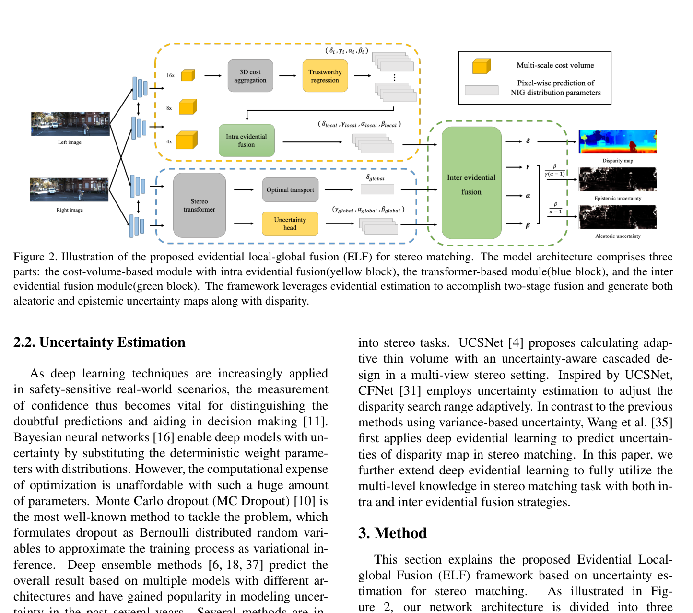
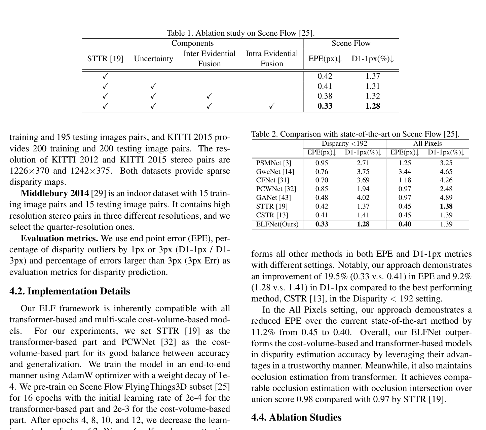

# ELFNet: Evidential Local-global Fusion for Stereo Matching

**Authors:** Jieming Lou, Weide Liu, Zhuo Chen, Fayao Liu, Jun Cheng (A*STAR / NUS)
**Venue:** ICCV 2023
**Tier:** 2 (evidential fusion of two paradigms)

---

## Core Idea
Fuses a **cost-volume-based branch (PCWNet)** and a **transformer-based branch (STTR)** using **deep evidential learning** — the model predicts explicit aleatoric and epistemic uncertainties and uses them as weights to merge the two complementary predictions.

## Architecture Highlights
- **Cost-volume branch (PCWNet):** pyramid group-wise correlation volumes at 1/16, 1/8, 1/4 scales with 3D aggregation; modified with **trustworthy regression head** outputting 4-channel Normal-Inverse-Gamma (NIG) distribution parameters $(\delta, \gamma, \alpha, \beta)$ instead of a single disparity
- **Transformer branch (STTR):** alternating self/cross-attention sequence-to-sequence matching, augmented with lightweight 2D uncertainty head
- **Intra Evidential Fusion:** merges the three pyramid-scale NIG outputs within the cost-volume branch using Mixture of Normal-Inverse-Gamma (MoNIG) closed-form summation rule
- **Inter Evidential Fusion:** merges local (cost-volume) and global (transformer) NIG distributions via MoNIG → single fused disparity + aleatoric uncertainty + epistemic uncertainty

## Main Innovation
**First application of deep evidential regression (Normal-Inverse-Gamma distribution over disparity) to stereo matching.** Uses the resulting per-pixel evidence (confidence) as a **mathematically grounded fusion weight**.

The MoNIG fusion is elegant: **the heavier-evidence branch automatically dominates** — cost-volume branch wins on fine local textures, transformer branch wins on large uniform regions. Addresses two neglected problems in one framework:
1. Uncertainty quantification for safety-critical deployments
2. Reliable multi-model fusion

## Benchmark Numbers
| Metric | Value |
|--------|-------|
| **Scene Flow (D≤192) EPE** | **0.33 px** (19.5% better than CSTR 0.41) |
| Scene Flow (all pixels) EPE | 0.40 |
| **Cross-domain Middlebury EPE** | **1.79** (vs PCWNet 2.17) |
| **Cross-domain KITTI 2012 EPE** | **1.18** (vs PCWNet 1.32) |

## Historical Position
Sits at the intersection of the **STTR transformer-stereo lineage** and **PCWNet cost-volume lineage**. Contemporaneous with ACVNet, IGEV-Stereo, and early iterative methods. Arrived at ICCV 2023 just as the iterative paradigm was consolidating. **Does not propose a new base architecture — introduces the first evidential-fusion meta-framework over existing architectures.**

## Relevance to Edge Stereo
**Low direct relevance for edge deployment** — running two full networks in parallel doubles memory and latency.

However, the **evidential uncertainty maps are extremely valuable for edge safety systems** (flagging unreliable pixels without a separate confidence module). The intra-evidential multi-scale fusion idea could be adopted within a single lightweight network. The uncertainty output is also a candidate **supervision signal for knowledge distillation** to an edge student model.
