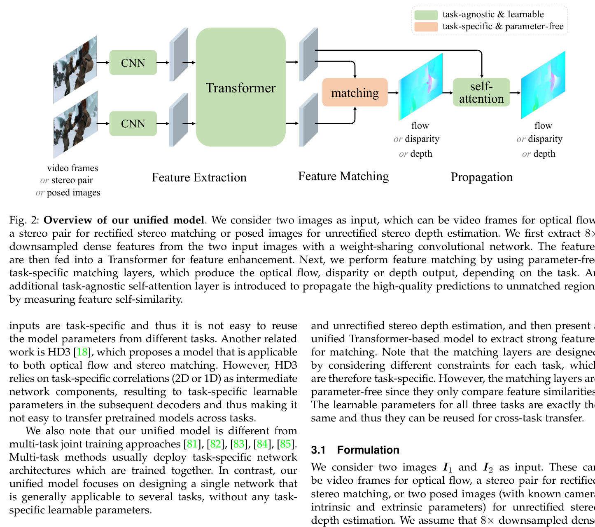
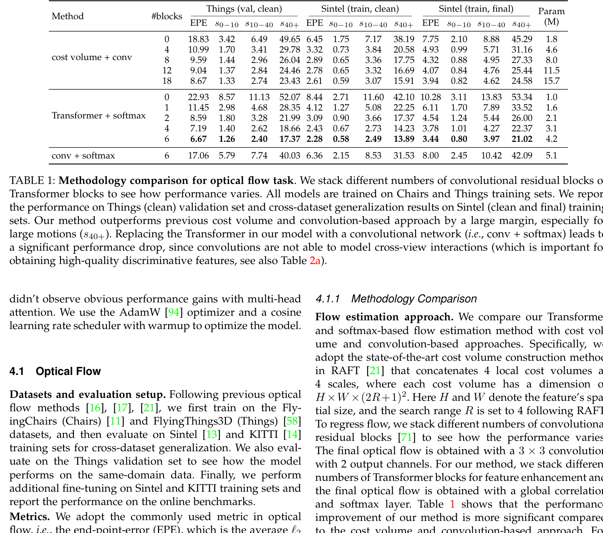

# GMStereo: Unifying Flow, Stereo and Depth Estimation

**Authors:** Haofei Xu, Jing Zhang, Jianfei Cai, Hamid Rezatofighi, Fisher Yu, Dacheng Tao, Andreas Geiger
**Venue:** TPAMI 2023 (extended from CVPR 2022 GMFlow)
**Tier:** 2 (unified transformer for multi-task correspondence)

---

## Core Idea
A **single unified model** — sharing all parameters — solves optical flow, rectified stereo matching, and unrectified stereo/monocular depth estimation by reformulating all three as a **dense correspondence matching problem** solved via global feature correlation through cross-attention. Eliminates task-specific cost volumes or architectures.

## Architecture Highlights
- **Shared CNN backbone** (ResNet-based) downsamples to 1/8 resolution feature maps
- **Transformer** with alternating self-attention and cross-attention; cross-attention **directly computes the feature similarity at all positions** — effectively a global correlation matrix $C = F_1 F_2^T / \sqrt{D}$
- **Task-specific matching layers are parameter-free** — only compare feature similarities using task-specific correspondence constraints (2D for flow, 1D horizontal for rectified stereo, 2D for unrectified stereo/depth)
- **Learnable weights are shared across all three tasks**
- **Self-attention propagation layer** (final stage) propagates high-quality predictions from matched to unmatched/occluded regions
- **GMStereo+ variant** adds 1 hierarchical refinement step with local 2×2 window attention

## Main Innovation
**Optical flow, rectified stereo, and depth estimation are all instances of the same dense correspondence problem** — a single cross-attention mechanism can solve them all without any task-specific learnable parameters.

The cross-attention matrix $C = F_1 F_2^T / \sqrt{D}$ is mathematically identical to computing an all-pairs correlation volume but is computed via a softmax-normalized Transformer that **jointly refines features before matching**. The unified model enables natural **cross-task transfer**: a pretrained optical flow model can initialize a stereo model with faster convergence.

**Key efficiency result:** GMFlow+ achieves comparable performance to RAFT with **1 hierarchical matching step vs 31 RAFT refinements**.

## Benchmark Numbers
| Task/Dataset | Metric | Value |
|--------------|--------|-------|
| Optical flow (Things val, clean) | EPE | **6.67** |
| Optical flow (Sintel train, final) | EPE | 3.08 |
| **Stereo (KITTI 2015)** | EPE 0.89, **D1 2.64%** | 23ms |
| Depth (ScanNet) | Abs Rel **0.050** | — |
| Cross-task transfer | 50K steps matches 100K from scratch | — |

## Paradigm Comparison vs RAFT-Stereo / IGEV-Stereo
**Sits between STTR and RAFT-Stereo architecturally:**
- Like STTR, uses global cross-attention for matching **without a fixed disparity range**
- Unlike STTR, does **not use optimal transport** and uses a propagation step rather than a separate context adjustment layer
- **Compared to RAFT-Stereo:** requires far fewer refinement steps (1 vs 31 iterative GRU updates)
- **Generalizes across tasks without any parameter change**

**Disadvantage vs IGEV/RAFT:** global matching at 1/8 resolution misses fine-grained details and large displacements — iterative all-pairs correlation with high-resolution features handles better.

## Relevance to Edge Stereo
**High conceptual relevance.** The insight that **a single shared Transformer can handle multiple tasks with no extra parameters** is directly applicable to multi-task edge models (joint stereo + flow for autonomous driving). GMStereo runs at **23ms on A100 with only 4.2M parameters** — one of the most parameter-efficient competitive stereo models.

**Caveat:** global cross-attention at 1/8 resolution still requires $O(HW \times HW)$ memory worst case. For edge deployment, replacing global with local windowed attention (as in the 2×2 split variant) is the practical path — and GMStereo demonstrates this is sufficient for good accuracy.
