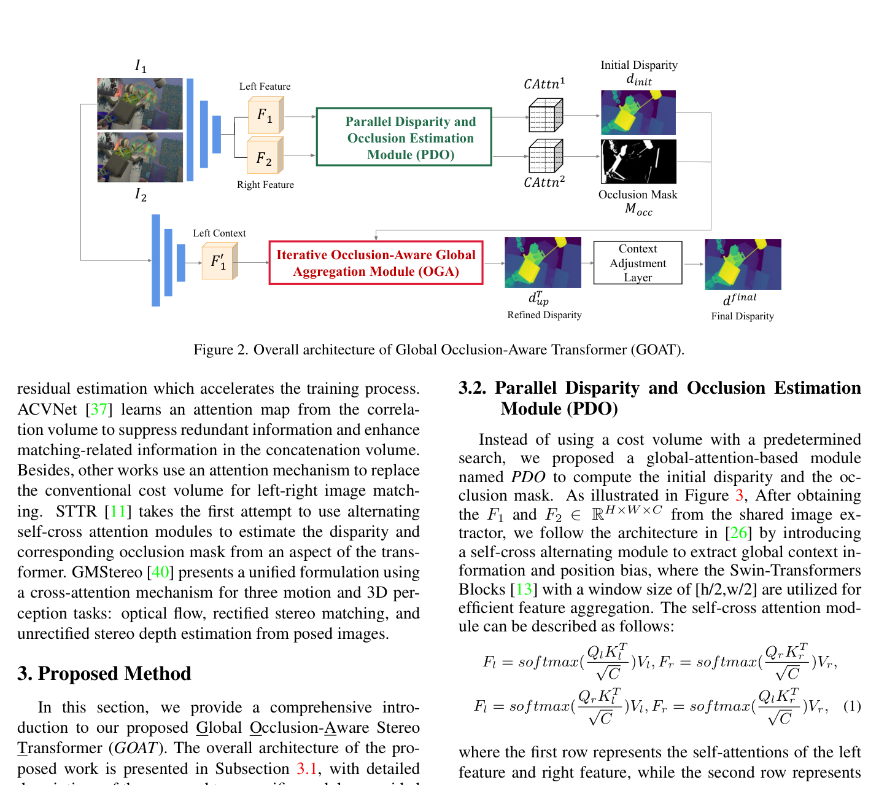
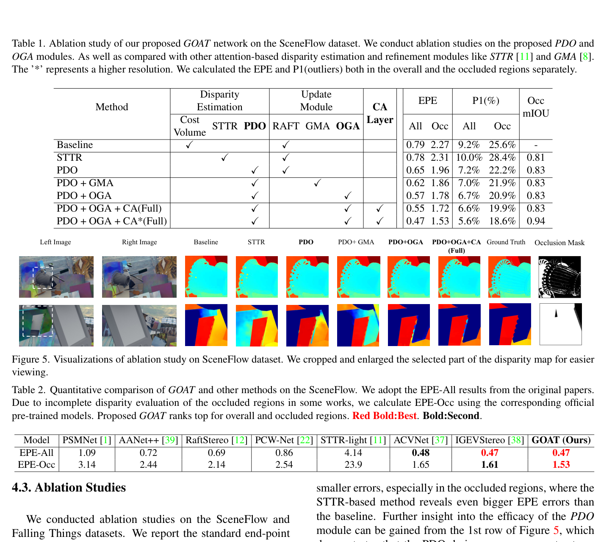

# GOAT: Global Occlusion-Aware Transformer for Robust Stereo Matching

**Authors:** Zihua Liu, Yizhou Li, Masatoshi Okutomi (Tokyo Institute of Technology)
**Venue:** WACV 2024
**Tier:** 2 (occlusion-focused transformer)

---

## Core Idea
Pure-attention architecture with two purpose-built modules:
- **Parallel Disparity and Occlusion (PDO):** produces initial disparity + explicit occlusion mask simultaneously from parallel cross-attention matrices
- **Occlusion-Aware Global Aggregation (OGA):** iterative, uses **restricted global self-attention gated by the occlusion mask** to refine only ill-conditioned occluded regions without corrupting well-matched areas

## Architecture Highlights
- **Shared feature extractor** (CNN)
- **PDO module:** 6 stacked Swin Transformer self-cross attention blocks produce aggregated features; **two parallel cross-attention matrices** $\text{CAttn}_1$ (global cost volume for disparity regression) and $\text{CAttn}_2$ (column sums identify occluded pixels) computed from **separate QK projections** — decoupling disparity and occlusion estimation
- **OGA module (iterative, 12 steps):** at each step, local cross-attention around current disparity + full-image self-attention → occlusion mask selects local features for non-occluded pixels and global aggregated features for occluded pixels; GRU cell regresses residual update
- **Context Adjustment Layer (CAL):** mono-depth-inspired post-processing refines final disparity

## Main Innovation
**Restricted global attention strategy.** Unlike GMA (optical flow) which applies uncontrolled global attention everywhere (risking error propagation into well-matched regions), GOAT's OGA **selectively applies global correlation only within the spatial focus scope of detected occlusions**.

The **PDO module eliminates the shared cross-attention matrix compromise** that forced a trade-off between disparity accuracy and occlusion accuracy in STTR.

**Result:** matches IGEV-Stereo overall while significantly surpassing it in occluded regions — with 12 rather than 32 refinement iterations.

## Benchmark Numbers
| Metric | Value |
|--------|-------|
| **Scene Flow EPE-All** | **0.47** (tied with IGEV-Stereo) |
| **Scene Flow EPE-Occluded** | **1.53** (best, vs IGEV 1.61) |
| **KITTI 2015 D1-fg** | **2.51%** (best fg at publication) |
| **KITTI 2015 D1-all** | 1.84% |
| **Middlebury AvgErr (fine-tuned, half-res)** | **2.71** (best) |
| **Middlebury (zero-shot Occ AvgErr)** | **5.7** (best) |
| Runtime | 0.29s |

## Historical Position
**Direct successor to STTR (ICCV 2021) and GMStereo**, arriving at WACV 2024. The most sophisticated pure-attention stereo network before the foundation-model era. Incorporates RAFT-style iterative refinement into a transformer framework and **explicitly models occlusion** — a problem ignored by most iterative methods. **Bridges the transformer and iterative paradigms.**

## Relevance to Edge Stereo
The **occlusion-gated attention mechanism** is architecturally important for edge models handling autonomous driving scenes with many occluded boundaries (pedestrians, vehicles). **Routing information selectively through occlusion masks** rather than uniformly is compute-efficient (global attention only over a small set of occluded pixels).

**PDO's parallel cross-attention decoupling** is a clean design pattern. The Swin Transformer blocks + GRU combination could be replaced with lighter alternatives (FastViT, MobileNetV4). **Quadratic self-attention cost** is the main barrier to direct edge deployment.
