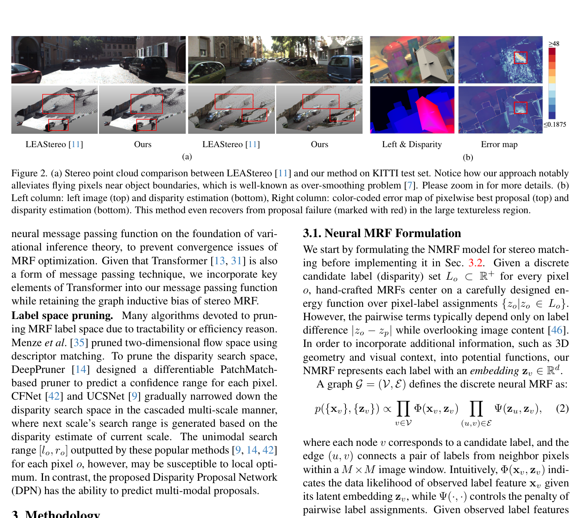
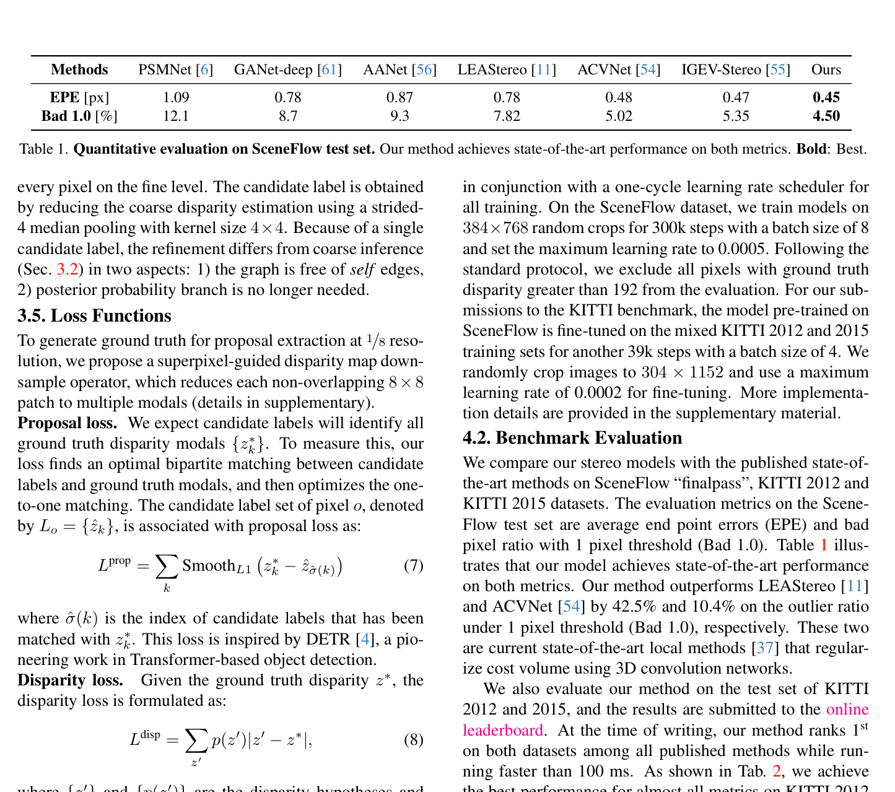

# NMRF: Neural Markov Random Field for Stereo Matching

**Authors:** Tongfan Guan, Chen Wang, Yun-Hui Liu (CUHK, University at Buffalo)
**Venue:** CVPR 2024
**Tier:** 2 (MRF-based alternative to iterative methods)

---

## Core Idea
**Replaces hand-crafted potential functions and message passing of classical MRF stereo with fully data-driven neural counterparts.** Combines a **Disparity Proposal Network (DPN)** for sparse candidate generation with **neural message passing** for label inference. Achieves SOTA generalization at >100ms runtime.

## Architecture Highlights
- **Local feature CNN:** RAFT-Stereo-style backbone (strided-2 stem + 3 residual blocks) → coarse (1/8) and fine (1/4) feature maps
- **Disparity Proposal Network (DPN):** instead of dense D-dim cost volume, extracts **top k=4 disparity hypotheses** per pixel from coarse 3D cost volume via approximate argmax with seed initialization. **Reduces candidate space from D (192+) to just 4 labels per pixel**
- **Neural MRF Inference:** MRF graph over pixels with **learned neural potentials** (unary Φ, pairwise Ψ); mean-field variational inference as neural message passing — $N_p=5$ label seed propagation + $N_i=10$ neural MRF inference + $N_f=5$ refinement
- **Cross-shaped window attention** (CSWin Transformer-inspired) for efficient long-range dependencies
- **Self-edges** (intra-pixel edges between different candidate labels of the same pixel) for label competition
- **Unary potential** encodes matching cost from BOTH left and right views

## Main Innovation
**First fully data-driven stereo MRF** where both unary potential functions and message passing schedule are learned end-to-end. Classical MRF methods (SGM, PBCP, LBPS) use hand-crafted potentials that cannot model complex boundary discontinuities, and hand-crafted message passing that can fail to converge.

**NMRF addresses both:**
- **Neural potentials** learn complex geometric priors from data
- **Neural message passing** (Transformer-based embedding propagation) is differentiable and benefits from self-attention over the label space
- **Self-edges** make the winner label more prominent — acting as label competition classical hand-crafted MRFs overlook

**The DPN is the critical efficiency gain:** reducing candidate space to k=4 hypotheses per pixel avoids the full D-dim cost volume, making inference tractable at high resolution.

## Benchmark Numbers
| Metric | Value |
|--------|-------|
| **KITTI 2012 EPE** | **1.28 px** (noc), D1-all **1.01%** (rank 1) |
| **KITTI 2015 D1-all** | **1.59%** (rank 1) |
| **Scene Flow EPE** | **0.45** (best at submission) |
| **Zero-shot KITTI** | D1-all 4.2% — surpasses DSMNet (6.2) and CREStereo++ by >50% |
| **ETH3D (zero-shot)** | 7.5% outlier ratio |
| **Runtime** | <100ms (5× faster than classical MRF methods like LBPS) |

## Paradigm Comparison vs RAFT-Stereo / IGEV-Stereo
**Not iterative in the RAFT sense.** While RAFT uses a dense all-pairs 4D correlation volume and recurrent GRU updates refining a single disparity estimate, NMRF uses a **sparse MRF graph with k=4 candidate labels per pixel** and message passing as the inference procedure.

Both share structural similarity (information propagation between neighboring pixels iteratively), but NMRF is **explicitly probabilistic and graph-structured** while RAFT is continuous regression.

**Key advantage over iterative methods:** stronger zero-shot generalization — the graph inductive bias of MRFs prevents overfitting. **Cost:** runtime (>100ms) vs IGEV (0.18s).

## Relevance to Edge Stereo
**Moderate.** NMRF's **k=4 disparity proposal approach** is directly applicable to edge devices where full D-dim cost volumes are prohibitive. The idea of maintaining a small set of disparity hypotheses per pixel + sparse message passing is compatible with edge hardware.

**Caveat:** Transformer-based message passing still requires significant computation. Key takeaway: **sparse candidate label spaces + graph-structured inference as a replacement for dense 3D convolutions**. BridgeDepth (the direct successor) pushes this further with k=2 + monocular priors.
