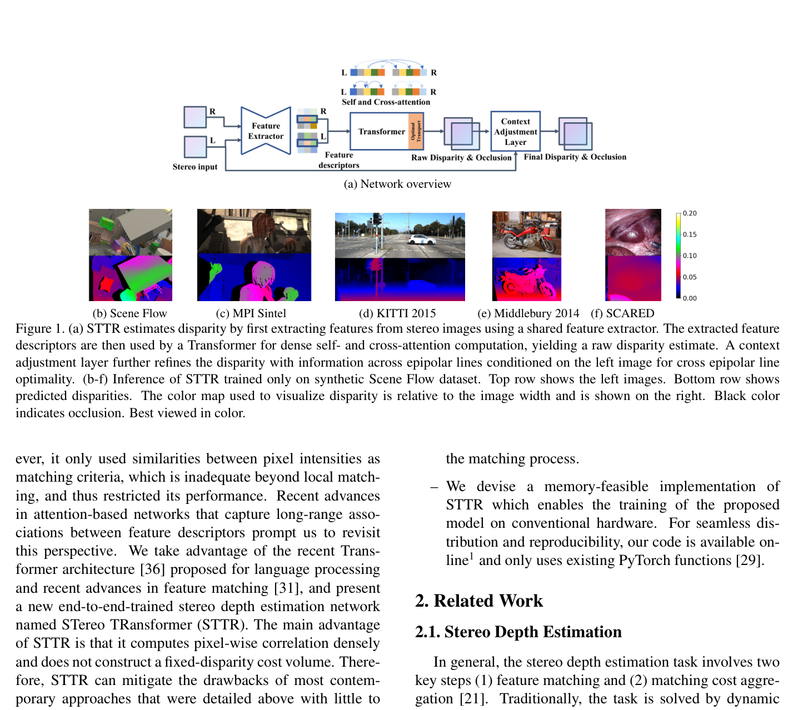
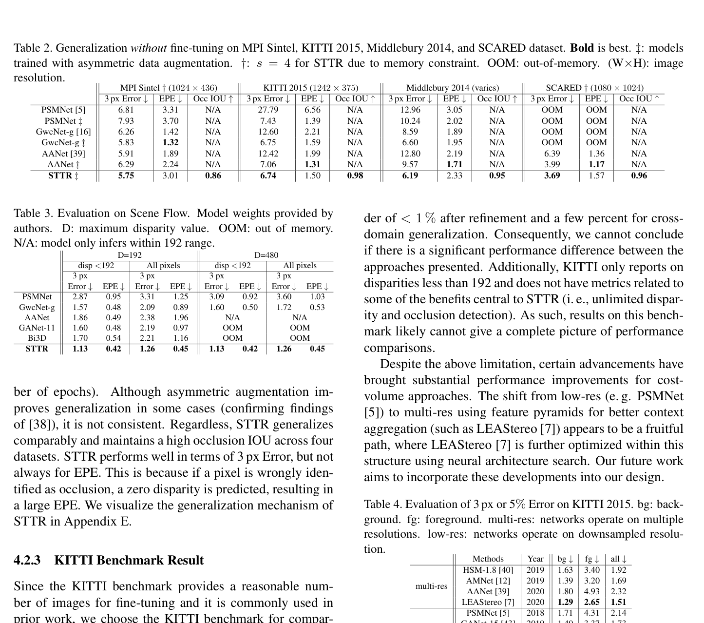

# STTR: Revisiting Stereo Depth Estimation From a Sequence-to-Sequence Perspective with Transformers

**Authors:** Zhaoshuo Li, Xingtong Liu, Nathan Drenkow, Andy Ding, Francis X. Creighton, Russell H. Taylor, Mathias Unberath (Johns Hopkins University)
**Venue:** ICCV 2021
**Tier:** 2 (the first pure transformer stereo network)

---

## Core Idea
**Replaces the standard fixed-disparity cost volume entirely with a Transformer** that performs dense sequence-to-sequence matching along epipolar lines. Eliminates the need to pre-specify a maximum disparity and explicitly handles occlusions through optimal transport.

## Architecture Highlights
- **CNN hourglass feature extractor** (with SPP modules) produces full-resolution feature maps for both images
- **Transformer** with N=6 alternating **self-attention** (intra-image, along epipolar line) and **cross-attention** (inter-image, left-right) layers — replaces cost volume entirely
- **Relative positional encoding** (shift-invariant, not absolute) injected at every layer
- **Optimal transport (Sinkhorn algorithm)** in the final cross-attention layer enforces soft uniqueness constraint (each left pixel matches at most one right pixel); produces occlusion probability via "dustbin" unmatched entries
- **Context Adjustment Layer:** 2D convolutions over multiple epipolar lines, conditioned on left image, refines the raw disparity and occlusion maps
- **Memory:** $O(I_h \cdot I_w^2 / s^3)$ with attention stride $s$; gradient checkpointing required for training

## Main Innovation
**The first pure transformer stereo network** that treats disparity estimation as dense sequence-to-sequence matching rather than cost-volume lookup. Three contributions work together:
1. **No fixed disparity range** — attention window scales with image width, enables generalization to any baseline/resolution without retraining
2. **Explicit occlusion detection** — optimal transport "dustbin" marks pixels unmatched rather than hallucinating disparities
3. **Uniqueness constraint** — entropy-regularized optimal transport enforces soft one-to-one matching, reducing ambiguity in repeated textures

**Relative positional encoding is a critical enabler** — without it, the Transformer cannot resolve textureless regions (shown in PCA feature visualization).

## Benchmark Numbers
| Metric | Value |
|--------|-------|
| **Scene Flow (D≤192)** | EPE **0.42**, 3px error 1.13% (best at time) |
| **Scene Flow (unconstrained disparities)** | EPE 0.45, 3px 1.26% — competitors degrade sharply |
| **KITTI 2015** | bg 1.70%, fg 3.61%, all 2.01% (comparable to GwcNet/PSMNet, behind LEAStereo) |
| **Cross-domain zero-shot** | Middlebury 6.19%, KITTI 2015 6.74%, MPI Sintel 5.75% — competitive or best |
| **Occlusion IOU** | 0.92-0.98 across datasets (no prior work reports this) |

## Paradigm Comparison vs RAFT-Stereo / IGEV-Stereo
**Predates RAFT-Stereo and represents a fundamentally different paradigm:**
- **RAFT:** all-pairs 4D correlation volume + iterative GRU updates (recurrent refinement, $O(HWD)$ memory)
- **STTR:** single-pass Transformer along epipolar lines with $O(H W^2 / s^3)$ complexity

STTR has **no disparity range limit** and **native occlusion detection** — iterative methods lack these. However, STTR's accuracy was only competitive with early methods. STTR **does not iterate** — it's a one-shot matcher — and lacks the fine-detail recovery of multi-scale recurrent updates.

## Relevance to Edge Stereo
**Moderate-to-low.** STTR's quadratic attention complexity makes it slow and memory-heavy at high resolution (e.g., 216 GB at 960×540 without gradient checkpointing). Insights remain relevant:
- The **local window attention reduction** (stride $s$) is a precursor to efficient attention
- **Occlusion-aware matching** is valuable for edge downstream tasks
- Replacing cost volumes with attention could reduce memory if combined with efficient attention kernels (linear attention)
- **For edge deployment, STTR as-is is impractical** — but its conceptual framework motivates hybrid approaches like GMStereo
