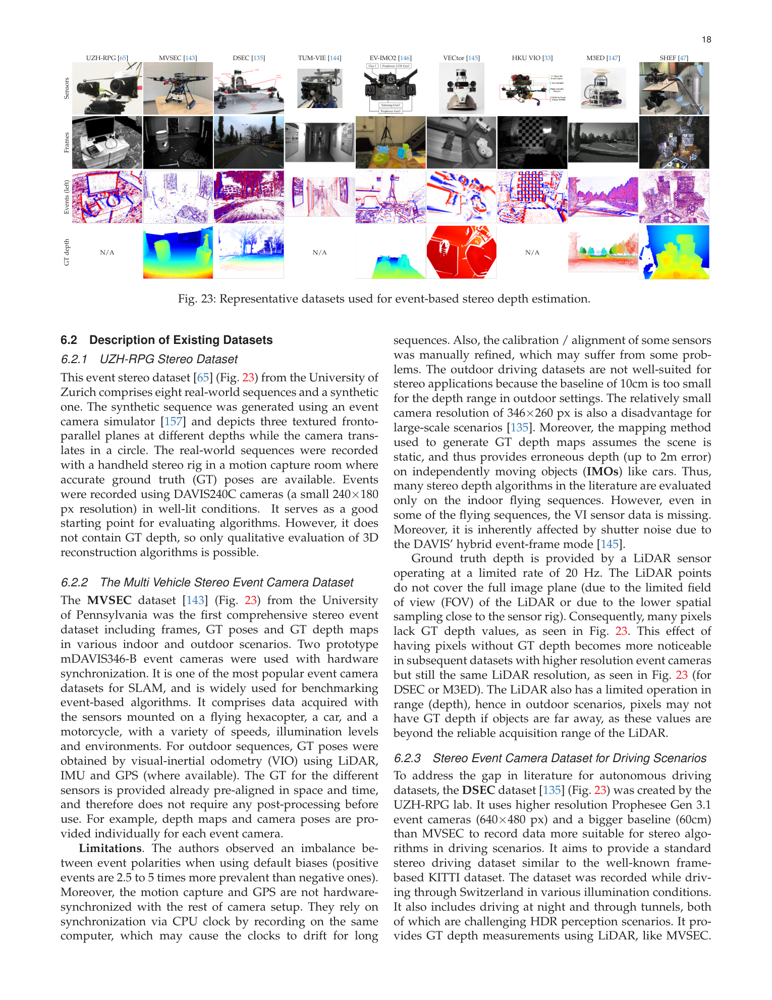
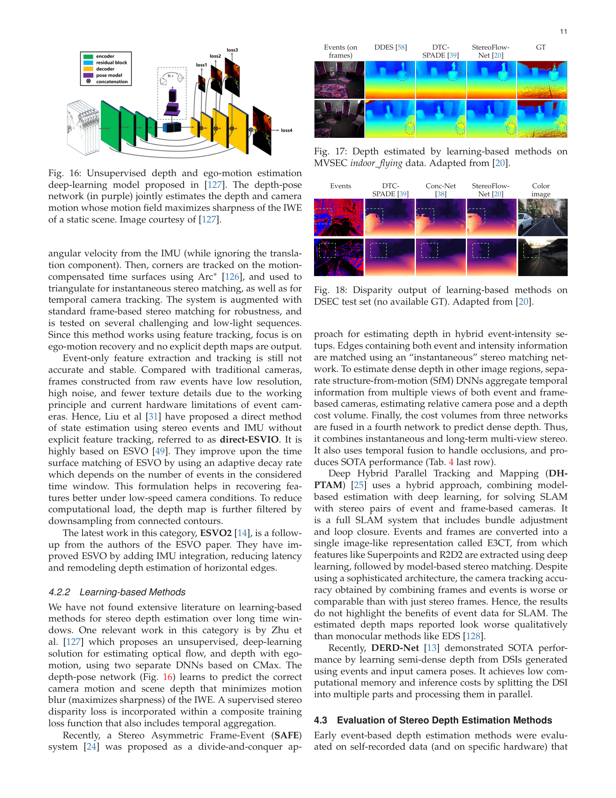

# Event-based Stereo Depth Estimation: A Survey

**Authors:** Suman Ghosh, Guillermo Gallego (TU Berlin / Einstein Center Digital Future / SCIoI / Robotics Institute Germany)
**Venue:** IEEE TPAMI 2025
**Tier:** 3 (comprehensive survey of event-camera stereo, 135+ papers)

---

## Core Idea
Provide the first full-scope survey of event-based stereo depth estimation covering both **instantaneous stereo** (disparity from the most recent events alone) and **long-term stereo** (fusing depth over time with known ego-motion), both **model-based** and **learning-based** approaches, and — uniquely among prior surveys — a comprehensive treatment of **stereo event datasets** (MVSEC, UZH-RPG, DSEC, EV-IMO2, VECtor, M3ED, SVLD, StEIC, SEID, and others). The timespan stretches from Mahowald's 1992 silicon-retina stereo prototype through 2024 deep SNN and hybrid event-frame methods.

## Scope/Coverage

The survey is organised around two orthogonal axes:
- **Instantaneous vs. long-term** stereo — instantaneous uses recent events only (good for independently moving objects, low latency); long-term exploits known camera motion to refine/fuse depth (good for static scenes, higher accuracy).
- **Model-based vs. learning-based** — model-based includes cooperative networks, epipolar matching of time surfaces, line-based stereo, probabilistic fusion (ESVO, MC-EMVS, TSES); learning-based includes DDES, EIT-Net, DTC-SPADE, ES, Conc-Net, CES-Net, EI-Stereo, and spiking-neural-network variants.

Major sections cover:
- Historical background from silicon retinas to modern DVS/DAVIS/Prophesee sensors.
- Instantaneous stereo via cooperative networks, time-surface matching, epipolar event matching, hybrid edge-map methods.
- Deep event-only stereo (DDES, DTC-SPADE, Conc-Net, CES-Net) benchmarked on DSEC and MVSEC indoor-flying.
- Hybrid event + intensity stereo (EI-Stereo, SCSNet, disparity hallucination).
- Long-term methods: ESVO, MC-EMVS, TSES, SGM with time surfaces, EMVS monocular baseline.
- SNN-based approaches and unsupervised depth+ego-motion estimation.
- Dataset-by-dataset analysis with per-dataset limitations (hardware synchronisation, GT depth density, baseline, FOV overlap).

## Key Findings
- **Deep learning dominates instantaneous stereo accuracy** on DSEC and MVSEC: Conc-Net, CES-Net, DTC-SPADE all beat SGM-on-time-surfaces by factors of 2-3x on 1-pixel error rate, though at significantly higher compute.
- **Hybrid event+frame methods** (2E+2F) consistently outperform event-only (2E) or frame-only stereo in low-light / high-dynamic-range scenarios — events and frames are complementary, not competitive.
- **Long-term probabilistic fusion (ESVO, MC-EMVS)** remains the accuracy leader on static-scene depth but cannot localise moving objects, so it is not a drop-in replacement for instantaneous methods.
- **Generalisation is weak**: most deep event stereo models trained on MVSEC transfer poorly to DSEC and vice versa; domain gap is as large as it is for RGB stereo pre-foundation-models.
- **Dataset fragmentation** is a major bottleneck: MVSEC, UZH-RPG stereo, and DSEC account for ~80% of all citations, making the field overly anchored on a few benchmarks (some with known GT-depth artefacts).
- **Unsupervised / self-supervised event stereo is under-explored** — most methods need accurate GT depth which is expensive to acquire at event-camera temporal resolution.

## Notable Results

Representative quantitative comparisons from the survey (Table 4/5):
- **DSEC (MAE px / 1PE / 2PE / RMSE):** CES-Net 0.510 / 9.37 / 2.41 / 1.170; DTC-SPADE 0.526 / 9.27 / 2.41 / 1.285; DDES 0.576 / 10.92 / 2.91 / 1.386. Deep methods cluster tightly.
- **MVSEC indoor-flying Split 1 mean depth error [cm]:** ES 13.27, DDES 16.7, DTC-SPADE 13.5, EIT-Net 14.2. Long-term SGM-on-time-surfaces 35.45 — instantaneous learning wins.
- **Long-term (MVSEC, Table 5):** EMVS (monocular) 39.4 cm, ESVO ~35 cm, GTS 700 cm (suffers from sparse events), CopNet 61 cm. Variance across methods is huge.
- **Pose-based indirect evaluation** is often used in lieu of GT depth because GT depth acquisition at event rates is hard.

## Role in the Ecosystem
This survey is the authoritative navigation aid for event-camera stereo circa 2025. It effectively ends the "event stereo is niche" framing by documenting 135+ papers and a mature (if fragmented) dataset landscape. It positions event cameras as a complement to — not replacement for — RGB stereo: events shine at high-speed / HDR / low-power, while RGB dominates textured static scenes.

## Relevance to Our Edge Model
Indirect but meaningful:
- **Low-power is the event camera's chief selling point** (sub-mW sensors vs. tens of mW for rolling-shutter CMOS). If our edge deployment targets battery-constrained robots or always-on perception, an event-camera variant of our stereo model is a credible follow-up.
- **Hybrid event+frame fusion** (EI-Stereo, Conc-Net) is architecturally close to DEFOM-Stereo's monocular-prior + stereo-correction pattern: auxiliary modality contributes priors, primary modality corrects them. The design pattern transfers.
- **Dataset scarcity is a warning**: if we build an event variant, we should plan synthetic-data generation (e.g., simulating events from SceneFlow or WMGStereo) from day one because real event datasets are few and biased.
- **Temporal fusion gains (ESVO)** motivate keeping a temporal update path in our iterative edge model, even when deployed on single-frame RGB — future extension to video stereo or event stereo will benefit.

## One Non-Obvious Insight
The survey's quiet structural argument is that **instantaneous and long-term stereo are not competitors — they solve different problems**. Instantaneous methods are designed for scenes with independently moving objects where the most recent events dominate; long-term methods exploit camera motion on static scenes and can integrate away noise via probabilistic depth fusion. The mistake in comparing them head-to-head on MVSEC static splits is that it rewards long-term methods at their strong point and hides that they cannot handle independent motion at all. For an edge model, the takeaway is architectural: **a real-world stereo system needs *both* modes** — an instantaneous backbone for moving scene content and a temporal-fusion path for static structure — rather than one fused loss that averages the two. This dual-mode structure is already latent in RAFT-Stereo's iterative refinement (per-frame) plus video-stereo extensions and is worth keeping explicit in our design.
