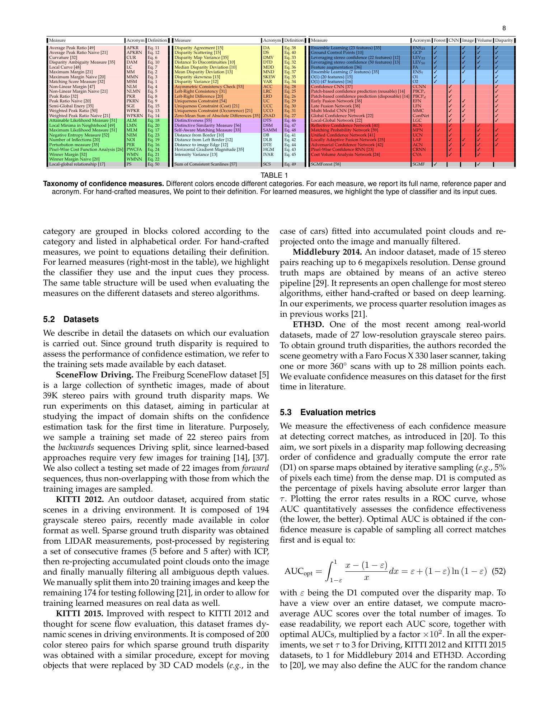
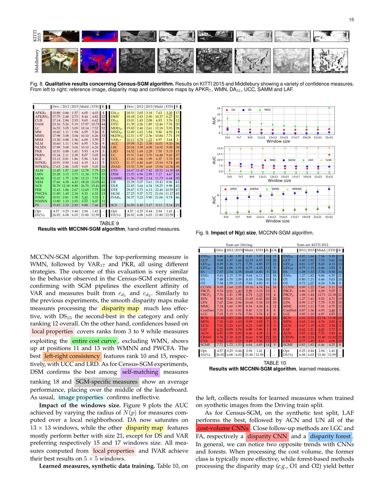

# On the Confidence of Stereo Matching in a Deep-Learning Era: A Quantitative Evaluation

**Authors:** Matteo Poggi, Seungryong Kim, Fabio Tosi, Sunok Kim, Filippo Aleotti, Dongbo Min, Kwanghoon Sohn, Stefano Mattoccia (Bologna, Korea U., Yonsei, KIST)
**Venue:** IEEE TPAMI 2022
**Tier:** 3 (authoritative survey of stereo confidence; the successor to Hu & Mordohai 2012)

---

## Core Idea
A **decade-spanning survey and apples-to-apples benchmark** of stereo confidence measures — from hand-crafted cost-curve statistics to modern deep CNNs — evaluated across **5 datasets (KITTI 2012/2015, Middlebury 2014, ETH3D, SceneFlow Driving), 3 stereo algorithms (Census-SGM, MC-CNN-SGM, and for the first time an end-to-end 3D CNN, GANet)**, and under both in-domain and cross-domain settings. Confidence is the probability that a predicted disparity is correct; it is essential for filtering, fusion, domain adaptation, and safety-critical perception.

## Survey Scope / Taxonomy

The paper organises **~76 confidence measures** into a hierarchy:

- **Hand-crafted (Section 3).** 50+ classical measures grouped by what they observe:
  - **Matching cost / WTA** — MSM, MM(N), PKR(N), APKR(N), NLM(N), WPKR(N), CUR, DAM, LC, SGE — exploit margin between the winner and runner-up costs
  - **Entire cost curve** — PER, MLM, ALM, NEM, NOI, LMN, PWCFA, WMN(N) — summarise the full curve shape
  - **Disparity-map features** — DTD, MDD, MND, DMV, VAR, SKEW, DA, DS — operate on the output map only
  - **Left-right consistency** — LRC, LRD, ACC, UC, UCC, UCO — compare reference to target disparities
  - **Image priors** — ZSAD and similar, using raw RGB cues
  - **SGM-specific** — SCS, PS — exploit the semi-global pipeline internals
- **Machine-learning (Section 4.1).** Random-forest classifiers fed with stacks of hand-crafted features; sub-families that process cost volume (GCP, LEV) vs disparity map (Ensemble, O1/O2) vs SGM-specific
- **Deep-learning (Section 4.2).**
  - **Disparity-only CNNs:** CCNN (9x9 patch), PBCP (joint ref+tgt), EFN/LFN/MMC (early/late/multi-modal fusion with RGB), LGC (local-global context), ConfNet
  - **Cost-volume CNNs:** MPN, RCN (reflective confidence), LAF (local adaptive filter)
  - **Self-supervised confidence:** SSDC — uses left-right agreement as its own training signal, no ground-truth confidence labels

Evaluation protocol: **AUC of the ROC of "drop low-confidence pixels; measure remaining D1 error"**, compared against the optimal curve (oracle) and the baseline D1 (random drop).

## Main Innovation
First study to (1) include **deep end-to-end stereo (GANet)** in the benchmark — a regime where the cost-volume-based confidence measures can't be applied directly because the "cost curve" is hidden inside 3D convolutions, (2) test **cross-domain generalisation** of learned confidences (train on synthetic, test on real), and (3) provide a unified ranking across **49 measures** on the same 5 datasets.

## Key Findings

**On classical stereo (Census-SGM, MC-CNN-SGM):**
- Simple disparity-map statistics (**VAR, DA**) are surprisingly strong (top-5 overall) — you don't always need the cost volume
- **APKR** (averaged peak ratio over a window) is the most robust hand-crafted method, top-4 with any SGM variant
- **Left-right consistency** (LRC, LRD, UC) is popular but only average in rank; UC family is the best among them
- **Image-only priors** are essentially useless — AUC frequently worse than random (D1 baseline)
- **Learned methods (LAF, CCNN, MMC)** dominate, but require matched training domain

**On deep end-to-end stereo (GANet, new in this survey):**
- **Disparity-only features collapse** — they were strong on classical pipelines but near-useless on GANet (GANet's disparity maps are already "too smooth")
- **Cost-curve-based and local-context measures** remain effective (VAR19 ranks #1, MLM and PER in the top 10)
- **PKR and WMN degrade below their naive counterparts** — suggesting that differentiable soft-argmax in deep nets distorts the runner-up peak structure, breaking classical peak-ratio intuitions
- Learned confidences still generalise best **within** a stereo backbone but **drop sharply across backbones** (a CCNN trained for MC-CNN does not transfer well to GANet)

**Cross-domain (synthetic to real):**
- Hand-crafted measures are stable by construction
- Learned measures show **5-15% AUC degradation** when the stereo backbone distribution shifts; self-supervised SSDC partially closes the gap

## Role in the Ecosystem
This survey is the **de facto reference** for anyone adding confidence estimation to a stereo pipeline after 2022. It:
- Standardises the evaluation protocol (AUC vs oracle, across 5 datasets) that newer confidence papers compare against
- Exposes that confidence for **deep end-to-end nets is an open problem** — later work (PCW-Net uncertainty, StereoRisk, CorAl, IGEV uncertainty heads) directly responds to the failure modes identified here
- Bridges the pre-deep era (Hu & Mordohai 2012) and modern foundation-stereo uncertainty
- Provides **49 re-implemented measures** as a public benchmark suite

## Relevance to Our Edge Model
Confidence is not optional for edge/safety-critical deployment — downstream consumers (path planning, occupancy mapping, sensor fusion with IMU/LiDAR) need per-pixel reliability. The survey gives concrete guidance for a resource-constrained stereo model:
1. **Cheap wins first.** If compute is tight, a single hand-crafted disparity-map statistic (**VAR** or **DA**) adds near-zero inference cost and dominates image-prior baselines on classical stereo outputs
2. **Avoid PKR-family intuitions for deep models.** Soft-argmax makes peak-ratio heuristics unreliable; instead compute **local variance** of the output or run a **small disparity-only CNN head** (CCNN-style, ~100k params) on the regressed map
3. **Self-supervised confidence (SSDC)** is attractive for edge: it trains from left-right consistency without annotations, survives domain shift better than supervised learned measures, and can be distilled into a tiny shared head
4. **Design for confidence from day one.** Backbones whose final disparity comes from a soft-argmax over a clear cost curve (RAFT-Stereo, IGEV correlation pyramid) expose richer signals for confidence than pure regression heads — relevant for choosing our edge architecture

## One Non-Obvious Insight
The same confidence cue can flip rank across stereo backbones. Left-right consistency — the "obvious" confidence signal — ranks middle-of-the-pack on SGM and **fails outright on GANet**, because the deep network's smooth disparities make reference and warped-target maps agree even when both are wrong. Conversely, **disparity variance in a local window (VAR19)** is mediocre on SGM but **#1 on GANet**. The lesson: a confidence measure encodes an implicit assumption about the failure mode of the matcher. As the matcher evolves (SGM -> 3D CNN -> iterative -> foundation-stereo), **the confidence measure must co-evolve**. Plugging classical confidences into a modern stereo network without re-validation gives dangerously overconfident maps — exactly the opposite of what safety-critical edge deployment needs.
