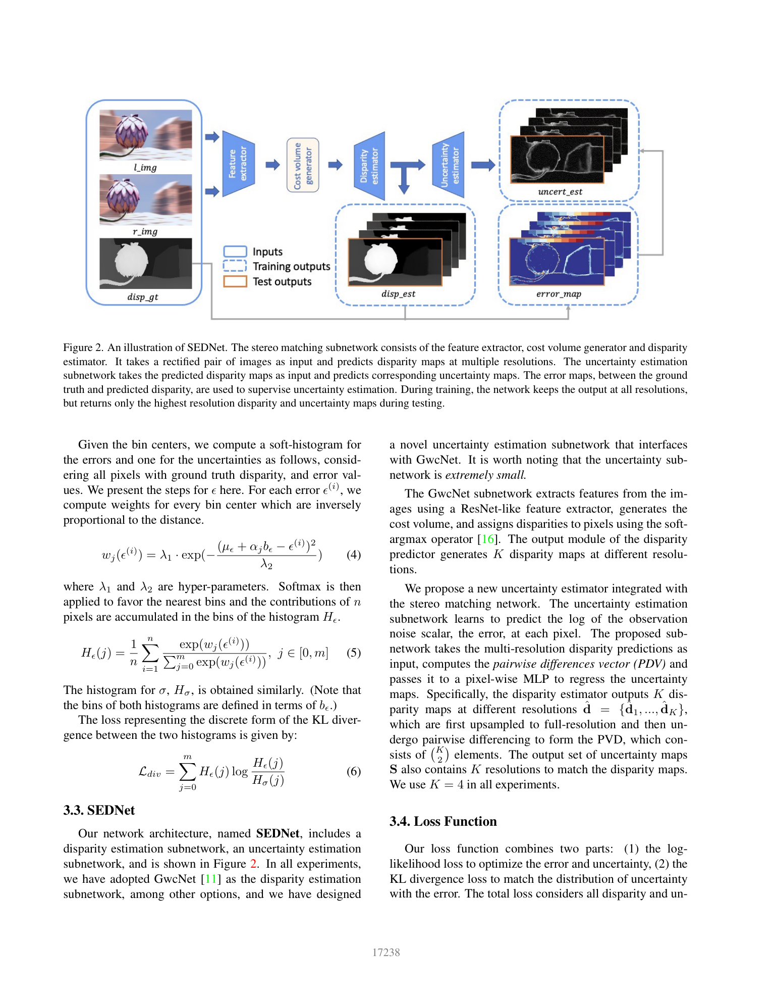
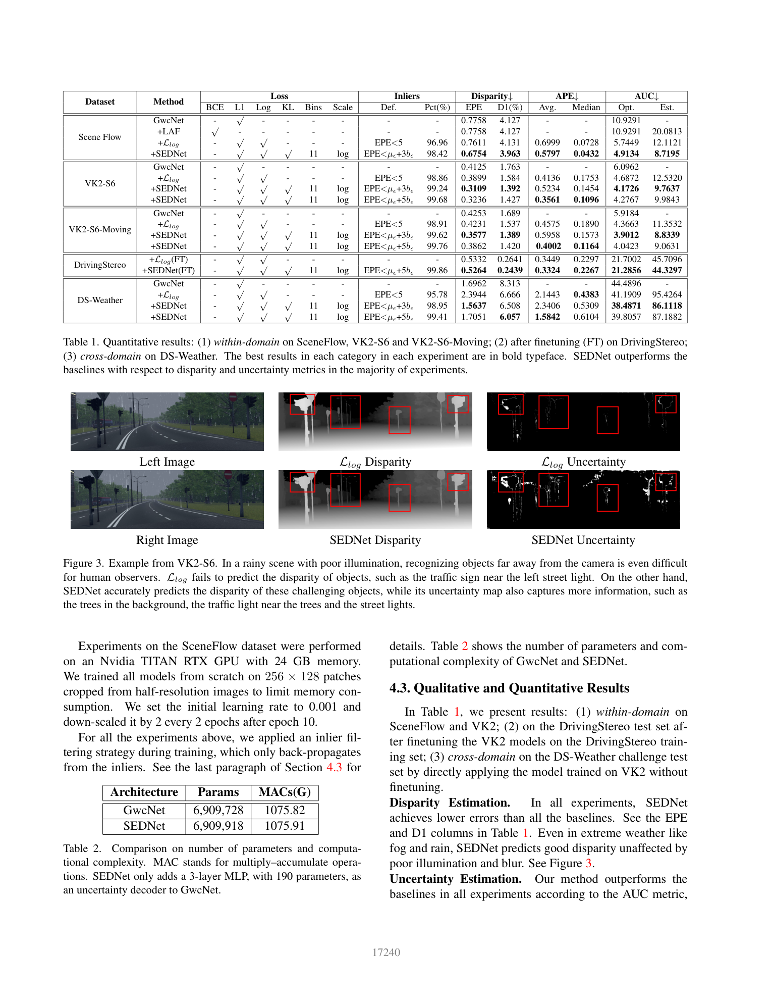

# SEDNet: Learning the Distribution of Errors in Stereo Matching

**Authors:** Liyan Chen, Weihan Wang, Philippos Mordohai (Stevens Institute of Technology)
**Venue:** CVPR 2023
**Tier:** 3 (calibrated uncertainty for stereo)

---

## Core Idea
Jointly estimate disparity **and** aleatoric uncertainty by requiring the predicted uncertainty distribution to **statistically match the actual error distribution**, enforced via a **KL divergence loss** between soft-histogrammed distributions. The key observation: standard Laplacian uncertainty estimation (L_log loss) produces uncertainty values that correlate poorly with actual errors in distribution **shape**. SEDNet explicitly corrects this by minimizing KL divergence between the histogram of predicted uncertainties and the histogram of observed errors.

## Architecture

**Disparity subnetwork:** GwcNet (Group-wise Correlation Stereo Network) backbone, predicting K disparity maps at multiple resolutions via soft-argmax.

**Uncertainty subnetwork:**
- Receives all K multi-resolution disparity maps
- Upsamples to full resolution
- Forms a **Pairwise Differences Vector (PDV)** containing C(K,2) elements
- Pixel-wise MLP predicts K uncertainty maps (one per resolution scale)
- **Adds only ~190 parameters** to GwcNet

**Soft-histogramming:**
- For both error distribution and uncertainty distribution
- Differentiable binning with **Gaussian-weighted bin assignments** approximates histograms from per-pixel samples
- 11 log-spaced bins

**Combined loss:** sum over resolutions of (L_log,k + L_div,k), weighted by resolution coefficients, where L_div is KL divergence between error and uncertainty histograms.

**Adaptive inlier filtering:** back-propagation restricted to pixels with EPE below `mean_error + N × bin_width`, adaptively excluding catastrophic outliers.

## Main Innovation
The **KL divergence term** forces the network to predict not just "some uncertainty" per pixel but uncertainty values whose **global distribution shape** matches the global distribution of actual prediction errors. This is a **distribution-level constraint** rather than a pixel-level one — the model implicitly learns the shape of the error distribution (heavy-tailed in occluded regions, tight in textured areas).

## Key Benchmark Numbers

| Dataset | GwcNet baseline | **SEDNet** | Notes |
|---------|----------------|------------|-------|
| **SceneFlow** | EPE 0.776 / D1 4.13% | EPE **0.675** / D1 **3.96%** | In-domain |
| **VK2-S6-Moving** | EPE 0.425 / D1 1.69% | EPE **0.358** / D1 **1.39%** | Cross-domain synthetic |
| **DS-Weather rainy** | EPE 3.19 / D1 17.36 | EPE **2.22** / D1 **11.02** | Hardest condition |

**Uncertainty AUC** (lower = better):
- SceneFlow: 12.11 → **8.72** (28% improvement)
- DS-Weather rainy: SEDNet 50.8 vs L_log 59.4

**Parameter overhead is essentially zero:**
- GwcNet: 6,909,728 params → SEDNet: 6,909,918 params (+190)
- MACs: 1075.82 → 1075.91 GMACs

## Role in the Ecosystem
SEDNet brought **calibrated uncertainty** to stereo at near-zero cost. Most prior stereo confidence methods (Poggi & Mattoccia 2016, learned confidence with PBCP) used heavier networks. SEDNet's PDV approach inspired follow-up work like **StereoRisk (ICML 2024)** that explicitly uses risk minimization over disparity distributions.

## Relevance to Our Edge Model
**Highly applicable.** The ultra-lightweight uncertainty head is **directly adoptable** for our edge model:
- **+190 params, +0.01% MACs** — essentially free
- Provides calibrated uncertainty maps for downstream **sensor fusion** (Kalman filtering, fusion with LiDAR)
- KL divergence loss is a **drop-in training improvement** for any stereo backbone

For edge deployment in safety-critical contexts (ADAS, robotics), having **calibrated uncertainty** is often more valuable than 1% accuracy improvement — downstream consumers can selectively trust or reject predictions.

## One Non-Obvious Insight
The uncertainty subnetwork derives **all its signal from the pairwise differences between multi-resolution disparity predictions** of the disparity backbone — it **never looks at the raw images**. This means the uncertainty head is learning to detect **"disagreement across scales"** as a proxy for prediction reliability — analogous to how classical stereo confidence measures exploit left-right consistency, but entirely **within the learned multi-resolution feature hierarchy** of a single forward pass.

This idea generalizes: **any iterative stereo network already produces a sequence of disparity estimates** — the variance across iterations is essentially free uncertainty information that current methods throw away.
