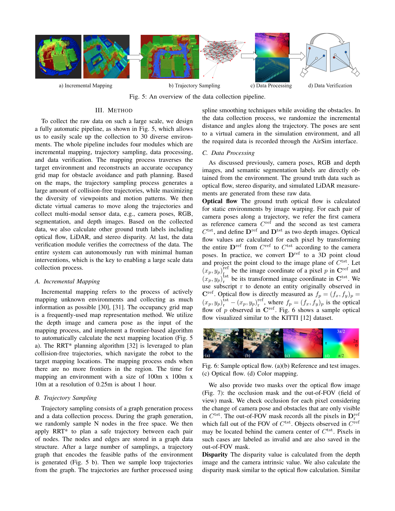
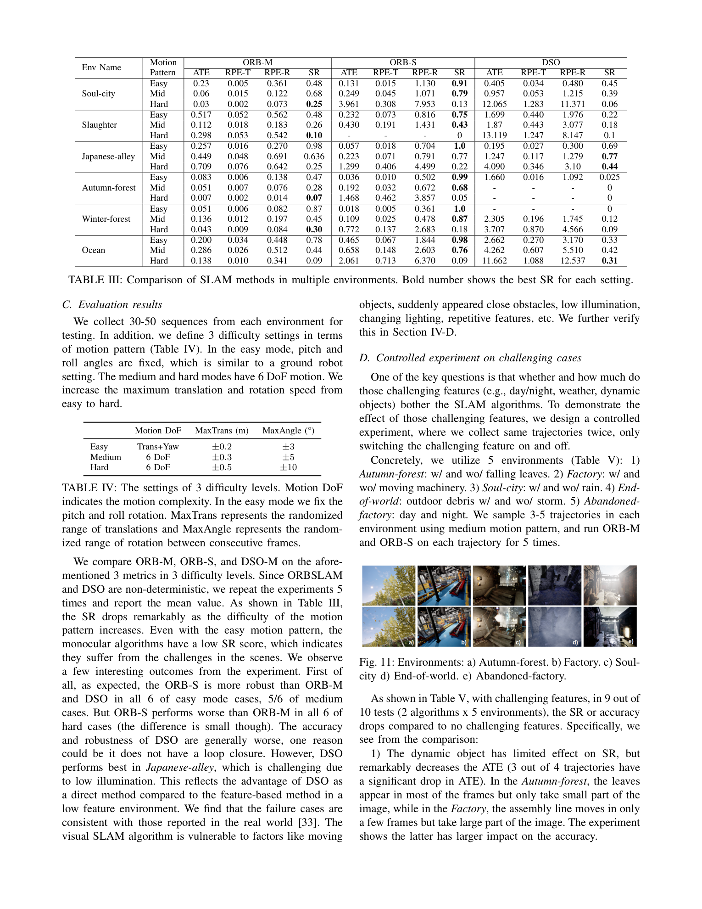

# TartanAir: A Dataset to Push the Limits of Visual SLAM

**Authors:** Wenshan Wang, Delong Zhu, Xiangwei Wang, Yaoyu Hu, Yuheng Qiu, Chen Wang, Yafei Hu, Ashish Kapoor, Sebastian Scherer (CMU, CUHK, Microsoft)
**Venue:** IROS 2020
**Tier:** 3 (large-scale photo-realistic synthetic dataset)

---

## Core Idea
A **large-scale photo-realistic simulation dataset** for visual SLAM and robot navigation, built on Unreal Engine + AirSim across **30 diverse environments**, providing synchronized multi-modal ground truth (RGB stereo, depth, optical flow, segmentation, LiDAR, poses) at scales and motion diversity impossible with physical platforms.

## Dataset Overview

| Property | Value |
|----------|-------|
| **Scene type** | **Synthetic** — Unreal Engine + AirSim |
| **Environments** | **30** spanning urban, rural, domestic, nature, sci-fi |
| **Sequences** | **1,037** total (~4 TB, ~1M+ frames) |
| **Resolution** | 640×480 |
| **GT modalities** | RGB stereo, **depth**, optical flow, semantic seg, LiDAR, IMU, poses |
| **Conditions** | Day/night, rain, fog, snow, lens flare, dynamic objects, seasonal variation |
| **Difficulty** | Easy / Medium / Hard (graded by motion intensity) |

## Pipeline



**Fully automatic** end-to-end:
1. **Incremental occupancy mapping** of each Unreal environment
2. **RRT*** trajectory sampling for diverse motion patterns
3. **AirSim** captures synchronized multi-modal data
4. **Automatic derivation** of optical flow, disparity, LiDAR
5. **Photometric synchronization verification** filters bad frames

**Motion diversity metric** σ (eigenvalue ratio of motion covariance):
- TartanAir: **σ = 0.95**
- KITTI: σ = 0.005
- EuRoC: σ = 0.207

**Two orders of magnitude more diverse motion than KITTI.**

## Key SLAM Benchmark Results



- ORB-SLAM Stereo achieves **91-100%** success rate on Easy sequences
- Drops to **0-13%** on Hard sequences (e.g., Slaughter Hard: SR=0; Soul-City Hard: SR=0.06)
- Demonstrates that prior SLAM datasets (KITTI, EuRoC) drastically under-test motion complexity

## Role in the Ecosystem
**The standard large-scale synthetic stereo training corpus** outside Scene Flow. Used by:
- **StereoAnything** as a primary training source
- **Pip-Stereo's MPT** as part of the multi-domain mix
- **FoundationStereo** for diverse-environment pretraining

Where **Scene Flow** dominates synthetic pretraining via **abstract diversity**, TartanAir contributes **realistic environmental diversity** (forests, urban, snowy, foggy) with photorealistic rendering.

## Relevance to Our Edge Model
**Mandatory training data.** Following StereoAnything's curriculum, our edge model should train on:
```
Scene Flow (35K)
  + TartanAir (~1M frames)  ← THIS PAPER
  + CREStereo synthetic
  + DrivingStereo (real)
  + Pseudo-stereo from monocular
```

TartanAir specifically contributes:
- **Motion diversity** (aggressive trajectories that match real robot deployment)
- **Adverse weather variants** (rain, fog, snow) for edge robustness
- **Day/night transitions** for ADAS validation
- **Dense ground truth** for every frame at 100% pixel coverage

## One Non-Obvious Insight
The paper shows that ORB-SLAM **stereo** is sometimes **worse** than ORB-SLAM **monocular** on Hard sequences (e.g., Winter-Forest Hard: ORB-M SR=0.30 vs. ORB-S SR=0.18). This counterintuitive result reveals that **aggressive motion violates stereo baseline assumptions more severely than it breaks monocular feature tracking** — a failure mode worth keeping in mind when designing stereo systems for fast-moving edge robots like drones.
