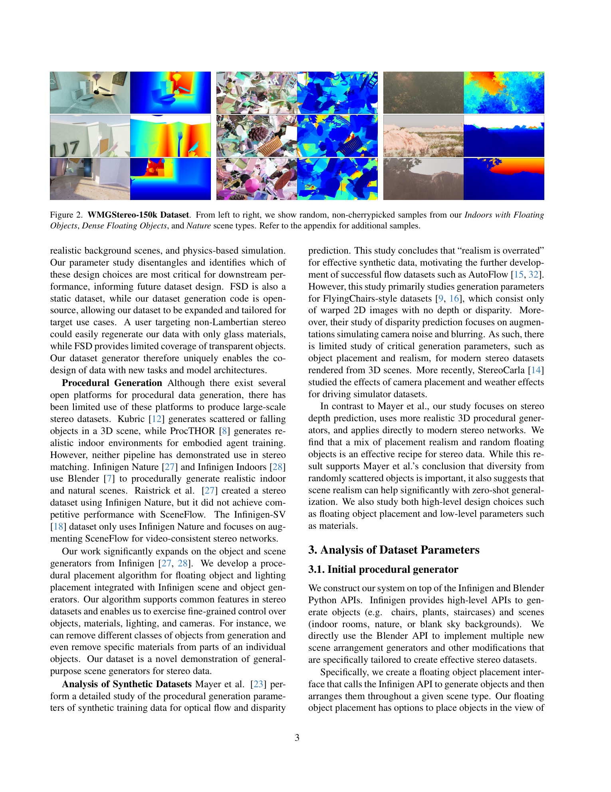
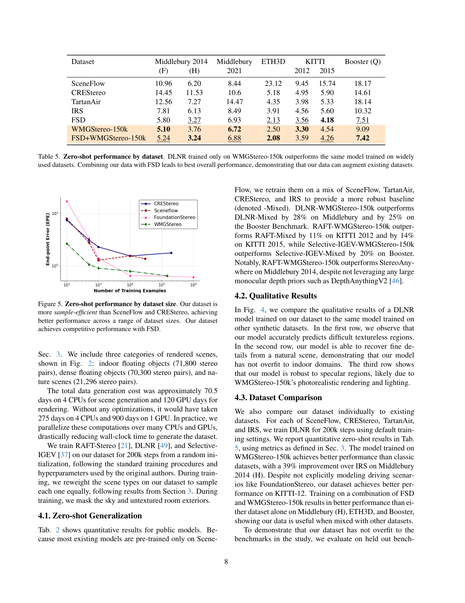

# What Makes Good Synthetic Training Data for Zero-Shot Stereo Matching? (WMGStereo-150k)

**Authors:** David Yan, Alexander Raistrick, Jia Deng (Princeton University)
**Venue:** arXiv 2025
**Tier:** 3 (procedural synthetic dataset + design-space study)

---

## Core Idea
Treat synthetic dataset generation as an optimisation problem: systematically vary the parameters of a procedural scene generator (Infinigen-based), measure zero-shot stereo performance for each setting on standard benchmarks, and read off which design choices matter. The paper then collects the best settings into **WMGStereo-150k** — 150,000 stereo pairs across three scene categories (indoor with floating objects, dense floating objects, nature) — and shows that training a single architecture (RAFT-Stereo, DLNR, Selective-IGEV) on this single dataset beats training on the commonly used mixture (SceneFlow + CREStereo + TartanAir + IRS, 600k pairs).

## Architecture / Scope

- **Procedural generator:** built on Infinigen (Princeton's procedural-scene engine); generates stereo pairs at 1920 x 1080 with pixel-accurate GT disparity.
- **Design-space axes studied** (each ablated by regenerating a 5k dataset and retraining RAFT-Stereo from scratch):
  - Floating object density (0 / 0-10 / 10-30 per scene)
  - Background objects (present vs. absent)
  - Object type (chairs only, shelves only, bushes only, all)
  - Object material (none, one diffuse, metal+glass, all)
  - Stereo baseline distribution (narrow / wide / full-range uniform)
  - Lighting (realistic vs. augmented)
  - Render quality (1024 vs. 8192 ray-tracing samples; denoise on/off)
  - Solver realism (full vs. reduced physics solver for object placement)
- **Final dataset composition:** 71,800 indoor-floating + 70,300 dense-floating + 21,296 nature scenes = 163,396 pairs (reported as 150k). Generation cost: ~70 CPU-days scene generation + ~120 GPU-days rendering.
- **Release:** open-source generator code (the central contribution alongside the dataset), enabling further parameter studies.

## Main Innovation (Key Findings)
1. **Scene diversity beats scene realism.** Using *all* Infinigen object generators wins over any single class; diffuse + metal + glass material mixtures win over any single material. Realistic physics solver (550 steps) *slightly hurts* out-of-domain generalisation vs. a reduced solver (60 steps) that produces less-realistic placement.
2. **Wide stereo baseline distribution is essential.** A narrow baseline Uniform[0.04, 0.1] gets 32.5% error on Middlebury-F vs. 9.2% with the full Uniform[0.04, 0.4] range. This is the single most sensitive knob.
3. **Background clutter matters.** Adding background objects drops Middlebury-H 2-px error from 8.35 to 6.60 — textureless backgrounds in FlyingThings3D-style scenes were a systematic weakness.
4. **Augmented lighting ≥ physically realistic lighting** — same reason as the solver finding: diversity beats fidelity.
5. **Compute-optimal rendering** is 1024 samples + denoising (not 8192 samples), which gives a 6x speedup with *better* out-of-domain numbers when compute-matched. Under fixed-compute, 30k denoised pairs beat 5k high-fidelity pairs.
6. **Training on WMGStereo-150k beats 600k-sample mixed dataset** for RAFT-Stereo, DLNR, and Selective-IGEV — generalisation scales with dataset *quality*, not just quantity.

## Notable Results

Zero-shot (Table 2, trained only on WMGStereo-150k):
- **DLNR-WMGStereo-150k:** Midd2014(H) 3.76, Midd2021 6.72, ETH3D 2.50, KITTI-12 3.30, KITTI-15 4.54, Booster(Q) 9.09 — beats DLNR-Mixed on every benchmark.
- **Selective-IGEV-WMGStereo-150k:** Midd2014(H) 3.61 (vs. 5.24 Mixed), KITTI-15 4.55 (vs. 5.31), Booster 8.84 (vs. 11.00).
- **Competitive with StereoAnywhere** (similar compute); loses to FoundationStereo (much larger) but matches its training-dataset role at a fraction of the scale.
- **Sample efficiency (Fig. 5):** 500 WMGStereo pairs already beat 100k CREStereo pairs on Middlebury2014-H EPE; scaling continues smoothly past 100k samples where SceneFlow and CREStereo plateau.
- **Held-out DrivingStereo** (not used in parameter tuning): 27% improvement over FSD on 3-px error — findings generalise beyond the tuning benchmarks.

## Role in the Ecosystem
WMGStereo joins FoundationStereo's FSD and (contemporaneously) StereoCARLA as the 2025 generation of stereo training datasets designed for zero-shot generalisation. Whereas FSD is a monolithic large-scale release, WMGStereo is a *recipe* — the open-source generator lets anyone regenerate variants, making it the Infinigen analogue of what TartanAir tried to be for SLAM. This positions WMGStereo as a tool for dataset research, not just another pretrained dataset.

## Relevance to Our Edge Model
Very high relevance for our training strategy:
- **We should train our edge model on WMGStereo-150k** (or WMGStereo + FSD mixture, which is optimal per Table 5). Doing so gives us state-of-the-art zero-shot generalisation without access to FoundationStereo's private training data.
- **The parameter study is a free gift**: baseline range, object diversity, background clutter, and augmented-lighting settings are all transferable to any stereo training pipeline.
- **Compute-efficient rendering (1024 + denoise, reduced solver)** matters for any lab-scale replication: we do not need a foundation-stereo-budget GPU farm to produce competitive synthetic data.
- **Sample efficiency matters for edge model development**: we can train iterations of our lightweight architecture on 10-50k WMGStereo pairs quickly, verify it scales, then commit to the full 150k only for final runs.

## One Non-Obvious Insight
The paper's deepest result is that **for zero-shot stereo, the diversity-vs-realism tradeoff favours diversity at every axis studied** — solver realism, lighting realism, material realism, and even ray-trace sample count. Physically-correct scenes are not the goal; they are an expensive way to generate training data whose correctness the network cannot exploit without extensive fine-tuning. A stereo network essentially needs many geometrically-varied correspondence puzzles, and the visual "look" beyond a threshold of basic plausibility is compute that could have produced more puzzles. **This inverts the usual intuition from simulation-to-real transfer literature** — and it explains why FlyingThings3D (cartoonish floating objects, "unrealistic") has remained a competitive training set for a decade while more photorealistic datasets only marginally improve generalisation.
