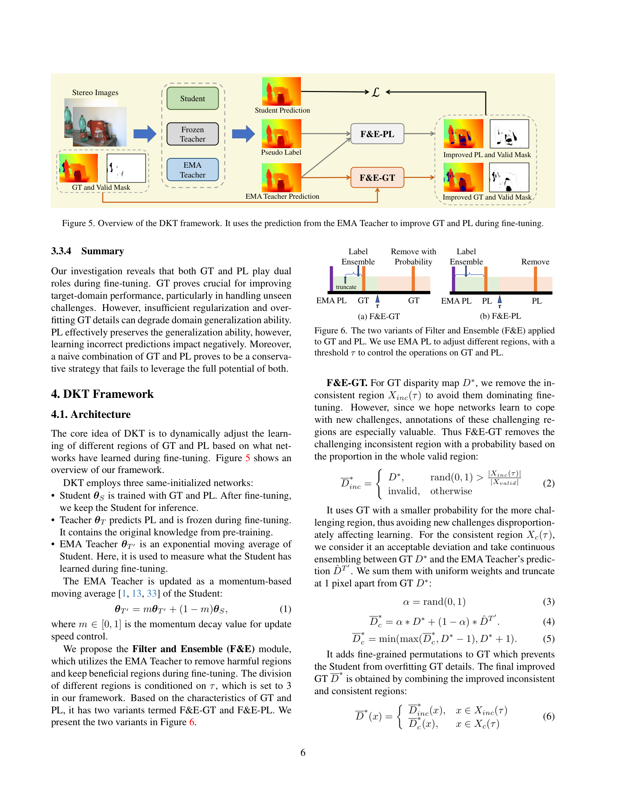
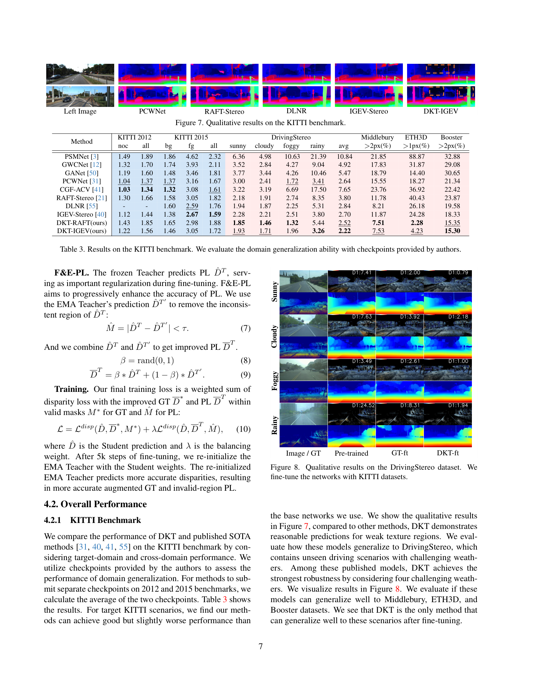

# DKT-Stereo: Robust Synthetic-to-Real Stereo via Dual Knowledge Transfer

**Authors:** Jiawei Zhang, Jiahe Li, Lei Huang, Xiaohan Yu, Lin Gu, Jin Zheng, Xiao Bai (Beihang, Macquarie, RIKEN AIP/U. Tokyo)
**Venue:** CVPR 2024
**Tier:** 3 (catastrophic-forgetting cure for fine-tuning)

---

## Core Idea
When fine-tuning a synthetic-pretrained stereo network on real-world target data using **ground-truth labels**, **domain generalization ability collapses**. But **pseudo-labels** (the model's own predictions) preserve it. **DKT (Dual Knowledge Transfer)** exploits this asymmetry: it uses a frozen Teacher and an EMA Teacher to dynamically filter and ensemble GT and pseudo-labels — preventing overfitting to target-domain specifics while still improving in-domain accuracy.

## Architecture

**Three co-initialized networks:**
- **Frozen Teacher** — predicts pseudo-labels, never updated (preserves synthetic-trained knowledge)
- **EMA Teacher** — exponential moving average of Student, tracks learning progress
- **Student** — the network actually being trained (kept for inference)

**Filter & Ensemble modules:**
- **F&E-GT:** Removes inconsistent regions (where GT and EMA-Teacher disagree by > τ=3px) from GT with a probability; adds fine-grained ensemble perturbations in consistent regions to prevent detail overfitting
- **F&E-PL:** Removes unreliable pseudo-label regions (frozen Teacher vs. EMA Teacher disagreement); blends remaining PL with EMA-Teacher prediction via random β

EMA Teacher is **re-initialized from Student every 5K steps** to progressively sharpen its predictions.

**Plug-and-play** with: IGEV-Stereo, RAFT-Stereo, CFNet, CGI-Stereo, CroCo-Stereo.

## Main Innovation
Framing stereo fine-tuning catastrophic forgetting as a **"dark knowledge"** problem: the difference between GT and pseudo-labels encodes information about what the pretrained model **does vs. does not** know. That signal can be used to **selectively gate supervision** rather than applying GT uniformly.

## Key Benchmark Numbers (IGEV-Stereo backbone, fine-tuned on KITTI)

| Metric | DKT-IGEV | GT fine-tuning |
|--------|----------|----------------|
| **KITTI 2015 D1 (target)** | 1.46% bg / 3.05% fg | 1.38% / 2.67% |
| **Middlebury >2px (unseen)** | **7.11%** | 12.23% |
| **ETH3D >1px (unseen)** | **3.64%** | 23.88% |
| **Booster >2px (unseen)** | **15.51%** | 18.43% |
| **DrivingStereo avg** | **2.22%** | 2.70% (baseline IGEV) |

**42% improvement on Middlebury, 85% improvement on ETH3D** vs. naive GT fine-tuning, with virtually no loss on the target domain.

## Role in the Ecosystem
DKT is the **canonical fine-tuning protocol** for stereo when cross-domain generalization matters. It's a training-loop modification with **zero architectural cost** — works with any backbone. Modern foundation-stereo papers (DEFOM-Stereo, FoundationStereo, MonSter) implicitly incorporate similar ideas through their training recipes.

## Relevance to Our Edge Model
**Mandatory.** When deploying our edge stereo model to a specific site and fine-tuning on a small labeled set (e.g., 200 frames from a Jetson Orin deployment), DKT prevents the **generalization collapse** that would otherwise destroy the model's ability to handle anything outside that exact site. Cost: zero inference overhead, ~3× training compute (frozen teacher + EMA teacher + student forward passes).

## One Non-Obvious Insight
The "inconsistent region" — pixels where GT and pseudo-label disagree — is **not just noise to ignore**. It represents **novel knowledge** the pretrained model never encountered on synthetic data. The crux insight is that **learning this novel knowledge too aggressively** (without sufficient consistent-region regularization) is what causes generalization collapse, **not the new knowledge itself**. Removing only the inconsistent GT regions (a one-line change to the loss) already recovers substantial cross-domain performance — proving that targeted label filtering is more powerful than any architectural change.
