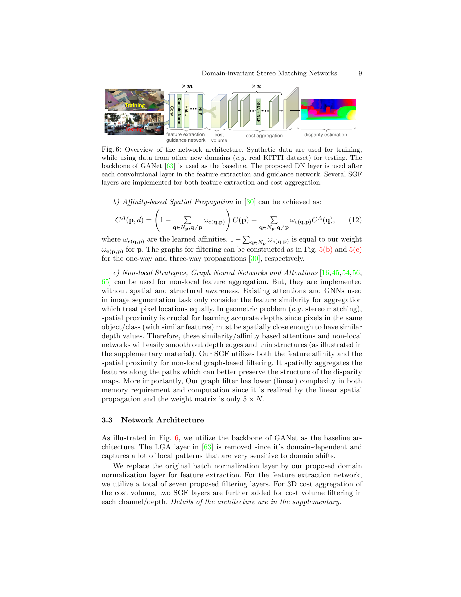
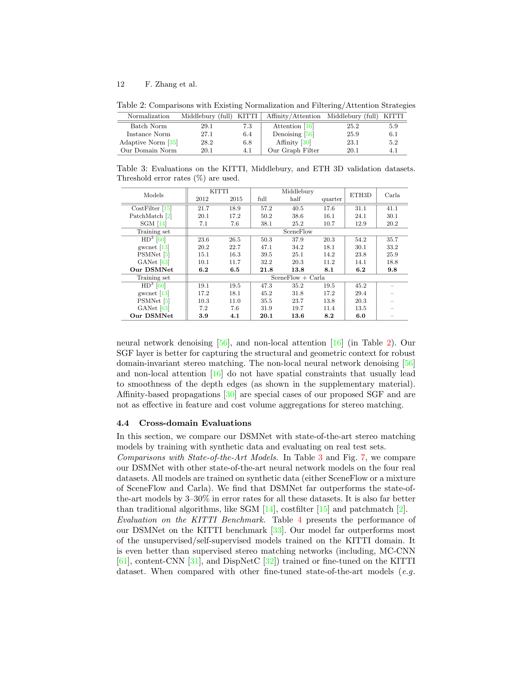

# DSM-Net: Domain-invariant Stereo Matching Networks

**Authors:** Feihu Zhang, Xiaojuan Qi, Ruigang Yang, Victor Prisacariu, Benjamin Wah, Philip Torr (Oxford, HKU, Baidu)
**Venue:** ECCV 2020
**Tier:** 3 (the seminal cross-domain stereo paper)

---

## Core Idea
Address the synthetic-to-real domain gap in stereo matching by training **only on synthetic data** while generalizing zero-shot to real domains. Achieved with two purpose-built layers: **Domain Normalization (DN)** that removes both image-level and pixel-level feature distribution shifts, and **Structure-preserving Graph-based Filter (SGF)** that captures geometric/structural context while suppressing domain-sensitive texture noise.

## Architecture

**Domain Normalization (DN):**
- Two-stage normalization combining **instance normalization** (across spatial H×W axis) with **L2 normalization** along the channel C axis per pixel
- Unlike batch norm (domain-dependent statistics) or instance norm alone (only image-level), DN simultaneously normalizes:
  - **Image-level style** (αI, βI parameters)
  - **Per-pixel local contrast** (αp parameter)

**Structure-preserving Graph-based Filter (SGF):**
- Trainable non-local filter built on an 8-connected pixel graph split into two directed sub-graphs (G1, G2)
- Edge weights = cosine similarity between pixel feature vectors
- Information propagates along all feasible paths → long-range spatial aggregation that respects image structure
- **GANet's SGA and affinity propagation are special cases** of this formulation (proven in the paper)

**Backbone:** GANet baseline with all BN replaced by DN; 7 SGF layers in feature extraction, 2 more in 3D cost volume aggregation. LGA is removed (captures domain-sensitive local patterns).

## Main Innovation
**Domain Normalization** — the insight that stereo suffers from **both** image-level style shifts **and** per-pixel feature norm variation across domains. Existing normalization methods address one but not both simultaneously. DN's per-pixel L2 normalization along the channel axis is a lightweight addition that produces dramatically more transferable features.

## Key Benchmark Numbers

**Trained on SceneFlow only, evaluated zero-shot:**

| Method | KITTI 2012 | KITTI 2015 | Middlebury | ETH3D |
|--------|-----------|-----------|-----------|-------|
| GANet (baseline) | 10.1% | 11.7% | 32.2% | 14.1% |
| **DSMNet** | **6.2%** | **6.5%** | **21.8%** | **6.2%** |

**With SceneFlow + CARLA training:**
- KITTI 2012: **3.9%**, KITTI 2015: **4.1%**

DN alone improves KITTI 2015 from 9.4% → 7.9% over baseline; full DSMNet reaches 6.5%.

## Role in the Ecosystem
**The seminal domain-generalization stereo paper.** Established the playbook that every cross-domain method since has built on:
- **HVT (CVPR 2023)** — uses DSMNet's DN as a baseline component, adds learnable visual transformations
- **FCStereo, GraftNet, MRL-Stereo** — all build on DN
- **Foundation stereo era** (DEFOM-Stereo, FoundationStereo) — implicitly inherits the cross-domain evaluation protocol that DSMNet popularized

## Relevance to Our Edge Model
**High.** Both DN and SGF are computationally lightweight, drop-in modules:
- **DN** is just a normalization variant with no extra parameters and negligible compute — directly substitutable for BatchNorm in our edge model's encoder
- **SGF** adds linear-complexity non-local aggregation that improves generalization — usable in our cost-volume aggregation if compute budget allows

For an edge model that **must generalize across indoor/outdoor/adverse conditions without target-domain fine-tuning**, DN is essentially a free upgrade.

## One Non-Obvious Insight
The paper proves mathematically that **SGA (GANet's semi-global aggregation) and affinity propagation are special cases of SGF** — meaning SGF is strictly more general. This implies replacing SGA-style aggregation with SGF doesn't sacrifice anything: SGF subsumes SGA's behavior while gaining cross-domain robustness. **Strict generalization improvements rarely come for free in deep learning** — when they do, you adopt them.
