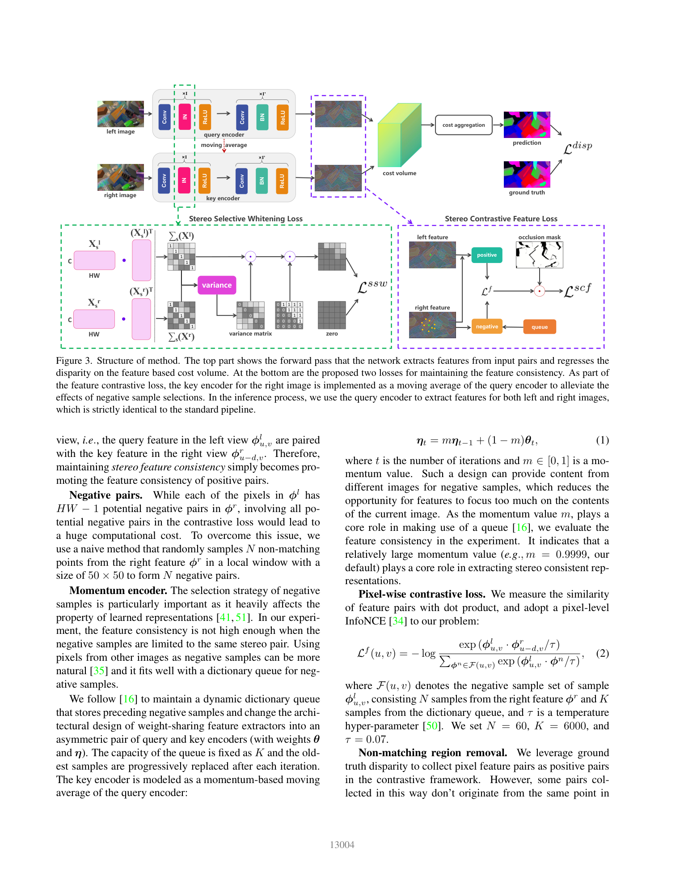
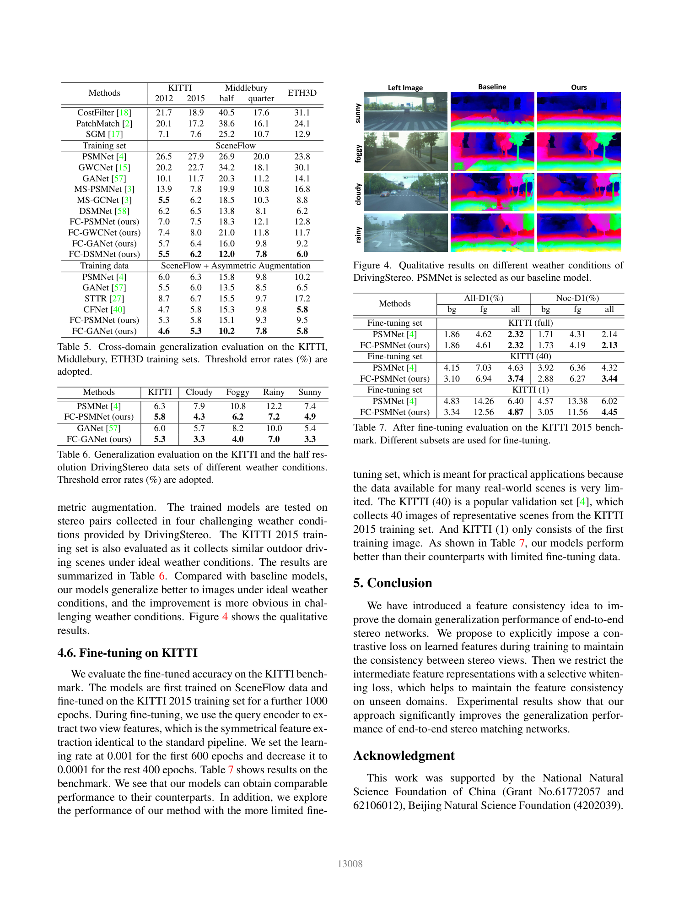

# Revisiting Domain Generalized Stereo Matching Networks from a Feature Consistency Perspective (FCStereo)

**Authors:** Jiawei Zhang, Xiang Wang, Xiao Bai, Chen Wang, Lei Huang, Yimin Chen (Beihang University); Lin Gu (RIKEN AIP / U. Tokyo); Jun Zhou (Griffith); Tatsuya Harada (RIKEN / U. Tokyo); Edwin R. Hancock (York)
**Venue:** CVPR 2022
**Tier:** 3 (feature-consistency domain generalization)

---

## Core Idea
What a stereo network truly needs to generalize is **matching relationships**, not appearance — i.e. the **feature consistency** of paired points between the left/right views. FCStereo enforces this with (a) a cross-view **pixel-wise contrastive loss** and (b) a **stereo selective whitening** loss that strips view-specific style from features.

## Architecture

- **Query encoder** (standard stereo feature extractor) + **Momentum encoder** (EMA copy, m = 0.999) that acts as a MoCo-style key generator for the right image
- **Stereo Contrastive Feature (SCF) loss:** pulls together features of corresponding left/right pixels (using disparity ground truth), pushes apart negatives drawn from a **momentum queue** across pairs
- **Stereo Selective Whitening (SSW) loss:** identifies style-sensitive covariance channels by injecting viewpoint-style perturbations, then whitens only those channels — preserving content while removing viewpoint-dependent statistics
- **Plug-in design:** tested on PSMNet, GWCNet, GANet, and DSMNet without architectural surgery
- **Inference:** symmetric — query encoder alone is used (no momentum overhead at test)

## Main Innovation
The first domain-generalization framework to **explicitly supervise cross-view feature consistency** via contrastive learning and selectively whiten only the style-correlated channels — counter-intuitively improving generalization by **strengthening the matching signal instead of regularizing the features globally**.

## Key Benchmark Numbers

**Trained on SceneFlow, tested without fine-tuning (threshold error rates):**

| Method | KT-15 >3px | MB half >2px | ETH3D >1px |
|---|---|---|---|
| PSMNet | 27.9 | 26.9 | 23.8 |
| FC-PSMNet | **7.5** | 18.3 | 12.8 |
| DSMNet | 6.5 | 13.8 | 6.2 |
| FC-DSMNet | **6.2** | **12.0** | **6.0** |

With asymmetric augmentation, FC-GANet reaches **5.3/10.2/5.8**. Feature cosine consistency rises from 0.65 (PSMNet) to **0.98** (FC-PSMNet) on KITTI.

## Role in the Ecosystem
FCStereo established the "**feature consistency is the root of generalization**" thesis that drove the 2022–2024 domain-generalization wave. Directly inspired **DKT-Stereo** (distilled knowledge transfer), influenced **ITSA-CFNet** (information-theoretic bottleneck), and is still a standard baseline in zero-shot stereo benchmarks.

## Relevance to Our Edge Model
The contrastive and whitening losses are **training-time-only** — zero inference overhead. This is essentially free cross-domain robustness for an edge model: we can add SCF+SSW during SceneFlow/synthetic pre-training and keep the tiny runtime backbone unchanged. The momentum queue is also cheap to implement in PyTorch Lightning and disappears at ONNX export time.

## One Non-Obvious Insight
Instance whitening **uniformly** hurts matching because it destroys content channels too. The paper shows that **only a subset of covariance channels encode style** — identified by injecting photometric perturbations and watching which covariance entries move most. Whitening **only those selected channels** improves generalization without damaging matching ability. This mirrors the broader lesson that in stereo, "domain style" lives in a low-rank subspace of features, not in the whole feature map.
