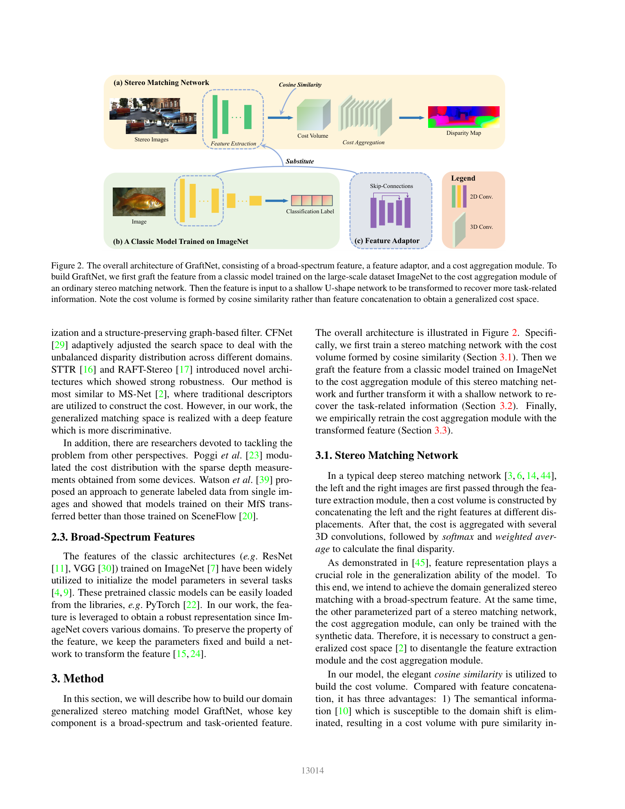
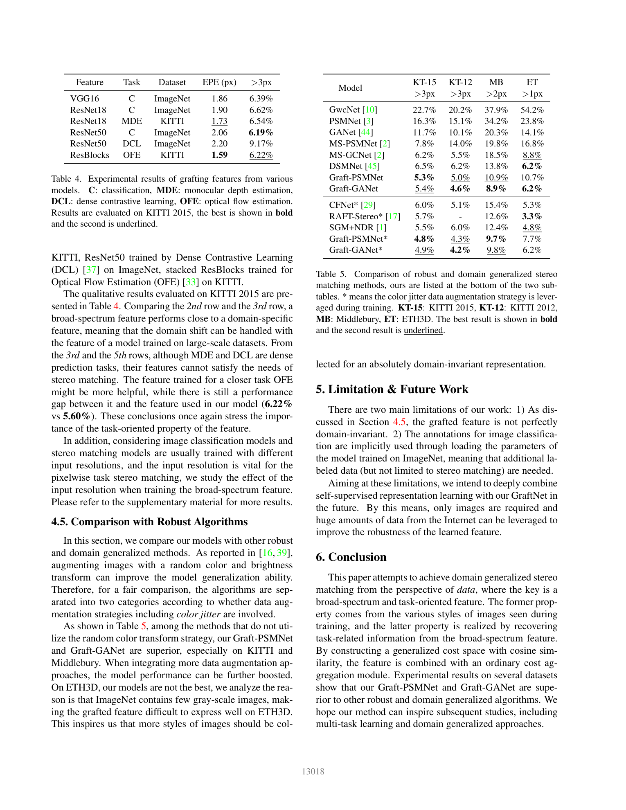

# GraftNet: Towards Domain Generalized Stereo Matching with a Broad-Spectrum and Task-Oriented Feature

**Authors:** Biyang Liu, Huimin Yu, Guodong Qi (Zhejiang University / ZJU-League R&D Center)
**Venue:** CVPR 2022
**Tier:** 3 (feature-graft domain generalization)

---

## Core Idea
**Graft** a large-scale-pretrained feature extractor (e.g. VGG/ResNet on ImageNet) into an existing stereo cost-aggregation module so that the domain-general prior of a broad-spectrum backbone is directly inherited by the stereo pipeline — enabled by replacing the feature-concatenation cost volume with a **cosine-similarity cost volume** that decouples the feature extractor from the aggregator.

## Architecture

- **Broad-spectrum feature:** a frozen classifier backbone (VGG16 on ImageNet works best) replaces the stereo network's feature extractor
- **Feature Adaptor:** a shallow **U-shape network** that transforms the generic classification feature into a task-oriented stereo feature, recovering fine texture lost in high-level classification features
- **Cosine-similarity cost volume:** replaces concatenation-based CV — normalized dot product gives a **pure similarity signal** that is domain-agnostic and prevents the aggregator from overfitting to specific feature magnitudes
- **Cost aggregation module:** unchanged (PSMNet or GANet-11), finally retrained with the adapted feature for best results
- **Three-stage pipeline:** train base stereo → freeze backbone, graft pretrained features → train adaptor → fine-tune CA

## Main Innovation
Showed that **feature extraction and cost aggregation can be decoupled** in deep stereo — but only if the cost volume carries **pure similarity** (cosine) rather than learned concatenation. This enables plug-in transfer of generic pretrained features, turning stereo generalization into a representation-transfer problem.

## Key Benchmark Numbers

**Trained on SceneFlow, zero-shot on real datasets (threshold error %):**

| Method | KT-15 | KT-12 | MB | ETH3D |
|---|---|---|---|---|
| PSMNet | 16.3 | 15.1 | 34.2 | 23.8 |
| GANet | 11.7 | 10.1 | 20.3 | 14.1 |
| DSMNet | 6.5 | 6.2 | 13.8 | 6.2 |
| **Graft-PSMNet** | 5.3 | 5.0 | 10.9 | 10.7 |
| **Graft-GANet** | **5.4** | **4.6** | **8.9** | 6.2 |

With color-jitter augmentation, Graft-GANet* reaches **4.9 / 4.2 / 9.8 / 6.2**. Ablations show cosine CV alone already drops KT-15 >3px from 19.5% → 15.4%; grafting VGG drops it to 6.39%, and adding the U-Net adaptor plus retraining takes it to **5.34%**.

## Role in the Ecosystem
GraftNet was the first to demonstrate **ImageNet-feature transfer** for stereo generalization — a direct precursor to the foundation-model-stereo era (DEFOM-Stereo grafting Depth Anything V2; FoundationStereo grafting DINOv2). The cosine-similarity CV insight is reused in many modern generalization-focused designs.

## Relevance to Our Edge Model
Highly relevant. Our target — an edge variant of DEFOM-Stereo — is conceptually a grafting operation from a monocular-depth foundation model into a cost-aggregation pipeline. GraftNet argues for:
1. **Cosine-similarity (normalized) cost volumes** over concatenation — cheaper on edge and more domain-robust
2. **Small U-Net adaptors** (a handful of conv layers) to bridge backbone features to matching features — which is exactly the parameter budget an edge design can afford
3. **Frozen pretrained backbones** → the adaptor-only fine-tune path reduces training cost drastically

## One Non-Obvious Insight
Features trained for **monocular depth estimation** (a seemingly closer task) transfer **worse than plain ImageNet classification** features when grafted. The reason: MDE features encode scene-specific depth cues (absolute scale, layout) that don't generalize, while classification features encode broad texture/object priors that happen to align with what stereo matching needs. "Broad-spectrum" beats "task-specific" when the target is generalization, not accuracy.
