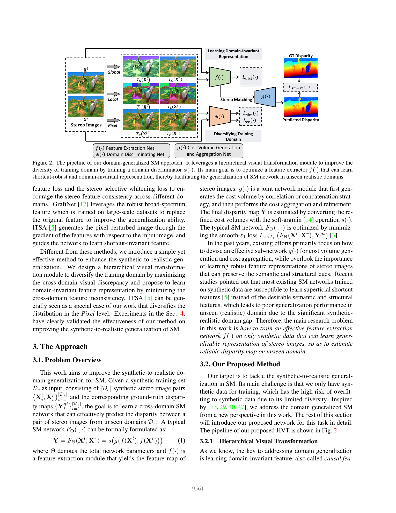
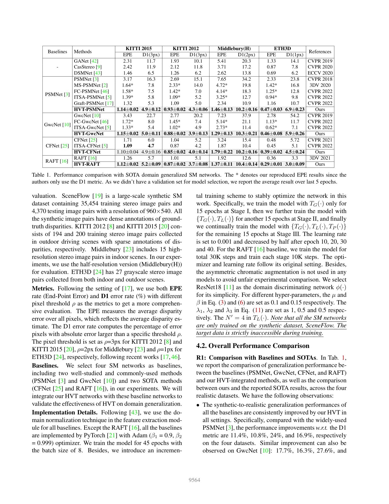

# HVT: Domain Generalized Stereo Matching via Hierarchical Visual Transformation

**Authors:** Tianyu Chang, Xun Yang, Tianzhu Zhang, Meng Wang (USTC, HFUT)
**Venue:** CVPR 2023
**Tier:** 3 (training-time augmentation for cross-domain stereo)

---

## Core Idea
Stereo networks trained on synthetic data fail because they learn **shortcut features** (consistent local RGB statistics, overreliance on chromaticity) instead of domain-invariant structural/semantic features. HVT trains a set of **learnable visual transformations** that augment training images at three hierarchical levels (Global, Local, Pixel), forcing the network to ignore distribution-specific shortcuts by simultaneously **maximizing cross-domain visual discrepancy** and **minimizing cross-domain feature inconsistency**.

## Architecture

**Three hierarchical transformation levels:**

1. **Global transformation TG** — adjusts brightness, contrast, saturation, hue with **learnable** sigmoid-bounded ranges
2. **Local transformation TL** — divides image into N′×N′ (default 4×4) non-overlapping patches and applies an independent TG per patch (mimics local illumination variation)
3. **Pixel transformation TP** — adds a learnable per-pixel perturbation matrix P (Gaussian noise scaled by learned weights W)

**Three complementary losses:**
- **Domain discrepancy loss** — minimizes cosine similarity between transformed and original features via discriminator φ
- **Cross-entropy domain classification loss** — 4-class (original + 3 transformed)
- **Feature inconsistency loss** — minimizes L2 distance between features of transformed vs. original stereo pairs

**Plug-and-play wrapper** around any backbone — evaluated on PSMNet, GwcNet, CFNet, RAFT-Stereo. DN from DSMNet is used as a standard component in all baselines.

## Main Innovation
**Hierarchical scale coverage of domain variation** (image-global → patch-local → pixel-level), combined with a **learned discriminator** that enforces transformed images to be genuinely "different domains" rather than mild augmentations. First work to make **augmentation strength itself a trainable parameter** (the sigmoid-bounded α parameters).

## Key Benchmark Numbers (zero-shot SceneFlow → real)

| Backbone | KITTI 2015 D1 | KITTI 2012 | Middlebury(H) | ETH3D |
|----------|---------------|------------|---------------|-------|
| PSMNet (baseline) | 16.3% | 15.1% | 34.2% | 23.8% |
| **HVT-PSMNet** | **4.9%** | **4.3%** | **10.2%** | **6.9%** |
| HVT-GwcNet | 5.0% | 3.9% | 10.3% | 5.9% |
| **HVT-RAFT** | **5.2%** | **3.7%** | 10.4% | **3.0%** |

Compared to **DSM-Net (ECCV 2020)**, HVT-PSMNet improves KITTI 2015 from 6.5% → **4.9%** and Middlebury from 13.8% → **10.2%**.

Ablation confirms all three transformation levels are **complementary** — removing any one hurts every dataset.

## Role in the Ecosystem
HVT is a **training-time-only** module — zero inference overhead. It demonstrated that learnable augmentation is more effective than hand-tuned augmentation for stereo cross-domain generalization, and inspired subsequent domain-randomization stereo methods.

## Relevance to Our Edge Model
**Highly applicable.** HVT provides a recipe for training any stereo backbone (including a future lightweight edge backbone) to generalize across synthetic-to-real domain gaps **without collecting target-domain data or modifying the architecture**. Implementation cost is purely in the training loop:
- A 4×4 patch loop and a small discriminator network
- 3-stage incremental training schedule
- Zero parameters or compute added at inference

This is a **free upgrade** for our edge model's training pipeline.

## One Non-Obvious Insight
HVT's **learnable augmentation range** (the sigmoid-bounded α parameters) means the network actively learns **"how much"** to perturb training data for optimal generalization, rather than tuning augmentation strength by hand. This is an **implicit curriculum**: discriminator and matching network co-adapt during training to find the **hardest useful distribution shift** — conceptually related to adversarial training, but without an explicit generator network. This pattern (let the network find its own augmentation) is broadly applicable across vision tasks.
