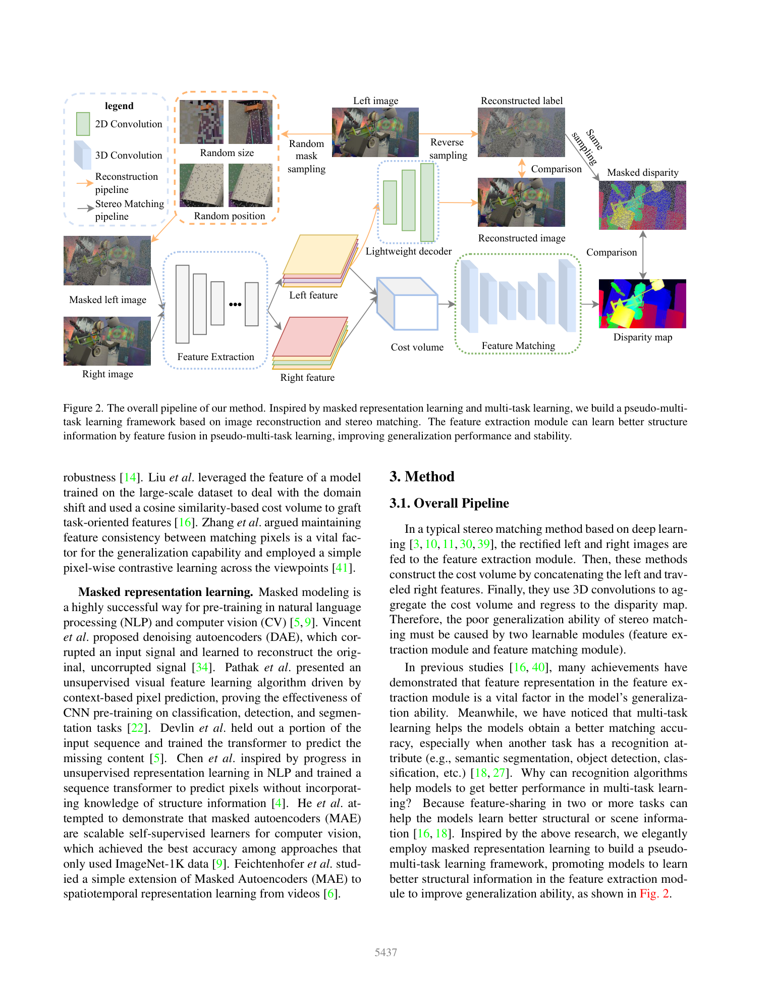
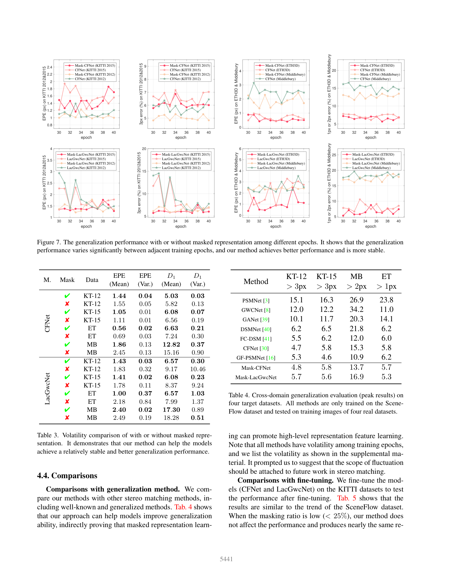

# Masked Representation Learning for Domain Generalized Stereo Matching (MRL-Stereo)

**Authors:** Zhibo Rao, Bangshu Xiong (Nanchang Hangkong University); Mingyi He, Yuchao Dai, Renjie He, Xing Li (Northwestern Polytechnical University); Zhelun Shen (Baidu Research)
**Venue:** CVPR 2023
**Tier:** 3 (masked representation learning for domain generalization)

---

## Core Idea
Feed a **randomly masked left image** and the complete right image into the stereo network, and attach a **lightweight decoder** that reconstructs the original left image from intermediate features — turning stereo matching into a **pseudo multi-task** (matching + image reconstruction) problem. This forces the feature extractor to encode **structure information** rather than appearance shortcuts, yielding better and **more stable** generalization across training epochs.

## Architecture

- **Random-size / random-position mask sampling** on the left image (mask ratio ~0.15–0.25 works best; >0.35 degrades matching)
- **Shared feature extractor** produces left (masked) and right features — right feature is also used for matching and for **reverse-sampling** supervision of masked regions
- **Standard stereo matching pipeline** (CFNet or LacGwcNet backbones) with standard cost volume + 3D aggregation
- **Lightweight reconstruction decoder:** a small conv-decoder branch predicts the original left image from the left feature
- **Comparison / masked-disparity supervision:** reconstruction loss + standard disparity loss, trained jointly
- **Test time:** decoder is discarded — only the stereo branch runs, so **zero inference overhead**

## Main Innovation
The first to identify and explicitly address the **volatility of generalization performance across training epochs** (a domain-generalized model can swing wildly on unseen domains from one epoch to the next). Masked representation learning acts as both a regularizer for structural features and a **stabilizer** of cross-domain error curves.

## Key Benchmark Numbers

**SceneFlow-trained, cross-domain (peak results, threshold error %):**

| Method | KT-12 >3px | KT-15 >3px | MB >2px | ETH3D >1px |
|---|---|---|---|---|
| PSMNet | 15.1 | 16.3 | 26.9 | 23.8 |
| DSMNet | 6.2 | 6.5 | 21.8 | 6.2 |
| FC-DSM | 5.5 | 6.2 | 12.0 | 6.0 |
| CFNet | 4.7 | 5.8 | 15.3 | 5.8 |
| **Mask-CFNet** | 4.8 | 5.8 | 13.7 | 5.7 |
| **Mask-LacGwcNet** | 5.7 | 5.6 | 16.9 | **5.3** |

**Volatility (D1 variance across epochs 30-40) on LacGwcNet / KT-12:** 10.46 → **0.30** (~35× more stable with masking).

## Role in the Ecosystem
MRL-Stereo ported the **MAE / masked-modeling** idea from ViT pretraining into stereo, complementary to contrastive (FCStereo) and feature-graft (GraftNet) approaches. It also introduced the **volatility-of-generalization metric**, which later work picked up as a secondary evaluation axis. Sits in the same line as DKT-Stereo and more recent self-supervised generalization methods.

## Relevance to Our Edge Model
Two edge-friendly takeaways:
1. **Training-only auxiliary decoder** — the reconstruction branch is completely removed at inference, so we pay zero edge-device cost for substantially improved cross-domain stability. Ideal for a Jetson-deployed model trained on SceneFlow + synthetic data.
2. **Stability at deployment time** — the paper's central finding (generalization swings ±10% EPE across epochs) warns us to not cherry-pick checkpoints by source-domain validation. The MRL recipe narrows the band and makes checkpoint selection robust, which matters when shipping an edge model.

## One Non-Obvious Insight
The mask ratio **must stay low** (~0.15–0.25), unlike MAE in ViT pretraining where ~0.75 works. In stereo, high mask ratios reduce the matchable area in the feature matching module — pixels with no right-view correspondence literally cannot be supervised. So stereo masking is a **regularization**, not a pretext task: the goal is tiny disturbances that bias the encoder toward structural features, not large-scale self-supervision. Also the authors explicitly caution that KITTI/ETH3D/Middlebury **are not truly unseen domains** (they share scene categories with SceneFlow subsets), and show failures on remote-sensing / human-body imagery — an important sanity check for anyone claiming "zero-shot" results.
