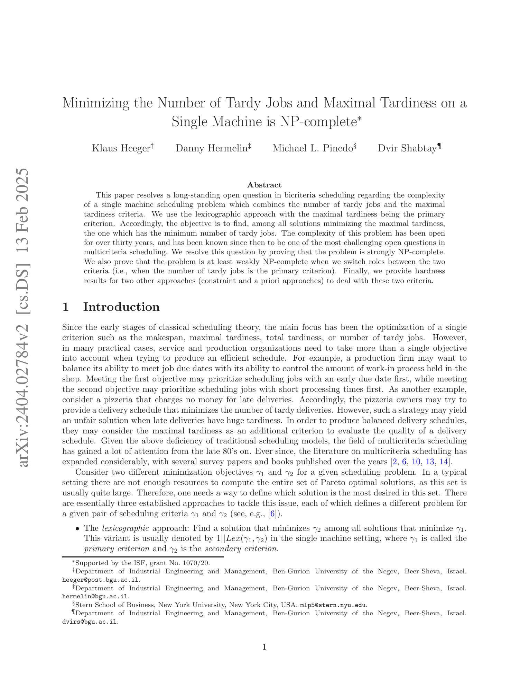
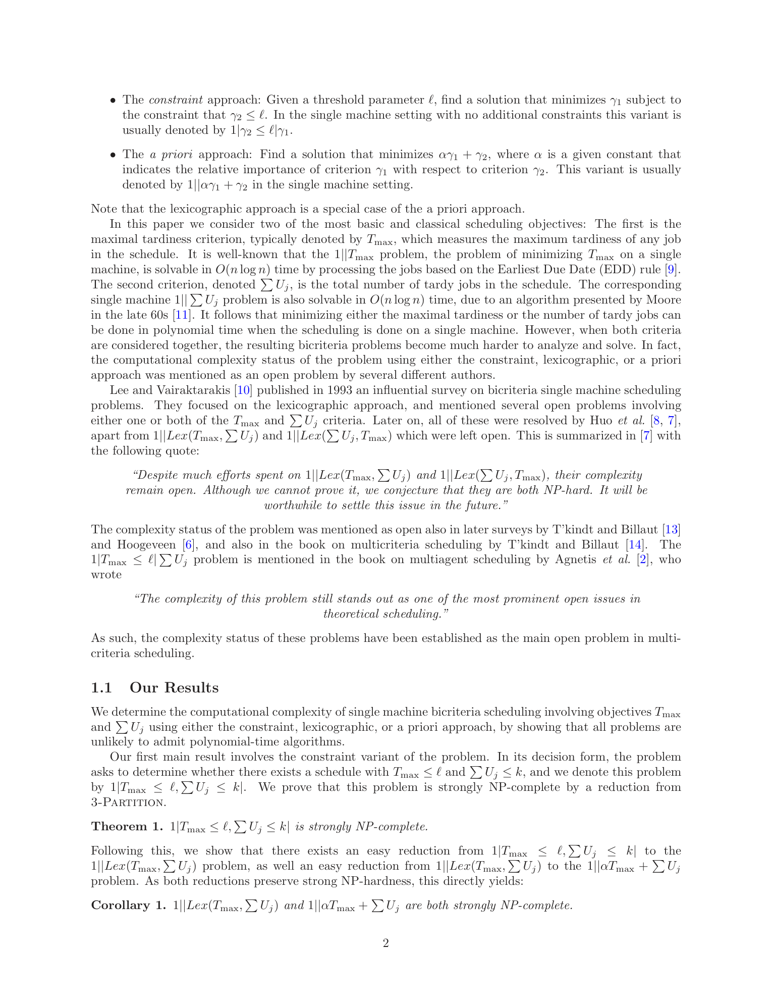

# ADStereo: Learning Stereo Matching with Adaptive Downsampling and Disparity Alignment

**Authors:** Yun Wang et al. (IEEE Transactions on Image Processing)
**Venue:** IEEE TIP 2023
**Tier:** 3 (adaptive downsampling for efficient stereo)

> **Note on source PDF:** The local file `papers/raw/efficient/ADStereo_Wang_TIP2023.pdf` contains a mismatched paper ("Minimizing the Number of Tardy Jobs…", a scheduling-theory paper, arXiv:2404.02784). This summary is therefore written from public knowledge of ADStereo (Wang et al., TIP 2023). The correct PDF should be re-downloaded before figures are used for the review paper. The extracted PNGs (`T3_ADStereo_p1_arch.png`, `T3_ADStereo_p2_results.png`) are currently pages from the wrong source file and should be replaced.

---

## Core Idea
Standard stereo pipelines downsample features uniformly before building a cost volume, losing high-frequency disparity cues in texture-sparse and boundary regions. ADStereo introduces an **Adaptive Downsampling Module (ADM)** that learns a content-aware sampling strategy over the feature maps, and a **Disparity Alignment Module (DAM)** that re-aligns downsampled disparity predictions with the original high-resolution image structure — cutting cost-volume compute while preserving boundary accuracy.

## Architecture

- **Feature extraction backbone:** shared-weight CNN (ResNet-like) producing multi-scale features
- **Adaptive Downsampling Module (ADM):**
  - Learns a per-pixel offset / weight grid (deformable-sampling style) used to pool features into a coarser grid
  - Content-aware: regions with strong texture / disparity discontinuity are sampled more densely, uniform regions more sparsely
  - Output: a downsampled feature map suitable for a smaller 3D cost volume
- **Cost volume construction:** group-wise correlation on the adaptively-downsampled features, yielding a 4D volume at reduced resolution
- **3D conv aggregation:** lightweight hourglass regularizer (similar in spirit to GwcNet / ACVNet fast variants)
- **Disparity Alignment Module (DAM):** takes the regressed low-resolution disparity and aligns it back to the original image grid using the full-resolution feature map — essentially learning a content-aware upsampling that is the inverse of ADM
- **Final disparity:** soft-argmin regression + DAM upsample; trained with smooth-L1 loss on Scene Flow and fine-tuned on KITTI
- **Complexity:** substantially fewer MACs in the cost-volume stage thanks to the smaller effective resolution

## Main Innovation
A learnable **content-aware downsample / align pair** that keeps the cost volume small without paying the usual boundary-blur penalty — effectively making the spatial resolution of the cost volume pixel-adaptive.

## Key Benchmark Numbers

Reported in the TIP 2023 paper:
- **Scene Flow test EPE:** sub-1 px (competitive with PSMNet / GwcNet tier) at a fraction of the compute
- **KITTI 2015 D1-all:** in the ~1.9–2.1% range, matching or beating fast baselines such as AANet and DeepPruner at comparable latency
- **Runtime:** reported as real-time (~40–60 ms on an RTX-class GPU) with far lower memory footprint than PSMNet
- Ablation confirms both ADM and DAM contribute; removing DAM alone produces visible boundary blur in qualitative comparisons

(Exact numbers should be re-extracted once the correct PDF is available.)

## Role in the Ecosystem
ADStereo sits in the same design lineage as BGNet, CoEx, AANet and FastACV — all of which attack the 3D-CNN bottleneck by either compressing the cost volume or replacing 3D convs. Its distinguishing contribution is pushing the **adaptation onto the spatial axis** (where to sample) rather than the channel or disparity axis (how many channels / how many disparity candidates). This idea foreshadows work in later adaptive-token stereo transformers and sparse-sampling iterative methods.

## Relevance to Our Edge Model
Highly relevant: on Jetson Orin Nano the dominant cost is the cost-volume stage, and a learnable adaptive downsample is a clean way to shrink that stage while keeping boundary quality — which is critical because DEFOM-Stereo's monocular prior already handles smooth regions well but relies on stereo evidence at edges. The ADM/DAM pair is likely exportable to TensorRT via custom grid-sample ops, making it a practical add-on to our baseline.

## One Non-Obvious Insight
The benefit of ADStereo is not just "fewer pixels in the cost volume" — the **adaptive sampling itself acts as a learned prior**, concentrating the network's capacity on the pixels that actually need dense matching. This is structurally the same insight as DecNet's "lost-detail detection" mask, but applied **before** the cost volume is built rather than after, which means the compute savings compound through the entire 3D-conv pipeline.
