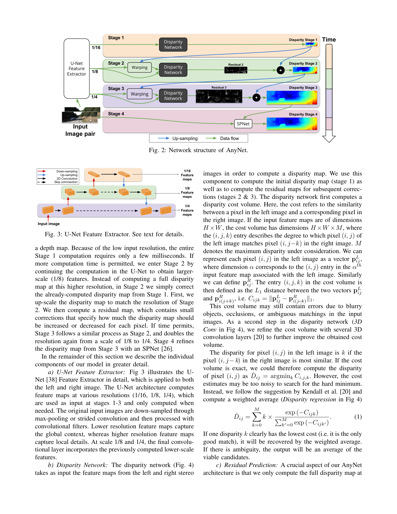
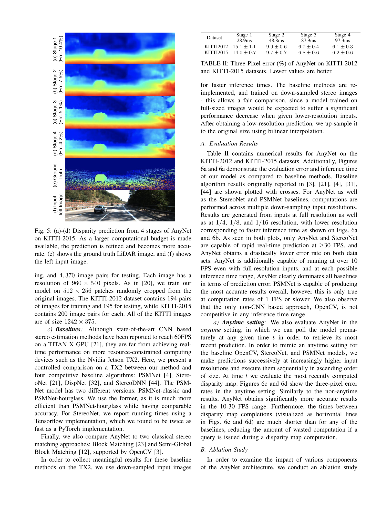

# Anytime Stereo Image Depth Estimation on Mobile Devices (AnyNet)

**Authors:** Yan Wang, Zihang Lai, Gao Huang, Brian H. Wang, Laurens van der Maaten, Mark Campbell, Kilian Q. Weinberger (Cornell + Oxford + Facebook AI)
**Venue:** ICRA 2019
**Tier:** 3 (anytime inference, mobile GPU target)

---

## Core Idea
Single network that can be **polled at any time during inference** to emit the current-best disparity map, trading off latency for accuracy on-the-fly. Depth is computed in four progressively higher-resolution **stages**, each predicting a small disparity residual on top of the previous stage's output — so compute already spent is never wasted.

## Architecture

- **U-Net feature extractor (shared Siamese):** produces features at 1/16, 1/8, 1/4 resolutions with skip connections — *critical for low-res stage quality*
- **Stage 1 (1/16 res):** full disparity search (max disparity M=192/16=12), distance-based cost volume (L1 feature diff, not concat), small 3D conv stack, soft-argmax → coarse disparity
- **Stage 2 & 3 (1/8, 1/4 res):** warp right features by upsampled disparity, compute **residual cost volume over only M=5 offsets (−2..+2)**, predict residual → add back
- **Stage 4:** SPNet (Spatial Propagation Network) sharpens 1/4 disparity using learned affinity filters predicted from the left image
- **Anytime property:** inference can stop after any stage — Stage 1 on TX2 ≈29 ms, Stage 4 ≈97 ms
- **Parameters: only ~40K** — two orders of magnitude smaller than PSMNet
- **Joint loss** over all four stages during training

## Main Innovation
The **residual cost volume with tiny M=5 search range** is the key efficiency trick — it limits compute at high resolutions to ~10-20% of what a full-range search would cost while still correcting the coarse disparity, enabling a fully cascaded multi-resolution pipeline at real-time rates on a Jetson TX2.

## Key Benchmark Numbers

**Jetson TX2, KITTI-2015 3-pixel error (%):**
| Stage | Time | KITTI2012 | KITTI2015 |
|---|---|---|---|
| 1 | 28.9 ms | 15.1 | 14.0 |
| 2 | 48.8 ms | 9.9 | 9.7 |
| 3 | 87.9 ms | 6.7 | 6.8 |
| 4 | 97.3 ms | **6.1** | **6.2** |

Runs at **10–35 FPS on Jetson TX2** at 1242×375, vs PSMNet OOM / multi-second on the same device.

## Role in the Ecosystem
AnyNet established the **residual cost volume cascade** as the canonical multi-scale stereo pattern. This idea — full-range search only at coarsest scale, narrow residual search at finer scales — reappears in CFNet (cascade cost volumes), HITNet (tile propagation), CasStereo, and IGEV-Stereo's hierarchical init. It is also the first deep stereo paper to **report results specifically on Jetson TX2**, pioneering the embedded-deployment benchmark culture.

## Relevance to Our Edge Model
The M=5 residual cost volume is **directly reusable** in our Orin Nano DEFOM variant — we can run full DEFOM cost volume at 1/16, then do residual corrections at 1/8 and 1/4 with tiny GRU updates. AnyNet's Jetson numbers give us a credible target: 10–35 FPS on TX2 means Orin Nano should comfortably hit our <33 ms budget if we keep M small at fine scales. The anytime-polling property is attractive for robotics/AV use where frame deadlines vary.

## One Non-Obvious Insight
The U-Net feature extractor matters dramatically more than one might expect: removing it (keeping total compute constant via three separate ConvNets) degrades Stage-1 error from 10.4% to **20.4%** — doubling it. The reason is that the 1/16 cost volume *alone* has no local appearance context; it relies entirely on the U-Net's upsampling path to inject high-frequency semantic features back into the low-resolution matching head. This suggests that for edge stereo, **feature extractor design matters more than cost volume design** — a lesson that directly applies to our Depth-Anything-backbone fusion strategy.
