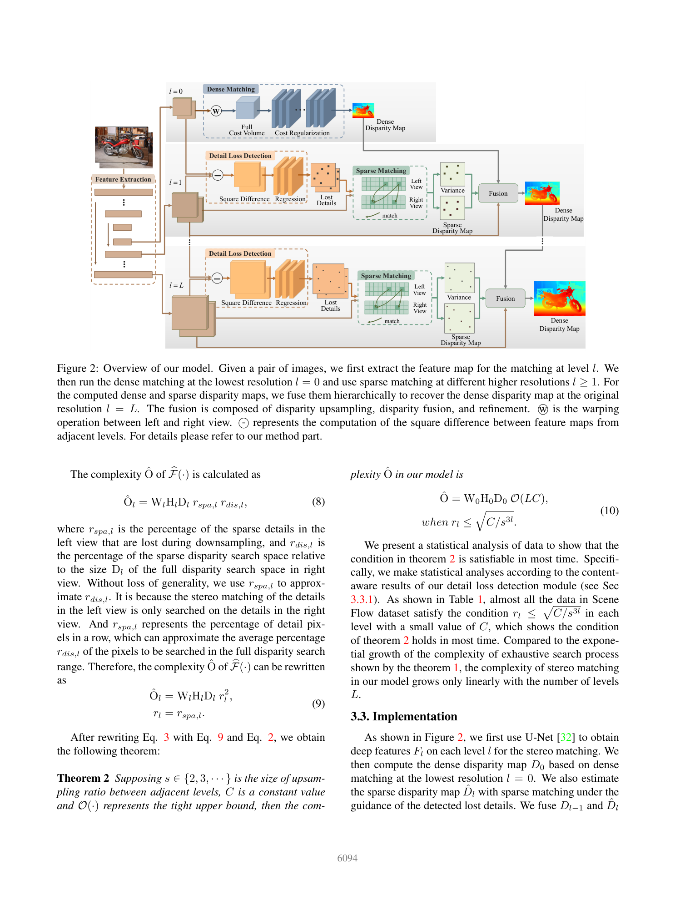
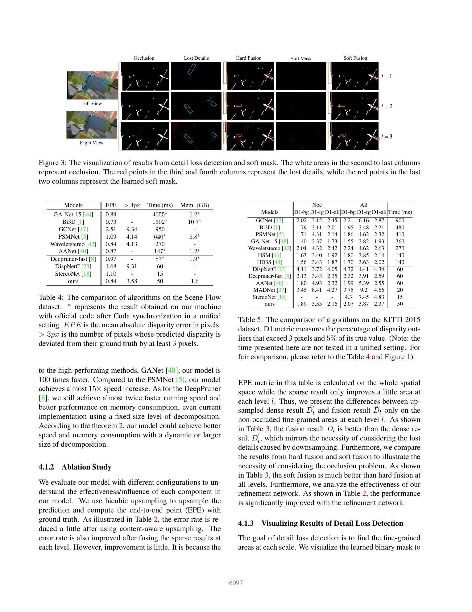

# DecNet: A Decomposition Model for Stereo Matching

**Authors:** Chengtang Yao, Yunde Jia, Huijun Di, Pengxiang Li, Yuwei Wu (Beijing Laboratory of Intelligent Information Technology, Beijing Institute of Technology)
**Venue:** CVPR 2021
**Tier:** 3 (dense-then-sparse decomposition for high-resolution stereo)

---

## Core Idea
Instead of running dense matching at every pyramid level, DecNet **decomposes** stereo matching into (1) a single **dense full cost-volume match at the lowest resolution** and (2) a cascade of **sparse matches at higher resolutions** that only recover the disparity at pixels flagged as "lost details". The result is a coarse-plus-fine (not coarse-to-fine) pipeline whose cost grows with the number of high-resolution detail pixels, not with total pixel count — enabling near-linear scaling to 4K-class inputs.

## Architecture

- **Feature extraction:** shared CNN produces multi-scale feature maps F₀…F_L
- **Dense matching (level 0):** full 3D cost volume + 3D conv cost regularization + softmax regression — cheap because the lowest-resolution search space is tiny
- **Detail Loss Detection (DLD):** binary mask M_FA derived from the squared difference between F_l and the upsampled F'_(l−1); learned **unsupervised** to flag pixels whose information disappears during downsampling
- **Sparse matching:** at detected lost-detail pixels only, compute cross-correlation over a small disparity window and apply softmax to recover high-frequency disparity
- **Disparity upsampling:** dynamic upsampling (learned kernels) lifts D_(l−1) to level l
- **Disparity fusion:** soft mask M_l blends the upsampled dense disparity D'_l with the sparse one D̂_l as D̄_l = D'_l(1−M_l) + D̂_l·M_l
- **Refinement:** lightweight network removes residual artifacts at each level
- **Complexity bound Ô_l** derived formally: authors prove 99%+ of Scene Flow pixels satisfy the sparsity condition r_l ≤ √(C/s³^l), justifying the sparse formulation

## Main Innovation
A provably **sparse multi-scale matching** that replaces the usual pyramid-wise dense dense-to-fine search with a single dense pass at low resolution plus a sparse "detail completion" step — transforming the cost-volume memory/compute curve from O(HWD) to nearly O(N_detail).

## Key Benchmark Numbers

**Scene Flow (EPE, px):** **0.84** with every fusion component enabled (ablation Table 2).

**KITTI 2015 test (D1-all):**
- DecNet reports **2.37%** at **~50 ms** — comparable to DeepPruner-Fast (2.59% @ 60 ms) and AANet+ (2.03% @ 60 ms) in its latency tier
- Significantly faster than PSMNet / GANet while staying within ~0.3% D1

**Memory / runtime:** O(1) extra memory per extra resolution level relative to the lowest-resolution cost volume — key for 4K deployment.

## Role in the Ecosystem
DecNet crystallized the **"coarse + sparse-fine" paradigm** that later appears in **HITNet** (tile hypotheses), **PCVNet** (parameterized distributions at selected pixels), and the TopK candidate strategy in **IINet**. Its framing of "lost-detail detection" as a learnable binary mask is an early example of adaptive computation in stereo and directly inspired later confidence-based filtering pipelines.

## Relevance to Our Edge Model
Two transferable ideas for Jetson Orin Nano: (1) run DEFOM-Stereo's GRU updates **only on detail pixels** flagged by a cheap mask, cutting the dominant iteration cost by 5–10x on typical driving scenes; (2) decouple the monocular-prior scale correction (cheap, full-resolution) from stereo residual matching (expensive, sparse). The DLD unsupervised-mask formulation is a drop-in candidate for sparsifying our recurrent refinement.

## One Non-Obvious Insight
The authors show that **hard vs. soft fusion** of dense and sparse disparities matters far more than either component alone — hard fusion at level 3 gives EPE 1.010 but soft fusion drops it to **0.893**. The lesson: the right blending of a coarse-dense and a fine-sparse signal is itself a learnable module, not a trivial max/argmax decision.
