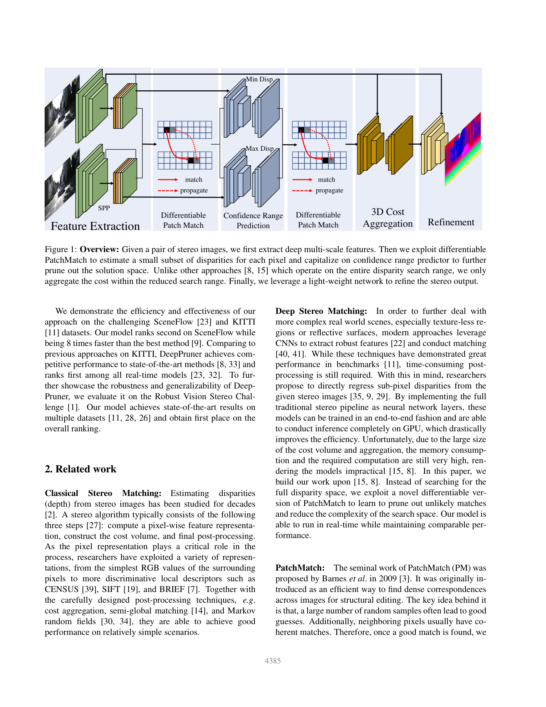
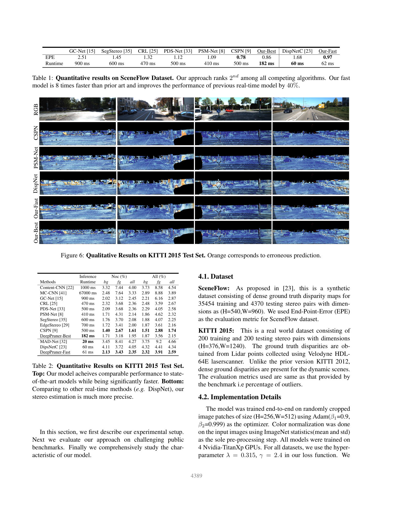

# DeepPruner: Learning Efficient Stereo Matching via Differentiable PatchMatch

**Authors:** Shivam Duggal, Shenlong Wang, Wei-Chiu Ma, Rui Hu, Raquel Urtasun (Uber ATG / Univ. of Toronto / MIT)
**Venue:** ICCV 2019
**Tier:** 3 (differentiable PatchMatch + cost volume pruning)

---

## Core Idea
Replace the fixed, dense disparity search of a 3D cost volume with a **per-pixel adaptive search range** learned via a **differentiable PatchMatch** module and a **Confidence Range Predictor (CRP)**. Only the pruned hypotheses go into the expensive 3D cost aggregation — saving both memory and compute by ~8× versus contemporary SOTA, while keeping accuracy.

## Architecture

- **Feature Extraction:** shared ResNet-like Siamese + Spatial Pyramid Pooling
- **Differentiable PatchMatch (round 1):** alternating *random-sample* and *propagation* layers implemented as a recurrent unit; each iteration keeps K best disparities per pixel. Generalized softmax (straight-through) makes the argmax differentiable
- **Confidence Range Predictor (CRP):** a small CNN takes the PatchMatch output and emits per-pixel `[d_min, d_max]` — the pruned search range
- **Differentiable PatchMatch (round 2):** re-samples within the pruned range to produce final disparity hypotheses
- **3D Cost Aggregation:** only evaluates the **narrow, per-pixel** cost volume on the pruned hypotheses (not the full 192-wide volume)
- **Image-Guided RefineNet:** lightweight 2D CNN that uses the left image and disparity for residual refinement
- **End-to-end differentiable** — trained with L1 + smooth-L1 loss
- Two variants: **DeepPruner-Best** (182 ms) and **DeepPruner-Fast** (61 ms)

## Main Innovation
A **differentiable, end-to-end learnable PatchMatch** that makes classical random-search + propagation compatible with deep networks — enabling *adaptive, per-pixel* cost-volume sparsity, which previous fixed-multiscale methods could not provide.

## Key Benchmark Numbers

**SceneFlow (EPE):**
- DeepPruner-Best = **0.86 px** @ 182 ms (2nd overall, 2.5× faster than CSPN)
- DeepPruner-Fast = **0.97 px** @ 62 ms (beats DispNetC 1.68 by 40% at same speed)

**KITTI 2015 test (D1-all %):**
- DeepPruner-Best = **2.15** @ 182 ms (vs PSMNet 2.32 @ 410 ms)
- DeepPruner-Fast = **2.59** @ 61 ms (vs DispNetC 4.34, MAD-Net 4.66)

**Runtime breakdown (Best):** feature 54 ms, PatchMatch-1 20 ms, CRP 61 ms, PatchMatch-2 13 ms, aggregation 32 ms, refinement 3 ms.

## Role in the Ecosystem
DeepPruner started the **"sparse / pruned cost volume"** efficient-stereo line that later includes CFNet (narrow-band cost volumes), CasStereo (cascade-from-coarse), and most modern iterative methods where each GRU step only looks at a small local cost slice (RAFT-Stereo all-pairs is itself a learned sampling strategy). Its core insight — that 3D cost aggregation should **not** be uniformly dense in disparity — underlies most edge-stereo work.

## Relevance to Our Edge Model
Adaptive per-pixel disparity pruning is **exactly the right primitive for Jetson Orin Nano**: DEFOM-Stereo's monocular prior from Depth Anything V2 already gives us a per-pixel disparity *estimate* and *confidence*, so the CRP step is effectively free — we can skip PatchMatch rounds entirely and use the mono prior to prune directly, then run a narrow-band cost volume + lightweight GRU. This should yield DeepPruner-Fast-class speed (~60 ms) with DEFOM-level accuracy.

## One Non-Obvious Insight
The network does **not need to run PatchMatch to full convergence** — just ~3 iterations are enough because the CRP afterwards accommodates residual uncertainty. In fact, PatchMatch-2 (the second round after pruning) is **only used during SceneFlow pre-training** and dropped entirely at KITTI fine-tuning with no accuracy loss, as the pruned ranges are already tight enough that direct 3D aggregation suffices. This echoes a broader theme: **coarse-but-confident initialization lets you truncate the expensive downstream machinery** — directly relevant to leveraging monocular priors in our edge model.
