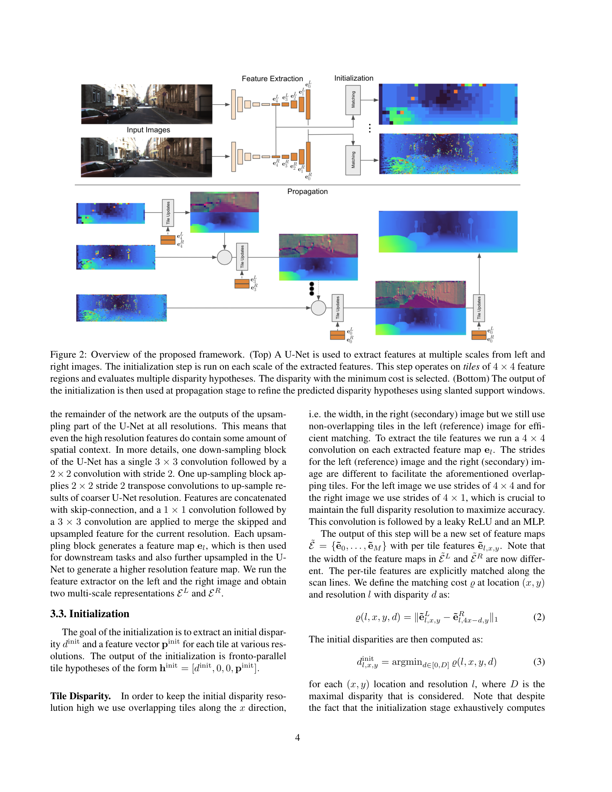
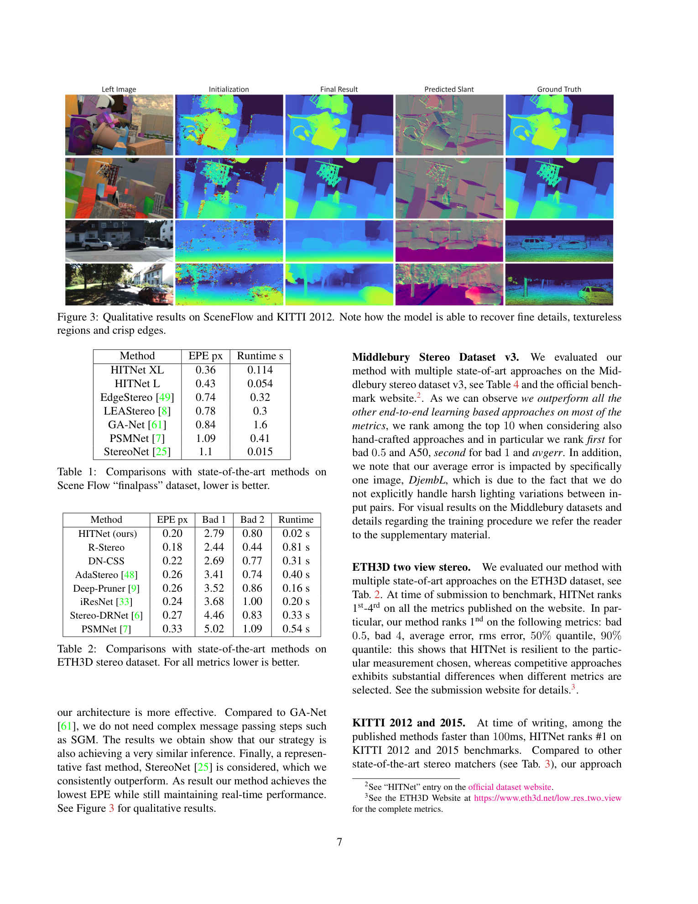

# HITNet: Hierarchical Iterative Tile Refinement Network for Real-time Stereo Matching

**Authors:** Vladimir Tankovich, Christian Häne, Yinda Zhang, Adarsh Kowdle, Sean Fanello, Sofien Bouaziz (Google)
**Venue:** CVPR 2021
**Tier:** 3 (tile-based non-volumetric real-time stereo)

---

## Core Idea
**Do not build a full 3D cost volume at all.** Instead, represent disparity as a lattice of **4×4 tiles**, each holding a **slanted plane hypothesis** (disparity + dx/dy gradients + per-tile descriptor). Generate a tiny multi-resolution initialization via cheap per-tile matching, then iteratively **propagate and refine** these slanted tiles across resolutions using 2D convolutions and differentiable warping — achieving SOTA accuracy at 20× the speed of volumetric 3D-CNN methods.

## Architecture

- **U-Net feature extractor** (shared) producing multi-resolution features; the high-resolution outputs still carry spatial context from the upsampling path
- **Initialization stage (per resolution):** each 4×4 tile evaluates a small set of disparity candidates, computes matching cost, and picks the minimum; per-tile descriptor is a learned embedding of the winning features
- **Slanted plane hypotheses:** each tile carries `(d, dx, dy, feature_descriptor)` — unlike a flat fronto-parallel disparity map, this models surface orientation explicitly
- **Propagation network** (2D conv-based) runs iteratively, reading tiles at current + coarser scales, generating slant-aware warped features, and updating tile parameters
- **Geometric warping** uses the slant parameters for sub-pixel-accurate, orientation-aware sampling during propagation — critical for the sharp-edge results
- **No 3D convolutions anywhere** — entire pipeline is 2D conv + warping
- **Multi-scale iterative output** — final full-resolution disparity reconstructed from highest-res tiles

## Main Innovation
Replacing the cost volume with **a tile-based slanted-plane representation refined by 2D propagation** — delivers SOTA accuracy on ETH3D, KITTI, and Middlebury at runtimes an order of magnitude below 3D-CNN methods (20 ms on a desktop GPU). The slanted-plane parameterization is what enables crisp edges without an explicit refinement module.

## Key Benchmark Numbers

**SceneFlow finalpass (EPE):**
- HITNet XL = **0.36 px** @ 114 ms
- HITNet L = **0.43 px** @ 54 ms (vs PSMNet 1.09 @ 410 ms, StereoNet 1.1 @ 15 ms)

**ETH3D two-view (bad 1.0 / 2.0):**
- HITNet = **2.79 / 0.80** @ **20 ms** (vs DeepPruner 3.52 / 0.86 @ 160 ms, PSMNet 5.02 / 1.09 @ 540 ms)

**KITTI 2012 / 2015:** Among methods <100 ms, HITNet **ranked #1** at time of publication.

## Role in the Ecosystem
HITNet proved that **explicit geometric parameterization (slanted planes)** can replace brute-force 3D cost aggregation — a philosophical cousin to NMRF / BridgeDepth's explicit MRF formulation. Its tile-based representation influenced later real-time work (PBCStereo, tile-aware refinement in newer methods). However, **HITNet is also the poster-child for cross-domain fragility in non-iterative methods**: Pip-Stereo (CVPR 2026) documents HITNet at **93% D1** on DrivingStereo weather conditions — the speed comes at the cost of robustness because the slanted-plane iteration count is fixed and tied to training resolutions.

## Relevance to Our Edge Model
Two lessons for our Orin Nano DEFOM variant. **Positive:** the tile/slanted-plane representation is ~100× lighter than a full cost volume; combining it with mono-depth-initialized tiles (instead of random init) could be a killer efficient architecture. **Cautionary:** HITNet's cross-domain failure means we should **not** throw away iteration entirely — keeping a small (2–3) RAFT-style GRU stack on top of a HITNet-style fast init gives us both speed and robustness. This matches what IGEV-Stereo and FoundationStereo have converged on: fast init + short iterative refinement.

## One Non-Obvious Insight
The slanted-plane parameterization is not just an accuracy trick — it is what makes **warping-based propagation numerically stable across scales**. With fronto-parallel tiles, upsampling a coarse disparity introduces discretization "stair-stepping" that breaks the propagation cost signal. With slanted planes, the same tile can predict sub-tile disparity variation, so upsampling produces a smooth disparity field and the propagation network receives clean gradients. This is why HITNet's 2D-only architecture can match 3D-conv accuracy: **the representation, not the aggregation, does most of the work.** For our edge model this suggests we should seriously consider emitting slant-aware tiles from the DEFOM fusion head, not scalar disparities.
