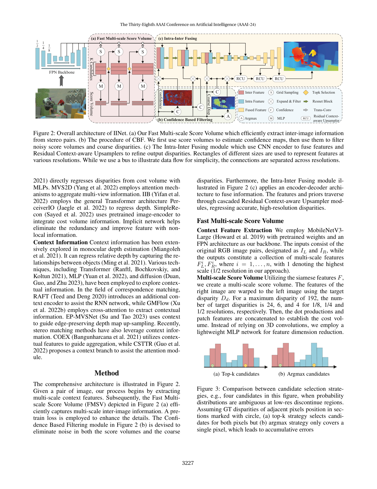
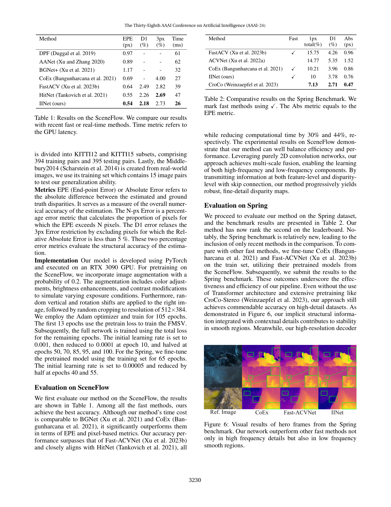

# IINet: Implicit Intra-inter Information Fusion for Real-Time Stereo Matching

**Authors:** Ximeng Li, Chen Zhang, Wanjuan Su, Wenbing Tao (National Key Laboratory of Multispectral Information Processing, Huazhong University of Science and Technology; Tuke Research)
**Venue:** AAAI 2024
**Tier:** 3 (2D implicit network replacing 3D CNN cost volume)

---

## Core Idea
Explicit 4D cost volumes processed by 3D CNNs carry significant redundancy. IINet replaces the 3D-CNN pipeline with a **compact 2D implicit network** that maintains a per-scale **score volume** (compressed inter-image information) and fuses it with **intra-image features** via residual context-aware upsamplers — achieving 3D-CNN-level accuracy at real-time (26 ms) on a single GPU.

## Architecture

- **FPN backbone** produces features at 1/8, 1/4, 1/2 resolution
- **Fast Multi-scale Score Volume (a):** per scale, an MLP with **shared weights across scales** compresses the 4D cost C_d = MLP([F_L(x), F_R(x−d), F_L ⊙ F_R]) into a 3D score volume of size D × H × W — no 3D conv
- **Top-k seed expansion:** score volume at 1/8 is used to select top-k disparity candidates; each seed spawns two target disparities at the next higher scale (1/4 then 1/2), so higher-resolution volumes stay small
- **Confidence-Based Filtering (CBF) (b):** confidence maps are derived from the score volumes and used to filter noisy score values and coarse disparities, mitigating low-level feature noise at fine resolutions
- **Intra-Inter Fusing module (c):** CNN encoder combines intra-image context features with filtered inter-image score features; stacked **Residual Context-aware Upsamplers (RCUs)** progressively refine the disparity at each scale
- **Pretrain loss** on the score volume accelerates convergence by explicitly supervising the compressed inter-image representation before end-to-end tuning
- **Argmax** (during inference) / soft regression (during training) produces the final disparity

## Main Innovation
A **2D implicit score-volume representation with top-k expansion** that eliminates 3D convolutions while retaining the accuracy benefit of multi-scale matching — and a **confidence-filtering** mechanism that keeps the implicit network stable at high resolution.

## Key Benchmark Numbers

**Scene Flow test:**
- IINet: **EPE 0.54 px**, D1 **2.18%**, 3 px **2.73%**, **26 ms**
- Beats HITNet (0.55 EPE, 47 ms), FastACV (0.64 EPE, 39 ms), CoEx (0.69 EPE, 27 ms)

**Generalization (train: Scene Flow, test on real):**
- KITTI 2012 D1: **11.6%** (best in tier) vs. FastACV 12.4, CoEx 13.5
- KITTI 2015 D1: **8.5%** vs. FastACV 10.6, CoEx 11.6
- Middlebury 2px: **19.57%** vs. FastACV 20.13, CoEx 25.51

IINet is the most accurate fast-stereo method in its latency class and has the best synthetic-to-real generalization in that class.

## Role in the Ecosystem
IINet continues the **"kill the 3D cost volume"** thread started by AANet, CoEx, BGNet, and FastACV. Its top-k disparity expansion is conceptually related to DecNet's sparse matching and PCVNet's candidate sampling, but implemented purely in 2D. It set a new SOTA in the sub-30 ms Scene Flow tier in 2024.

## Relevance to Our Edge Model
IINet is probably the closest published neighbour to our design target: no 3D convs, multi-scale, confidence-filtered, and ~26 ms on a single desktop GPU — we should benchmark it on Orin Nano as a baseline. The **score-volume MLP with weight sharing across scales** is a small, exportable module that will fit TensorRT cleanly, and the **top-k candidate expansion** is a clean way to sparsify DEFOM-Stereo's scale-update module at high resolution. Caveat: 26 ms is on a desktop GPU, so on Orin Nano expect ~3–5x slowdown without careful INT8 / kernel fusion.

## One Non-Obvious Insight
The **top-k strategy is critical at edges**, where disparity distributions are multimodal. A single argmax propagation from 1/8 to 1/2 accumulates error because the distribution is unimodal by assumption; retaining k candidates (the authors use small k) preserves the multimodal evidence and allows it to resolve itself at the finer scale — conceptually the same mechanism as SMD-Nets' bimodal output, but implemented via discrete candidate expansion instead of a continuous mixture.
