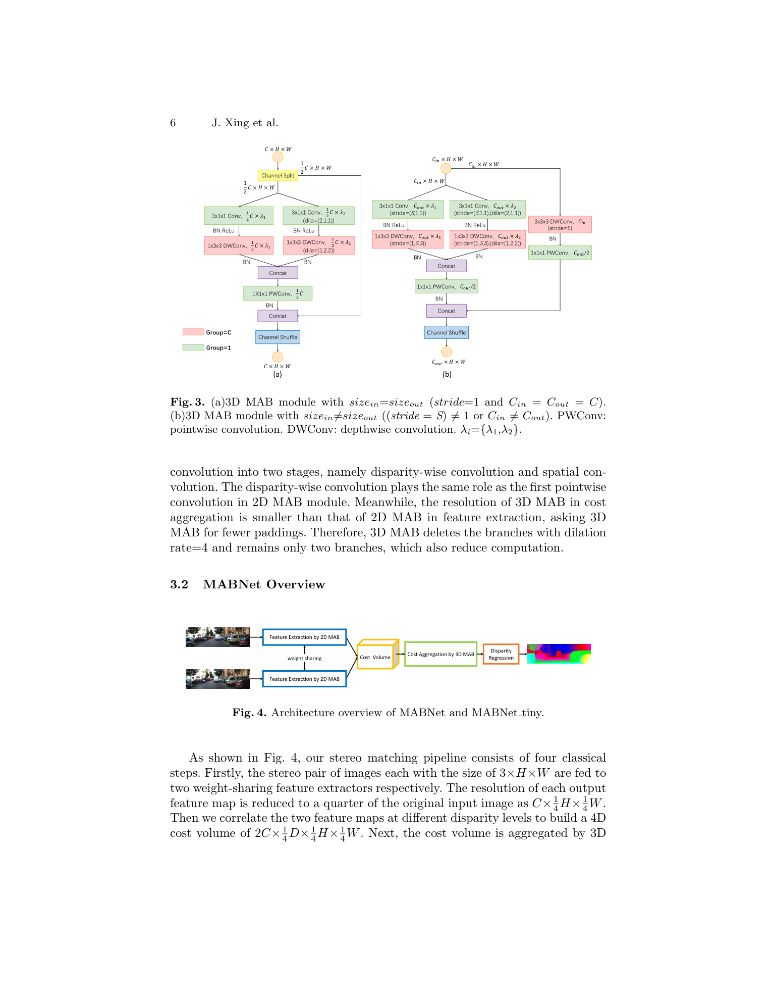
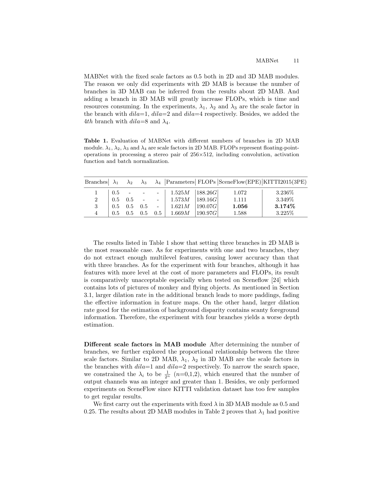

# MABNet: A Lightweight Stereo Network Based on Multibranch Adjustable Bottleneck Module

**Authors:** Jiabin Xing, Zhi Qi, Jiying Dong, Jiaxuan Cai, Hao Liu (Southeast University, National ASIC System Engineering Research Center)
**Venue:** ECCV 2020
**Tier:** 3 (depthwise-separable multi-branch bottleneck, compact 3D conv)

---

## Core Idea
Replace the heavy ResNet / 3D-conv blocks in PSMNet-style stereo with a novel **Multibranch Adjustable Bottleneck (MAB) module**: a ShuffleNet-v2-inspired block that splits channels across parallel branches with different **dilation rates** (each branch using depthwise-separable convolutions), then concatenates and shuffles. Each branch's channel-scale factor λ is independently tunable to trade compute vs. accuracy. The result is a full end-to-end 3D-cost-volume stereo network with only **1.65 M parameters** (MABNet) or **47 K parameters** (MABNet_tiny).

## Architecture

- **MAB block (2D and 3D variants):** channel split → N parallel branches with different dilation rates (1, 2, 4) → each branch uses **depthwise separable convolutions** (DWConv + PWConv) with its own channel scale factor λᵢ → concatenate → **channel shuffle** (ShuffleNet-style) for cross-branch information flow
- **Adjustable complexity:** scale factors λ₁, λ₂, λ₃ independently set the channel count of each branch; the paper's ablation finds **3 branches with dilations {1, 2, 4} and scales {1, 0.5, 0.25}** is optimal
- **Key fix over standard ResNet:** unlike PSMNet's residual block (which skips ReLU after summation to help gradient flow), MAB uses **concat + shuffle** instead of additive residuals, which is more DWConv-friendly
- **Feature extractor:** stack of 2D MAB blocks at multiple scales, outputs to SPP → cost volume
- **Cost aggregation:** hourglass of 3D MAB blocks with 3×3×3 depthwise-separable 3D convolutions
- **Two variants:** MABNet (1.65 M params, full config) and MABNet_tiny (47 K params — fewer channels and layers)
- **Standard PSMNet-style cost volume** (concat) + soft-argmax output

## Main Innovation
A **depthwise-separable, multi-branch, dilation-diverse bottleneck block that works for both 2D and 3D stereo operations** — the first paper to systematically apply ShuffleNet-v2 principles to the 3D cost aggregation head, where naive depthwise-separable convs tend to underperform due to the high channel count.

## Key Benchmark Numbers

**KITTI 2015 test (D1-all, All pixels %):**
- MABNet = **2.41%** with **1.65 M params** @ 0.38 s (vs PSMNet 2.32% @ 5.2 M params / 0.41 s, GC-Net 2.87% @ 3.5 M / 0.9 s)
- MABNet_tiny = **3.88%** with only **47 K params** @ 0.11 s — dramatically beats StereoNet 4.83% (360 K) and AnyNet 6.20% (40 K)

**KITTI 2012 (Out-Noc >2 px):**
- MABNet = **2.43%** (vs PSMNet 2.44%, StereoNet 4.91%)

**SceneFlow EPE:**
- MABNet = **0.797 px** (beats PSMNet's 1.09 at 1/3 the params)
- MABNet_tiny = 1.663 px

## Role in the Ecosystem
MABNet sits in the "**compress the 3D cost aggregation**" tradition alongside Separable-Stereo, MobileStereoNet, and BGNet. Its particular contribution — **3D depthwise-separable convolutions actually working for stereo** — opened the door to edge stereo models that retain full 3D volumetric cost aggregation rather than abandoning it (as HITNet does). The multi-branch dilation design is directly inherited from ShuffleNet-v2 but adapted with independent λ per branch to decouple receptive field from channel cost.

## Role in the Ecosystem (expanded)
MABNet's headline number — **1.65 M parameters achieving 2.41% D1** — remains a reference efficiency frontier, cited by nearly every subsequent edge stereo paper as a parameter-count baseline to beat.

## Relevance to Our Edge Model
The **3D MAB block is directly drop-in replaceable** for the 3D convs in DEFOM-Stereo's cost aggregation head. Since DEFOM's ViT backbone already dominates the compute budget, the ~3× FLOP reduction from depthwise-separable 3D MAB would reclaim budget we could spend on a few more GRU iterations. Also, MABNet's finding that **3 dilation branches = optimal, 4 degrades** is a useful prior to save ablation time in our hyperparameter search. **Caveat reported by the authors themselves:** depthwise convolutions **do not actually accelerate on GPU** due to the im2col/GEMM overhead, so on Jetson Orin Nano we should verify with TensorRT profiling whether MAB blocks are faster than dense 3×3×3 conv for our target channel counts — they may only pay off on NPUs with proper DWConv kernels.

## One Non-Obvious Insight
Adding a **fourth branch with dilation=8** actually **hurts accuracy** (SceneFlow EPE 1.588 vs 3-branch 1.056) despite adding parameters and receptive field. The paper explains this via the feature-map-size effect of large dilations: at dilation=8 on a 64-wide feature map, the effective sampling reaches nearly the whole image, dominated by padding zeros, which *drowns out* the foreground signal. This is a general lesson for edge architectures: **more branches / more dilation is not monotonically better — after some point extra parallel paths mostly inject noise**. This principle maps directly onto our decision about how many scales of feature pyramid to fuse with the Depth-Anything backbone.
