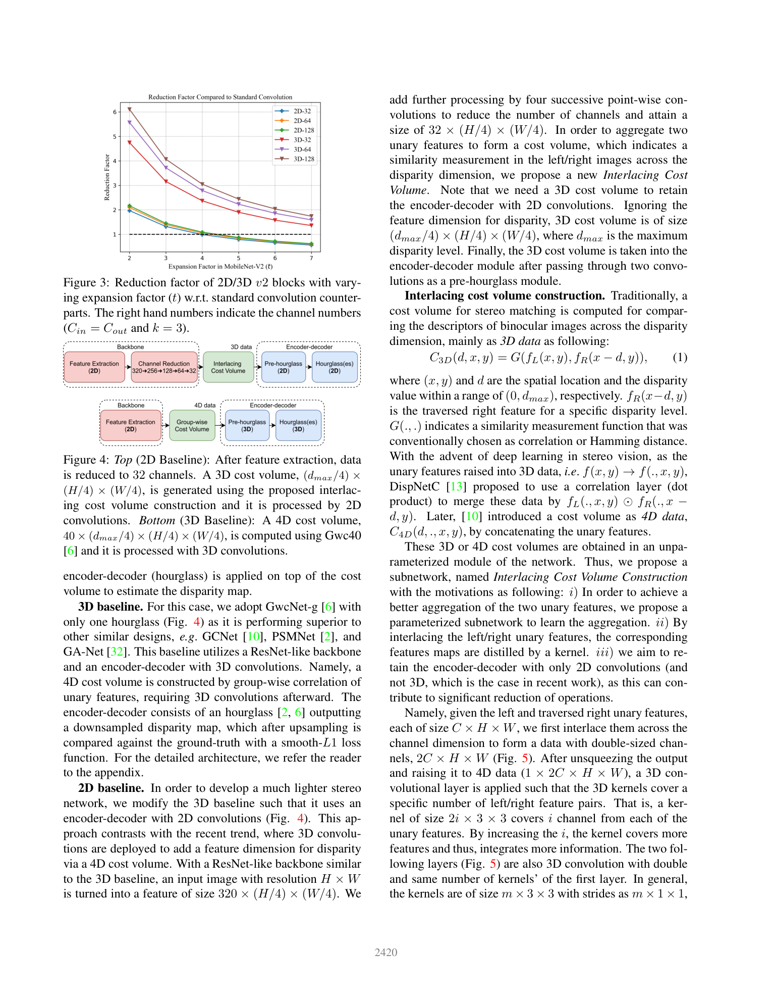
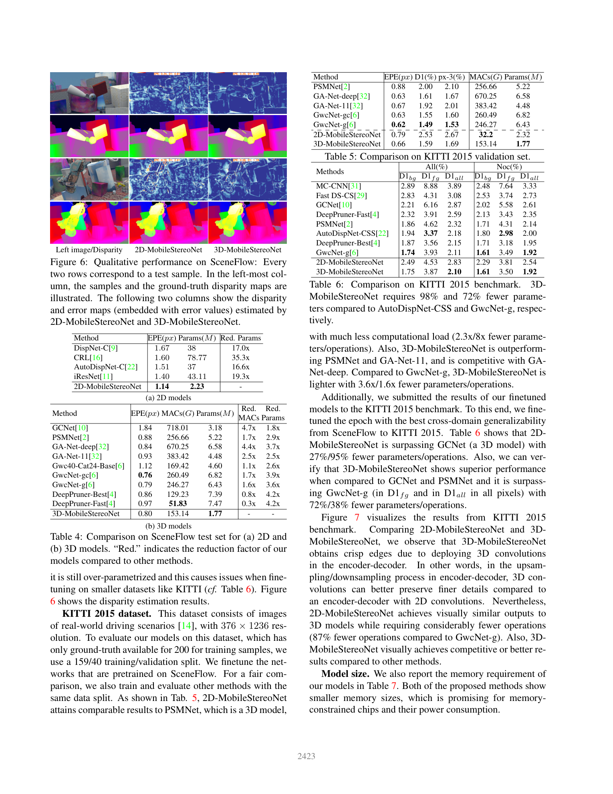

# MobileStereoNet: Towards Lightweight Deep Networks for Stereo Matching

**Authors:** Faranak Shamsafar, Samuel Woerz, Rafia Rahim, Andreas Zell (WSI Institute for Computer Science, University of Tuebingen, Germany)
**Venue:** WACV 2022
**Tier:** 3 (MobileNet-style blocks for lightweight stereo)

---

## Core Idea
Replace the standard 2D and 3D convolutions of stereo backbones with **MobileNet-V1 (depthwise + pointwise) and MobileNet-V2 (inverted residual) blocks**, extending both block families to 3D so they can be used inside cost-volume regularization. Propose two matching networks — **2D-MobileStereoNet** (uses an interlaced 3D cost volume processed by 2D convs) and **3D-MobileStereoNet** (Gwc40 4D cost volume processed by 3D convs) — that cut parameters and MACs by one to two orders of magnitude without sacrificing EPE.

## Architecture

- **Backbone:** ResNet-like feature extractor where every standard conv is replaced by a v1 or v2 block; channels reduced to 32 after extraction
- **3D cost volume (2D baseline):** novel **interlacing cost volume** — non-overlapping interlaced channel groups of left/right features concatenated at each disparity, aggregated by a learnable 2D kernel of size 2i × 3 × 3 (best at i=4)
- **4D cost volume (3D baseline):** group-wise correlation (Gwc40) inherited from GwcNet with one hourglass, but all 3D convs are swapped for 3D-v1 or 3D-v2 blocks
- **Hourglass encoder-decoder:** stacked v1/v2 blocks replace the standard regularization stack
- **Expansion factor `t`** in v2 blocks chosen per-layer to trade accuracy vs. MAC count; analyzed in Fig. 3 of the paper
- **Soft-argmin** disparity regression followed by bilinear upsampling to full resolution
- **Supervised** with smooth L1 loss on Scene Flow and fine-tuned on KITTI

## Main Innovation
The paper is the first to **extend MobileNet-V1/V2 blocks to 3D** and drop them into a cost-volume stereo pipeline, plus it introduces the **interlacing cost volume** — a learnable alternative to concatenation / correlation that keeps 2D-only regularization feasible while slightly beating correlation accuracy.

## Key Benchmark Numbers

**Scene Flow test (EPE, px):**
- 2D-MobileStereoNet: **1.14** with only **2.23 M params** (vs. DispNet-C 1.67 @ 38 M, iResNet 1.40 @ 43 M)
- 3D-MobileStereoNet: **0.80** with **1.77 M params, 153 G MACs** (vs. GwcNet-g 0.79 @ 6.43 M / 246 G MACs, GA-Net-deep 0.84 @ 6.58 M / 670 G MACs)
- Parameter reduction of **17x–35x over 2D baselines** and **1.8x–3.9x over 3D baselines** at comparable or better EPE
- Interlaced4 cost volume: **1.55 EPE** vs. concatenation 1.86, correlation 1.71

**KITTI 2015 (D1-all):** competitive with PSMNet/GwcNet at a fraction of the cost.

## Role in the Ecosystem
MobileStereoNet was one of the first papers to systematically bring the **mobile-CNN toolkit** (depthwise separable, inverted residual) into cost-volume stereo, paving the way for later efficient designs such as **Separable-Stereo**, **BGNet**, and **LightStereo**. It also validated that 2D-only regularization of a carefully constructed cost volume can match 3D-conv pipelines — a design axis later exploited by **IINet** and **FastACV**.

## Relevance to Our Edge Model
Direct: depthwise-separable 3D convolutions are a prime candidate for our DEFOM-Stereo GRU updater and cost-regularization path on Jetson Orin Nano. The **interlacing cost volume** is an attractive replacement for full group-wise correlation when we need to keep the regularizer 2D-only for TensorRT friendliness. Note that the paper reports MACs, not on-device latency, so we still need to re-benchmark these blocks on Orin Nano to confirm the <33 ms target.

## One Non-Obvious Insight
Larger interlacing group size is **not monotonically better** — Interlaced4 beats Interlaced1, 2, 8, and 16. This suggests the optimal kernel sees "just enough" channels from each side to measure similarity without diluting spatial context, and it justifies learnable similarity over fixed dot-products even when the parameter budget is tight.
