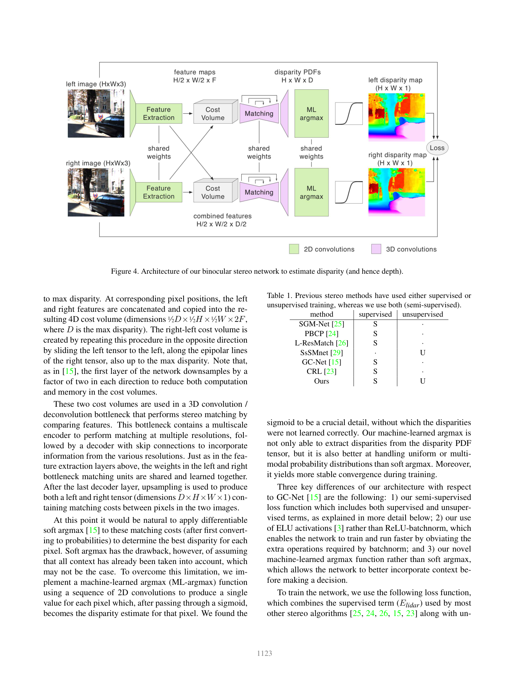
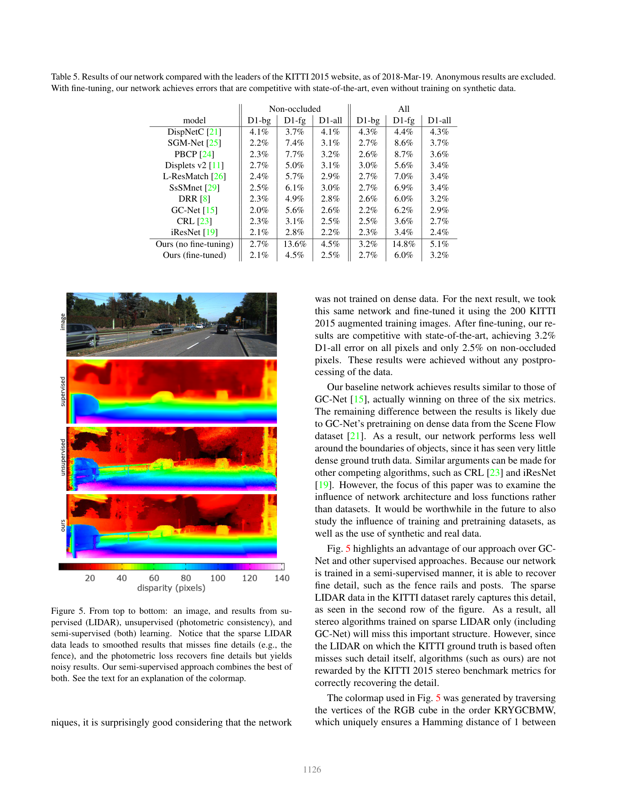

# On the Importance of Stereo for Accurate Depth Estimation: An Efficient Semi-Supervised Deep Neural Network Approach (NVStereoNet)

**Authors:** Nikolai Smolyanskiy, Alexey Kamenev, Stan Birchfield (NVIDIA)
**Venue:** CVPR Workshops 2018 (Autonomous Driving)
**Tier:** 3 (first TensorRT-ported edge stereo, semi-supervised)

---

## Core Idea
Take a GC-Net-style end-to-end stereo architecture, add a **"machine-learned argmax"** output layer, and train it **semi-supervised** using BOTH sparse LIDAR ground-truth AND photometric self-supervision from the raw stereo pairs. Then port the network to **Jetson TX2 via a custom TensorRT runtime** — the first deep stereo network shown to run on embedded hardware.

## Architecture

- **Siamese 2D CNN** feature extractor with downsampling (shared weights) producing per-pixel features
- **Concatenation-based cost volume** (concat left and shifted-right features over disparity hypotheses — same pattern as GC-Net)
- **3D convolution hourglass** for cost aggregation (multiple stride-2 down + transpose-up blocks with skip connections)
- **Machine-learned argmax:** a learned differentiable argmax that predicts disparity as a weighted sum with learned weights (rather than the standard soft-argmax temperature) — more robust and better-suited to TensorRT kernel fusion
- **Semi-supervised loss:** L1 on LIDAR-supervised pixels + photometric reconstruction loss (SSIM + L1) on all pixels + left-right consistency loss
- **Two model sizes:** full (for Titan XP) and a smaller variant for Jetson TX2 deployment
- **Custom TensorRT runtime:** authors hand-wrote CUDA plugins for 3D conv, 3D deconv, cost volume, soft-argmax, ELU (released as part of NVIDIA Redtail)

## Main Innovation
First paper to **deploy a deep 3D-cost-volume stereo network to an embedded NPU** (Jetson TX2) with a practical custom runtime, and to show that **semi-supervised training combining LIDAR ground truth with photometric loss** beats either supervision alone — especially for fine structures (fences, poles) that LIDAR misses.

## Key Benchmark Numbers

**KITTI 2015 test (D1-all %):**
- NVStereoNet fine-tuned = **3.2% all / 2.5% Noc**
- No fine-tuning (photometric only) = 5.1% all / 4.5% Noc — competitive without *any* dense GT
- Comparable to GC-Net (2.9%) and CRL (2.7%)
- D1-bg fine-tuned = **2.1% Noc** (beats GC-Net 2.0% marginally)

**Deployment:** runs in near-real-time on Titan XP (~20 fps) and achieves efficient inference on Jetson TX2 via their TensorRT custom runtime — exact TX2 milliseconds reported in their Table 6.

## Role in the Ecosystem
NVStereoNet pioneered two ideas that remain central to edge stereo: **(a) monocular/photometric signals as complementary supervision** (a thread picked up by Monodepth2 and all subsequent self-/semi-supervised stereo work, and more recently by DEFOM-Stereo which uses Depth-Anything as a learned prior), and **(b) end-to-end stereo nets can be deployed on embedded NPUs** if you are willing to write custom kernels. It seeded NVIDIA's Redtail autonomy stack.

## Relevance to Our Edge Model
Directly applicable in two ways. First, the **TensorRT deployment playbook** — custom plugins for operations PyTorch-to-ONNX export cannot handle (soft-argmax, cost volume construction, warping) — is exactly what we need for Jetson Orin Nano. Second, the **semi-supervised loss combining ground truth + photometric** is a potential zero-shot domain adaptation technique for our model: DEFOM-style mono priors are great but cross-domain fine-tuning via photometric-only signals could help close the gap without labels on the target device. Note: NVStereoNet is **not iterative**, so it shares the cross-domain fragility Pip-Stereo documented for HITNet (93% D1 on DrivingStereo weather); photometric self-supervision on unlabeled deployment-domain pairs can partially mitigate this.

## One Non-Obvious Insight
LIDAR-only supervision **smooths away fine structures** (fences, thin poles) because LIDAR returns are too sparse to constrain those pixels — the network learns to interpolate smoothly. Photometric-only supervision recovers those fine structures but adds noise in textureless regions. Combining them works because the two loss types have **complementary failure modes**: LIDAR fails where the beam misses, photometric fails where texture is missing — and the union of the two failure sets is small. This "combine supervision types by complementary failure domains" principle foreshadows the modern foundation-stereo idea of combining mono-depth priors (good in textureless regions) with stereo (accurate on texture) in DEFOM-Stereo.
