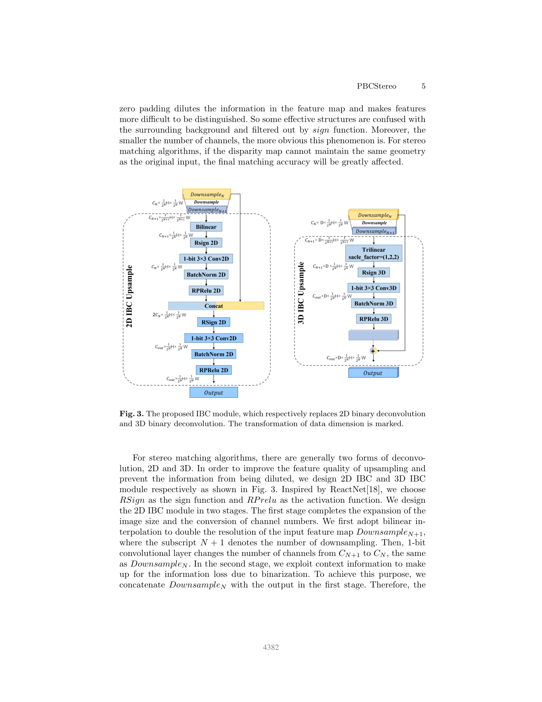
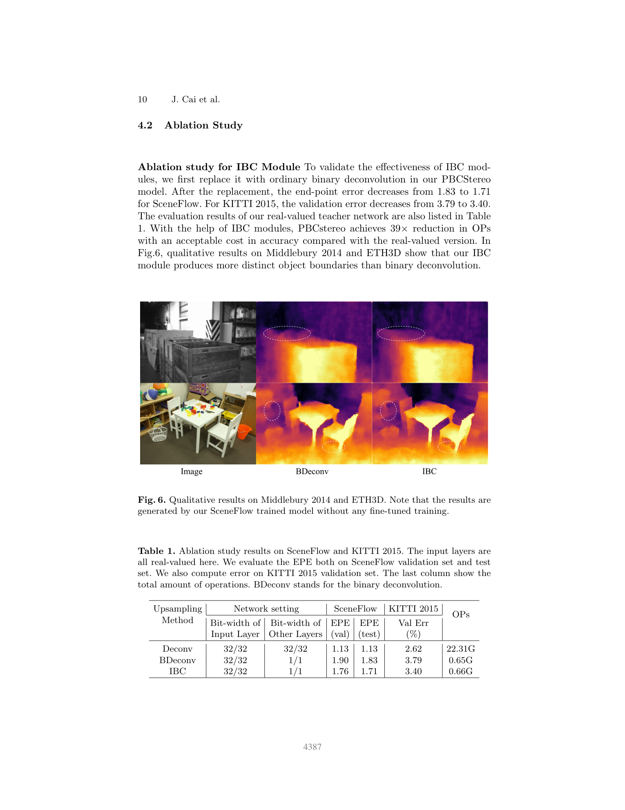

# PBCStereo: A Compressed Stereo Network with Pure Binary Convolutional Operations

**Authors:** Jiaxuan Cai, Zhi Qi, Keqi Fu, Xulong Shi, Zan Li, Xuanyu Liu, Hao Liu (Southeast University, Nanjing, China)
**Venue:** ACCV 2022
**Tier:** 3 (fully binarized stereo network)

---

## Core Idea
PBCStereo is the **first end-to-end stereo network whose convolutional layers are all 1-bit binary** (weights and activations), including the typically-problematic **input layer** and the **deconvolutional upsamplers**. Floating-point MACs collapse into XNOR + POPCOUNT operations, giving an extreme compression ratio while keeping accuracy within striking distance of a real-valued teacher via distillation.

## Architecture

- **Backbone:** binarized 2D convolutions for feature extraction, binarized 3D convolutions for cost-volume aggregation (XNOR-Net / Bi-Real style with RSign + RPReLU from ReactNet)
- **IBC (Information-preserving Binary Convolution) module:** replaces ordinary binary deconvolution in both 2D (feature upsampling) and 3D (cost aggregation) — first stage bilinearly doubles resolution + adjusts channels, second stage applies binary conv with a **skip connection** that concatenates (2D) or sums (3D) low- and high-level features, expanding the activation range from {−CNk², +CNk²} to {−2CNk², +2CNk²} and thereby preserving feature diversity
- **BIL (Binary Input Layer) coding:** a novel input binarization that encodes each pixel's magnitude as a **multi-bit thermometer-like binary vector**, preserving intensity information at the input layer where binarization normally destroys accuracy
- **Real-valued teacher network** supervises the binary student via distillation loss; weighting α balances ground-truth and teacher signals (best α = 0.8)
- **All core ops are XNOR + POPCOUNT** — hardware friendly for FPGA / ASIC edge inference

## Main Innovation
Solving the two long-standing failure modes of fully-binary stereo: (1) **binary deconvolution dilutes features** (IBC module fixes this via skip-connection-driven range expansion); (2) **binary input layers destroy intensity information** (BIL coding recovers it with near-zero EPE cost).

## Key Benchmark Numbers

**Scene Flow (EPE, px):**
- Real-valued teacher: ~1.28 EPE
- PBCStereo (full binary, no input bin.): **1.71 EPE**
- PBCStereo (with BIL binary input): **1.84 EPE** (only **+0.13 EPE** from fully binarizing input)

**KITTI 2015 validation (D1):** **3.43%** with distillation (α = 0.8) vs. 3.79% without IBC.

**Operations budget:** **39x OP reduction** vs. the real-valued teacher network at a very small accuracy cost.

**Comparison of input binarization:** Dorefa-Net 10.52 EPE, IRNet 7.82, ReactNet 6.22, FracBNN 2.58, **BIL 1.84**.

## Role in the Ecosystem
PBCStereo extended the binary-neural-network line (XNOR-Net, Bi-RealNet, ReactNet) into the stereo-matching regime and showed that full 1-bit pipelines are practically viable, not just a research curiosity. Later work on quantized stereo (INT8 / mixed precision, e.g., Distill-then-Prune) builds on its distillation-from-real-valued-teacher recipe.

## Relevance to Our Edge Model
Most directly useful as an **aggressive quantization endpoint**: for ASIC / FPGA derivatives of our DEFOM-Stereo variant, we can consider binarizing the cost aggregation 3D convs while keeping the monocular-foundation backbone in FP16 / INT8. The IBC skip-connection trick is a concrete fix for the "feature dilution" problem that arises whenever we aggressively quantize the upsamplers in a RAFT-style iterative stereo network. Jetson Orin Nano targets typically run INT8, but IBC principles still apply when channels are reduced for edge latency.

## One Non-Obvious Insight
**Removing the skip connection** from the IBC module produces an even larger single-change accuracy drop (-0.67 EPE) than 4× interpolation (-0.10) or extra-downsample aggregation (-0.03). In other words, the information-preserving element of binary deconvolution is the **residual path that assembles context from multiple layers**, not the resolution increase itself — binarization fails primarily because the nonlinear sign function wipes out feature diversity, and only a multi-source residual can restore it.
