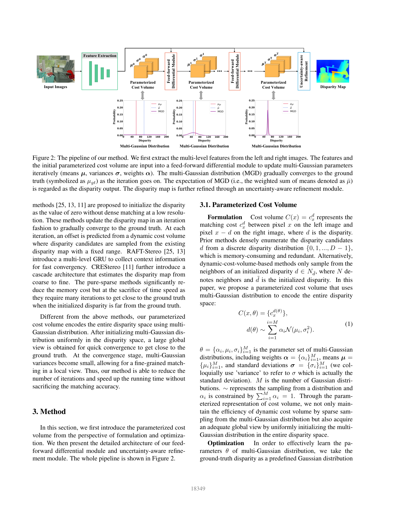
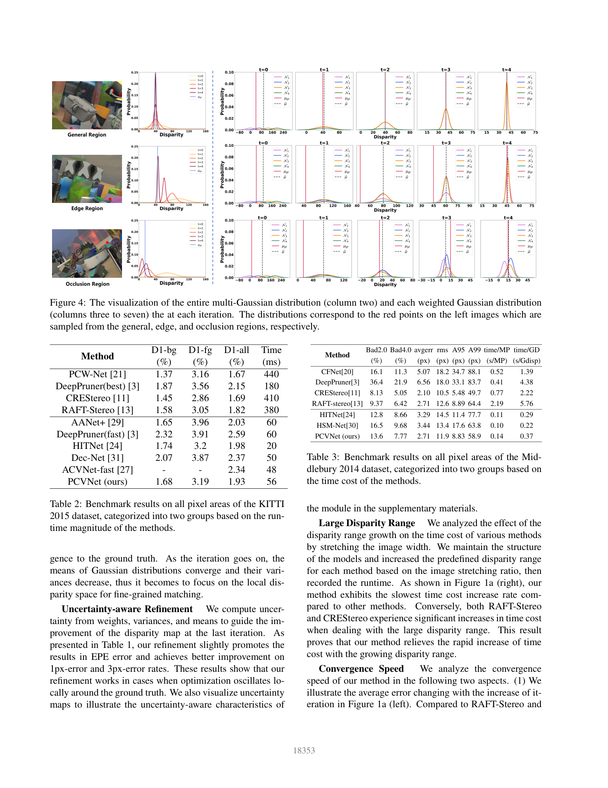

# PCVNet: Parameterized Cost Volume for Stereo Matching

**Authors:** Jiaxi Zeng, Chengtang Yao, Lidong Yu, Yuwei Wu, Yunde Jia (Beijing Institute of Technology; Shenzhen MSU-BIT University; Deeproute)
**Venue:** ICCV 2023
**Tier:** 3 (multi-Gaussian parameterized cost volume)

---

## Core Idea
Dynamic cost volumes used by iterative stereo methods implicitly encode the disparity space as a **single Gaussian with fixed, small variance** — giving a limited "field of view" that forces many iterations when initialization is far from the ground truth. PCVNet replaces this with an explicit **multi-Gaussian mixture** whose means μ, variances σ, and weights α are **iteratively updated via a feed-forward differential module** that predicts their gradients. This gives a global view over the entire disparity range and converges in far fewer iterations.

## Architecture

- **Feature extraction:** multi-level features from left and right images
- **Parameterized Cost Volume (PCV):** initialized as a multi-Gaussian distribution (M components) with means μ, variances σ, weights α covering the full disparity range
- **Feed-forward Differential Module:**
  - Sample disparity candidates from each Gaussian
  - Compute matching costs at candidates
  - GRU ingests costs + multi-level features and predicts **optimization steps −∂μ, −∂σ, −∂α** (gradient-style update)
  - Apply updates to parameters: μ_(t+1), σ_(t+1), α_(t+1)
- **Iterative refinement:** PCV gradually converges so means cluster on the truth and variances shrink — equivalent to "first global search, then local fine-tune" automatically
- **Disparity output:** weighted sum of means (expectation of the mixture) µ̄
- **Uncertainty-aware refinement:** final module uses the mixture's weights, variances, and means to compute a per-pixel uncertainty and refines the disparity map accordingly
- **Loss:** JS-divergence between the predicted mixture and a target Gaussian centered at the ground-truth disparity, plus L1 on the expectation

## Main Innovation
Reinterpreting the dynamic cost volume as a **single-Gaussian prior** and then generalizing to a **multi-Gaussian prior with learnable gradient updates** — giving iterative stereo a global disparity view without the memory cost of a full 4D volume.

## Key Benchmark Numbers

**Scene Flow (EPE, px) — ablation at 4 iterations:**
- SGFV (single Gaussian, fixed variance): 0.79
- MGFV (multi-Gaussian, fixed variance): 0.74
- PCV (multi-Gaussian, adaptive variance): 0.72
- PCV + uncertainty refinement: **0.71**
- 1 px error rate: **7.98%**, 3 px error: **4.79%**

**KITTI 2015 test (D1-all):**
- PCVNet: **1.93%** at **56 ms** — beats HITNet (1.98% @ 20 ms) on accuracy, competitive with RAFT-Stereo (1.82% @ 380 ms) at ~7× less runtime
- D1-bg **1.68%**, D1-fg **3.19%**

**Convergence:** PCVNet matches RAFT-Stereo accuracy in far fewer GRU iterations because the initial multi-Gaussian prior already covers the disparity space.

## Role in the Ecosystem
PCVNet provided the theoretical bridge between **dynamic-cost-volume iterative methods (RAFT-Stereo, CREStereo, IGEV)** and **distributional output methods (SMD-Nets)**. Its "parameterize the cost volume as a distribution and learn gradient updates" recipe influences newer hybrid stereo/flow works and is conceptually close to the deep-equilibrium and amortized-inference viewpoints.

## Relevance to Our Edge Model
Fewer GRU iterations at identical accuracy is directly aligned with our <33 ms Orin Nano budget. If we treat DEFOM-Stereo's scale-update module as equivalent to PCVNet's parameter-update module, we can initialize disparity using a **multi-Gaussian prior seeded by the monocular depth foundation** and use GRUs only to correct its means and variances — likely halving iteration count. The uncertainty-aware refinement also dovetails with SMD-style heads we're considering.

## One Non-Obvious Insight
Adding **adaptive variance** to a single-Gaussian cost volume (SGAV) actually **hurts EPE** (0.82) compared with the fixed-variance version (0.79). The gain only appears when combined with **multi-Gaussian** (PCV = 0.72). Lesson: flexibility of the variance helps only when there are multiple modes to separate — with a single mode, added flexibility is noise that the optimizer can abuse.
