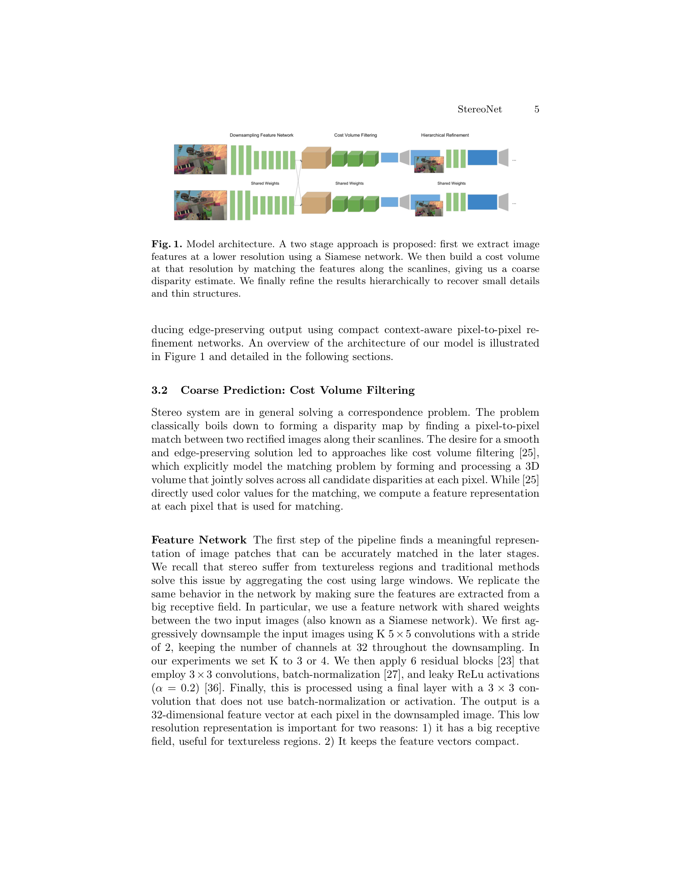
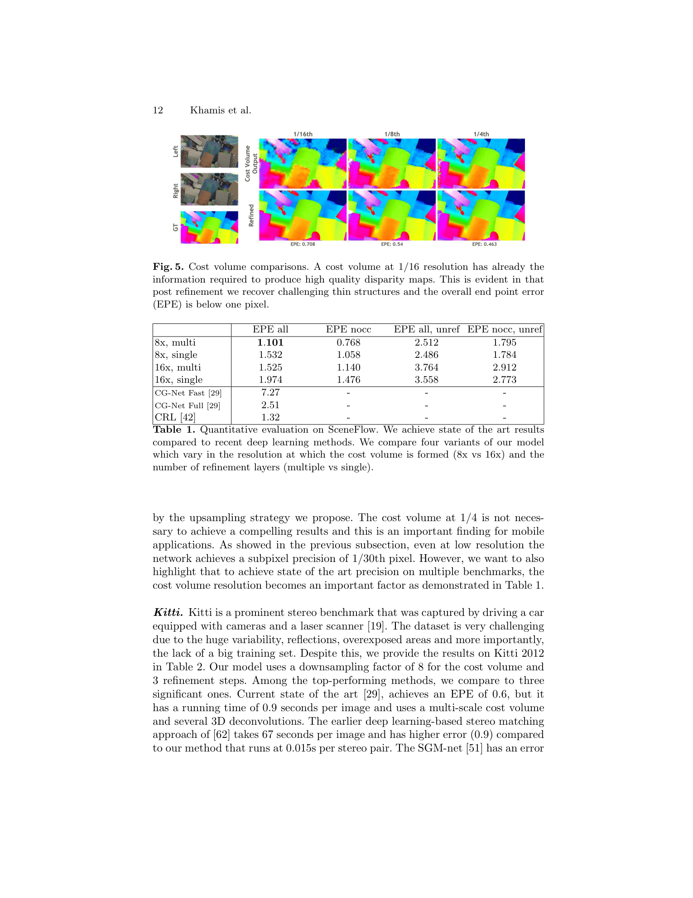

# StereoNet: Guided Hierarchical Refinement for Real-Time Edge-Aware Depth Prediction

**Authors:** Sameh Khamis, Sean Fanello, Christoph Rhemann, Adarsh Kowdle, Julien Valentin, Shahram Izadi (Google Inc.)
**Venue:** ECCV 2018
**Tier:** 3 (pioneering real-time deep stereo, hierarchical refinement)

---

## Core Idea
Build a **very low-resolution cost volume** (1/8 or 1/16 of input) to keep compute tiny, then hierarchically upsample the coarse disparity back to full resolution with **color-guided edge-aware refinement networks** that reintroduce high-frequency detail. The paper shows that a CNN can achieve **sub-pixel matching precision ~1/30 px**, an order of magnitude better than classical methods, so the low-res cost volume loses no accuracy.

## Architecture

- **Siamese feature tower:** shared 2D CNN with 5 stride-2 downsamples + 6 residual blocks, outputs a 32-D feature per pixel at 1/8 (or 1/16) resolution
- **Cost volume:** per-disparity feature differences across the rectified scanline at 1/8 resolution only (tiny tensor)
- **Filtering:** four 3D convolutions + soft-argmax regression → coarse disparity map
- **Hierarchical refinement cascade:** at each scale, concatenate (bilinearly upsampled coarse disparity, reference color image) and pass through a small residual network that predicts an **additive disparity residual**
- **Dilated residual blocks** (dilations 1,2,4,8,1,1) give a large receptive field in the refinement head for cheap
- **Edge-aware learning** emerges implicitly from the color concatenation — no explicit guided filter
- **Loss:** hierarchical L1 over all scales

## Main Innovation
First deep stereo network to run in **real time at 60 fps on Titan X** by aggressively subsampling the cost volume (8x-16x) and recovering edges through **learned, color-guided hierarchical upsampling** instead of expensive full-resolution cost aggregation.

## Key Benchmark Numbers

**SceneFlow (EPE):**
- StereoNet 8x multi = **1.10 px** (vs CRL 1.32, CG-Net Full 2.51)
- StereoNet 16x multi = 1.53 px

**KITTI 2012 (test):**
- Out-Noc (>2 px) = 4.91%, Out-All = 6.02%, Avg-Noc = 0.8 px
- Runtime = **0.015 s** (vs GC-Net 0.9 s, MC-CNN 67 s)

## Role in the Ecosystem
StereoNet is the **origin point for the real-time edge-stereo lineage**. Its hierarchical residual refinement pattern directly inspired AnyNet, HITNet, FADNet, and the refinement cascades in later models like Selective-Stereo. The "low-res cost volume + edge-guided upsample" recipe remains the default template for edge-deployed stereo.

## Relevance to Our Edge Model
The 1/8 cost volume + color-guided refinement recipe is **directly applicable to Jetson Orin Nano** — our DEFOM-Stereo variant can place the expensive ViT+GRU machinery at 1/16 or 1/8 and use a StereoNet-style lightweight color-guided upsampler to restore edges at full resolution almost for free. The 1/30-px sub-pixel claim also justifies why we do **not** need a dense full-resolution cost volume even with a foundation-model backbone.

## One Non-Obvious Insight
The cost volume at 1/16 resolution contains **almost all the geometric information needed** — ablation shows the refinement network can upsample 16× and still achieve <1.6 px EPE on SceneFlow. This decouples *where the match happens* (coarse, cheap) from *where the edges live* (fine, color-guided). The implication is profound for edge deployment: the matching problem does not need to be solved at full resolution; only the **appearance of the output** does. This observation was rediscovered years later by BGNet and ADStereo via bilateral grids and adaptive sampling.
