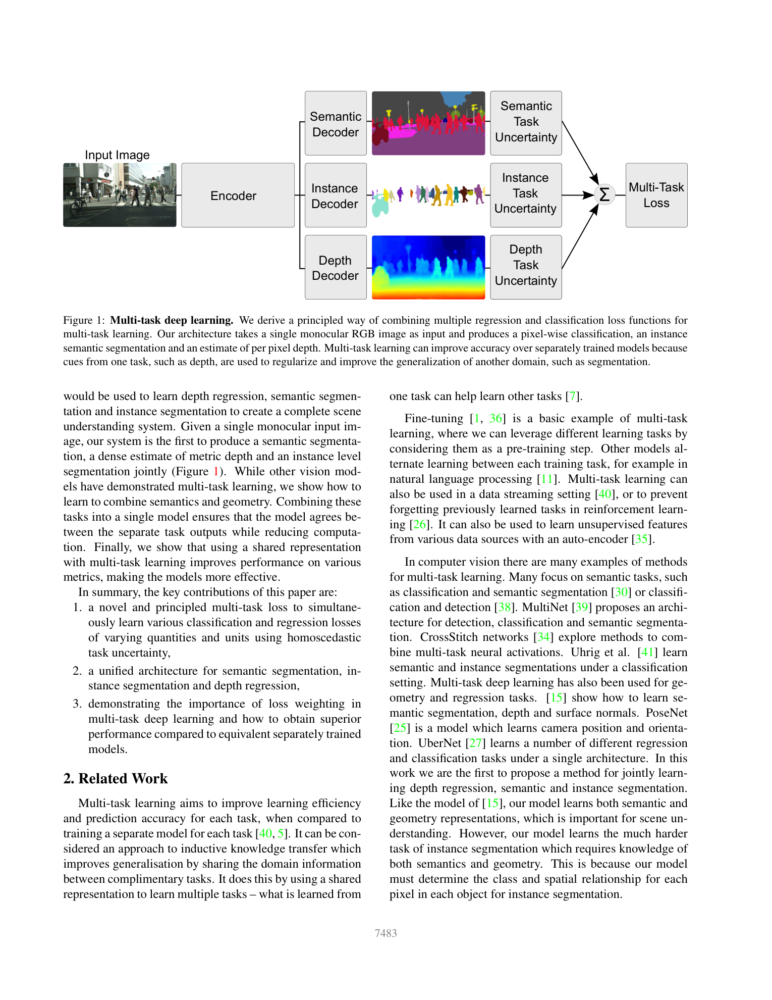
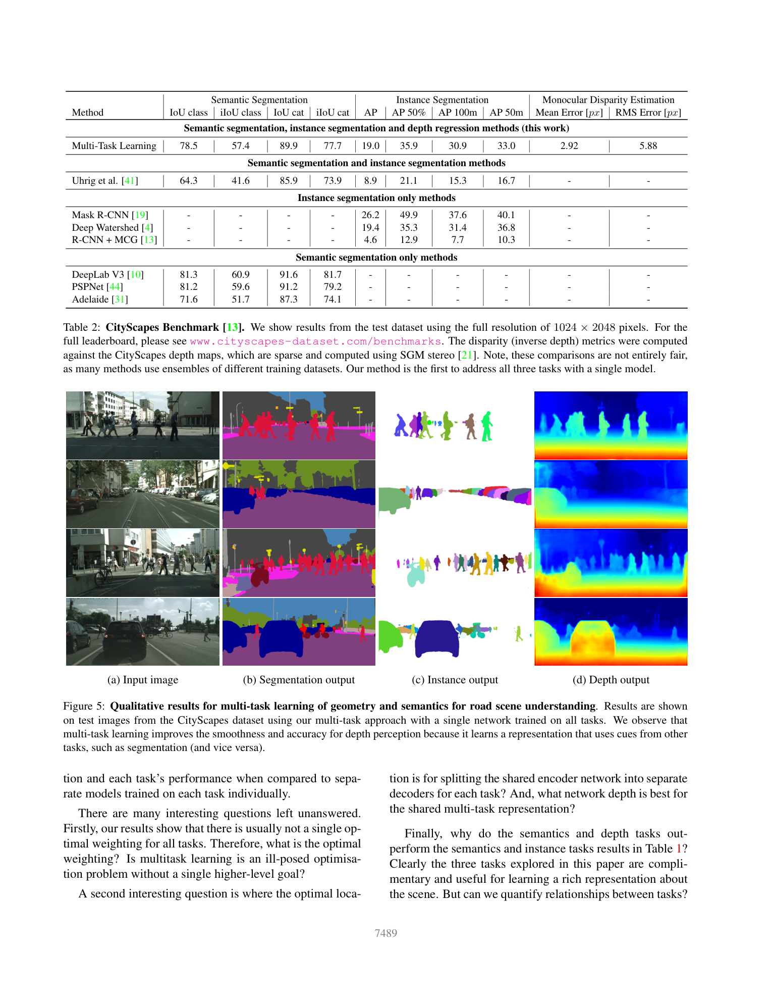

# Multi-Task Learning Using Uncertainty to Weigh Losses for Scene Geometry and Semantics

**Authors:** Alex Kendall, Yarin Gal, Roberto Cipolla (University of Cambridge)
**Venue:** CVPR 2018
**Tier:** 3 (foundational multi-task loss weighting, adopted across depth/stereo/segmentation)

---

## Core Idea
Instead of hand-tuning per-task loss weights in a multi-task network, learn a **per-task homoscedastic (task-dependent) noise parameter** sigma_i jointly with the network weights. Each task's loss is automatically scaled by 1/sigma_i^2 and regularised by a log(sigma_i) term, yielding a principled, data-driven balance between regression (Gaussian likelihood) and classification (scaled softmax) objectives.

## Architecture

- **Shared encoder** (DeepLabV3-style dilated ResNet) extracts features at 1/8 resolution
- **Three task decoders**, each a 3x3 conv (256 ch) followed by a 1x1 regression/classification head:
  - **Semantic segmentation** (per-pixel cross-entropy)
  - **Instance segmentation** via per-pixel 2D regression of a vector pointing to the instance centroid (a form of Hough voting)
  - **Monocular inverse-depth regression** (L1 loss, Gaussian likelihood)
- **Learnable log-variance parameters** s_i = log(sigma_i^2), one per task; total loss is sum_i [exp(-s_i) * L_i + 0.5 * s_i]
- For classification, the softmax is scaled: p(y|f, sigma) = Softmax(f/sigma^2), giving log-likelihood with a matching 1/sigma^2 weighting

## Main Innovation
A closed-form, theoretically grounded alternative to manual grid search over loss weights. The approach derives directly from maximum likelihood under a Gaussian-for-regression / Boltzmann-for-classification likelihood, needs **~1 extra scalar per task**, and is robust to initialisation (log(sigma) prevents degenerate sigma to 0/infinity solutions).

## Key Benchmark Numbers

**Tiny CityScapes (ablation, 128x256):**
- Segmentation only: IoU 59.4%. Instance only: 4.61 px. Depth only: 0.640 px
- Unweighted 3-task sum (weights 1/3 each): IoU 50.1, Inst 3.79, Depth 0.592 (worse than single-task on seg!)
- Grid-search near-optimal (0.89/0.01/0.10): IoU 62.8, Inst 3.61, Depth 0.549
- **3-task uncertainty weighting (learnt): IoU 63.4, Inst 3.50, Depth 0.522** — beats grid search without any tuning

**CityScapes test (full 1024x2048):**
- IoU class 78.5, iIoU class 57.4, IoU cat 89.9
- Instance AP 19.0 / AP50% 35.9 (competitive with Mask R-CNN AP 26.2 on a shared-backbone setup)
- Mean disparity error 2.92 px, RMS 5.88 px
- First single model addressing all three tasks simultaneously on CityScapes

## Role in the Ecosystem
This paper is the **canonical reference for task balancing** in any multi-task dense-prediction pipeline. It underpins:
- Joint stereo + segmentation / stereo + flow / stereo + normals networks (e.g., SegStereo, EdgeStereo)
- Self-supervised monocular depth systems that combine photometric + smoothness + semantic losses
- Aleatoric/epistemic uncertainty estimation for depth (Kendall & Gal 2017 is the companion paper)
- Later refinements (GradNorm, dynamic task prioritisation) compare against this baseline by default

## Relevance to Our Edge Model
Edge stereo training pipelines often mix **photometric, smoothness, proxy-label, and distillation losses** (e.g., self-supervised warmup before supervised fine-tune, or DEFOM-style monocular prior + stereo loss). Uncertainty weighting gives us a **~3 extra scalars** that replace fragile manual coefficients, stabilising training when task magnitudes differ by orders of magnitude. Additionally, the aleatoric-uncertainty output itself is a cheap safety signal for edge deployment: pixels with large learnt sigma can be flagged for downstream filtering before motion planning or fusion with IMU/LiDAR.

## One Non-Obvious Insight
The learned sigma values are **not** directly interpretable as "how hard is this task" — they also absorb the **loss function's scale** (an L1 loss in metres behaves very differently from cross-entropy in nats). The paper shows empirically that initialisation of sigma is almost irrelevant because the log(sigma) regulariser pins the optimum. This means the method Just Works even when practitioners combine losses from radically different numerical regimes (e.g., a disparity L1 in pixels, a segmentation CE in nats, and an edge BCE in [0,1]) — a silent but crucial property for heterogeneous edge-model training recipes.
