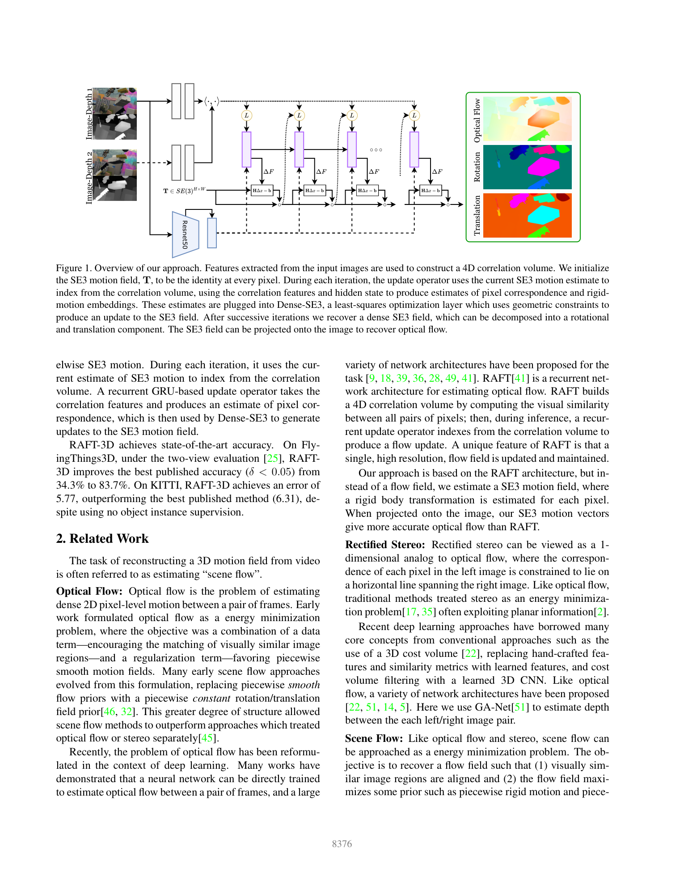
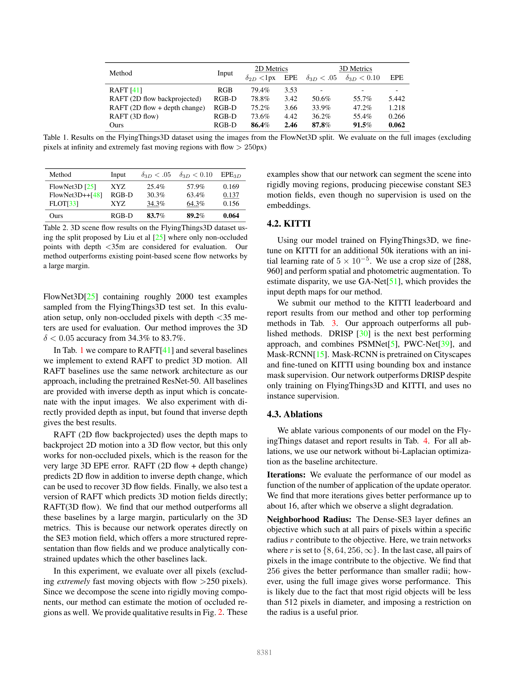

# RAFT-3D: Scene Flow using Rigid-Motion Embeddings

**Authors:** Zachary Teed, Jia Deng (Princeton)
**Venue:** CVPR 2021
**Tier:** 3 (RAFT extended to 3D scene flow)

---

## Core Idea
Extend RAFT from 2D optical flow to **full 3D scene flow** by replacing the 2D flow field with a **dense per-pixel SE(3) rigid-body transformation field**. The key novelty is **rigid-motion embeddings** — per-pixel vectors that softly group pixels into rigid objects — coupled with a differentiable **Dense-SE3 layer** that enforces geometric consistency via unrolled Gauss-Newton iterations on Lie manifolds.

## Architecture

**Inputs:** RGB-D image pairs (stereo depth from off-the-shelf GA-Net)

**Encoders:**
- **Feature encoder:** shared-weight 6-block ResNet at 1/8 resolution
- **Context encoder:** ImageNet-pretrained **ResNet-50** (frozen BN) — provides semantic features for rigid-body grouping (40M of the 45M total params)

**4D correlation pyramid:** all-pairs dot product at 1/8 resolution, pooled 3× → 4-level pyramid (identical to RAFT)

**GRU update operator:** 3×3 unit with dilated kernels (dilation 1 and 3). Inputs:
- Flow field (x′-x)
- Twist field log_SE3(T)
- Depth residual (d′-d̄′)
- Correlation features

Outputs:
- **Rigid-motion embedding map V**
- Flow revisions (rx, ry, rz)
- Confidence maps

**Dense-SE3 layer (the key innovation):**
- Pixel affinities computed as `aᵢⱼ = 2σ(−‖vᵢ−vⱼ‖²) ∈ [0,1]`
- Pixels with similar embeddings (same rigid object) should explain each other's reprojection via **shared SE(3) motion**
- One **Gauss-Newton iteration** per update step
- Decomposes the global problem into **H×W independent 6-variable problems** (one per pixel) → efficient CUDA
- **Bi-Laplacian embedding smoothing** via differentiable sparse Cholesky

**SE3 upsampling:** convex combination in **Lie algebra** (log map → convex combination → exp map)

## Main Innovation
The **Dense-SE3 layer** that enforces rigid-motion structure **geometrically**, not just statistically. By solving per-pixel Gauss-Newton problems in SE(3) space, the network jointly estimates **per-pixel rigid transforms** while discovering the **soft segmentation** of which pixels move together — all supervised only from ground-truth scene flow (**no instance mask supervision required**).

## Key Benchmark Numbers

**FlyingThings3D (Liu et al. split):**
- 3D δ<0.05 accuracy: **83.7%**
- vs. FLOT (prior best): **34.3%** — **>2× state of the art**

**FlyingThings3D full evaluation:**
- 2D δ<1px: **86.4%**
- 3D EPE: **0.062**
- vs. RAFT (2D only): 79.4%

**KITTI scene flow leaderboard:**
- All-metric SF error: **5.77**
- vs. DRISF (prior best): 6.31
- **First-rank at publication time** — without using any instance segmentation supervision (DRISF used Mask-RCNN pretrained on Cityscapes)

**Timing (540×960, GTX 1080Ti):** ~386ms total at 16 iterations
- GRU: 208ms
- Gauss-Newton: 120ms
- Features: 52ms

## Role in the Ecosystem
RAFT-3D is a **direct ancestor** of the RAFT-Stereo → IGEV-Stereo → DEFOM-Stereo lineage. It demonstrated that:
- **Differentiable optimization layers** (Dense-SE3) can be integrated into iterative networks without breaking training
- **Geometric structure** can be learned from supervision alone, without explicit segmentation labels
- The RAFT iterative paradigm is **modular** — the 2D flow field can be replaced with richer structures (SE(3), depth, scale)

The **per-pixel decomposition** trick (each pixel solves its own 6-variable Gauss-Newton problem independently) is now a standard pattern in learned geometric optimization layers.

## Relevance to Our Edge Model
**Conceptual ancestor.** The Dense-SE3 layer is **conceptually analogous** to the **Scale Update Module in DEFOM-Stereo** — both are differentiable optimization layers that enforce geometric constraints inside an iterative network. For an edge model:
- The **ResNet-50 context encoder (40M of 45M params)** is the obvious compression target
- The feature extractor + GRU core is **only 5M params** — already edge-feasible
- A lightweight context encoder (MobileNetV4, EfficientViT) would yield a deployable scene-flow variant

For ADAS, **scene flow** (not just disparity) is the actual quantity downstream consumers want — RAFT-3D's architecture shows the path to a unified edge stereo+motion model.

## One Non-Obvious Insight
RAFT-3D's observation that the problem **decomposes into H×W independent 6-variable Gauss-Newton problems** (one per pixel, since each pixel's SE3 update depends only on its own Tᵢ) is a **critical architectural insight for efficient implementation**. The Dense-SE3 layer scales **linearly with the number of pixels** despite involving millions of residual equations.

This pattern — **converting a global geometric optimization into per-pixel independent local optimizations via learned grouping** — is broadly exploitable in edge stereo design. Any geometric constraint that can be expressed per-pixel given a soft grouping is essentially free at inference time.
