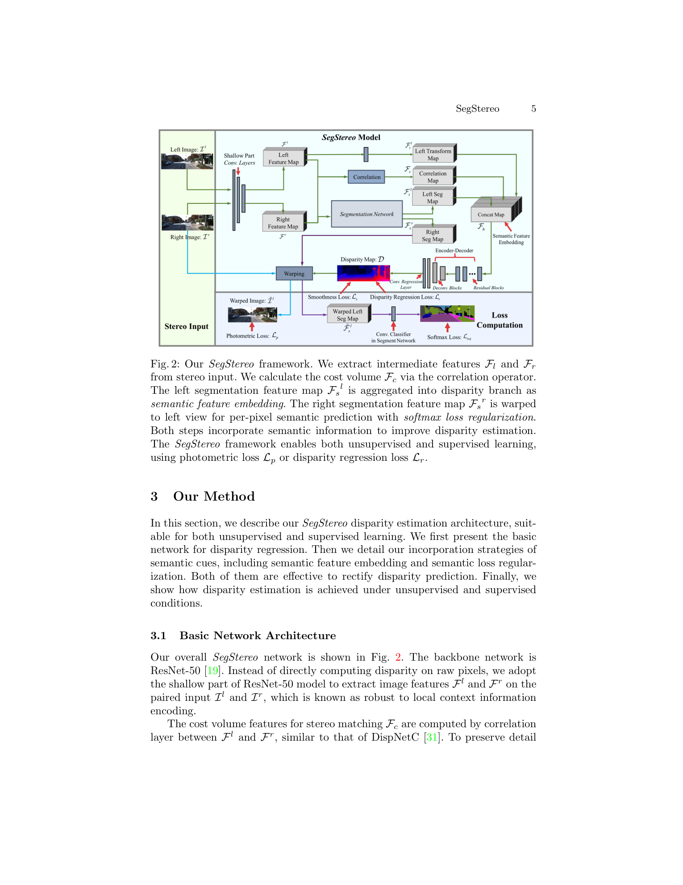
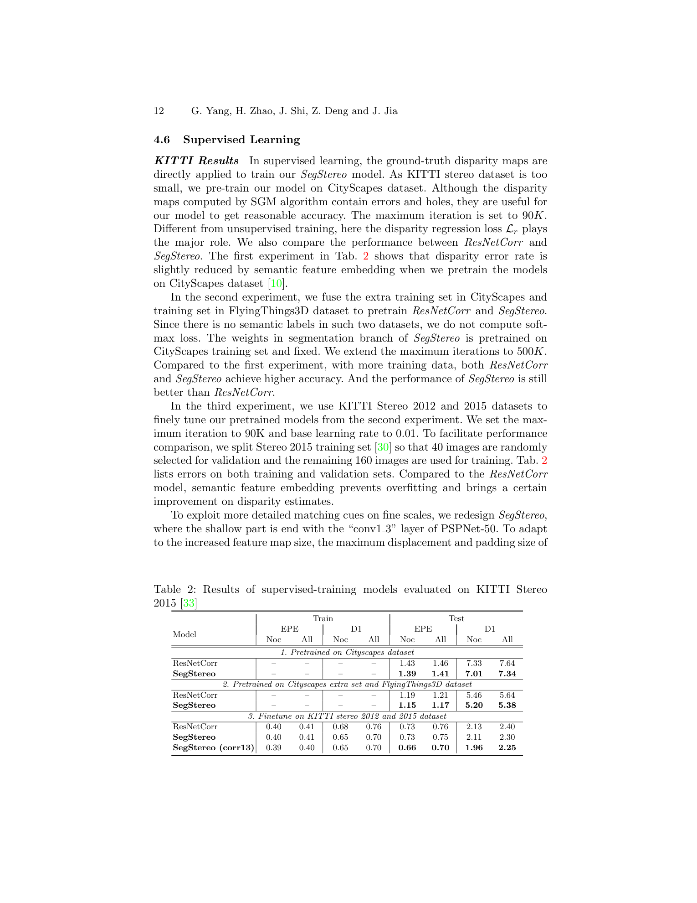

# SegStereo: Exploiting Semantic Information for Disparity Estimation

**Authors:** Guorun Yang, Hengshuang Zhao, Jianping Shi, Zhidong Deng, Jiaya Jia (Tsinghua, CUHK, SenseTime, Tencent YouTu)
**Venue:** ECCV 2018
**Tier:** 3 (early joint stereo + segmentation, both supervised and unsupervised variants)

---

## Core Idea
Semantic cues help stereo matching in exactly the places photometric or supervised losses fail: **textureless regions, reflective surfaces, object boundaries**. SegStereo fuses **semantic features into the disparity branch** (feature embedding) AND uses a **cross-view semantic warping loss** (softmax regularisation) to enforce that left and right views agree on class labels once reprojected by the predicted disparity.

## Architecture

- **Shared shallow backbone** (PSPNet-50 conv1_1 to conv3_1) produces F_l, F_r at 1/8 resolution
- **Correlation layer** between F_l and a transformed F_r produces cost volume F_c
- **Segmentation branch** (PSPNet-50 conv3_1 onward) produces semantic features F_s_l, F_s_r
- **Semantic Feature Embedding:** concatenate transformed left feature F_t_l + correlation F_c + left semantic F_s_l into a hybrid tensor F_h, which feeds an encoder-decoder disparity head to produce full-resolution D
- **Semantic Loss Regularisation:** warp right semantic feature F_s_r to the left view using predicted D; compute softmax cross-entropy against the left semantic labels. This loss flows gradients through D, nudging disparities that produce semantically inconsistent warps
- **Training modes:** purely self-supervised (photometric + smoothness + semantic softmax) OR fully supervised (L1 regression + semantic softmax + smoothness)

## Main Innovation
The two-way use of semantics: **(1) embed** them as extra input features to resolve ambiguous matches, and **(2) regularise** via a differentiable warp of semantic logits between views. The second signal is especially powerful for **unsupervised training** because photometric loss alone fails on uniform surfaces (road, walls), whereas a warped class label is piecewise constant and thus provides sharper supervision at object boundaries.

## Key Benchmark Numbers

**KITTI 2015 unsupervised (table 1):**
- ResCorr baseline (photometric + smooth): D1 all = 12.16, EPE 2.43
- SegStereo (photometric + smooth): D1 all = 10.53, EPE 2.17
- **SegStereo + softmax reg.: D1 all = 10.03, EPE 1.89**
- After KITTI fine-tune: **D1 all = 8.79, EPE 1.84** — beats Godard (9.19) and Zhou (9.91)

**KITTI 2015 supervised (table 3, test server):**
- PSMNet: D1-all = 2.32, D1-fg = 4.62
- **SegStereo: D1-all = 2.25, D1-fg = 4.07** — state-of-the-art at submission, 0.6 s runtime
- Better than iResNet (2.44), CRL (2.67), GC-Net (2.87), DispNetC (4.34)

## Role in the Ecosystem
SegStereo was an early and influential demonstration that **semantic priors help stereo**, foreshadowing:
- **EdgeStereo** (semantic + edge-aware), **SSPCV-Net**, and other 2D+semantic hybrids
- Foundation-era methods that inject **Depth Anything / DINO / SAM features** into the cost-volume pipeline (DEFOM-Stereo, FoundationStereo, Stereo Anywhere) — the same principle of "richer feature priors help matching in ambiguous regions"
- Cross-task consistency losses that warp auxiliary signals (semantics, normals, edges) between views
- The softmax-warp loss also reappears in self-supervised RGB-D and optical-flow literature

## Relevance to Our Edge Model
Two transferable ideas for an edge DEFOM variant:
1. **Cheap semantic priors.** Instead of a ViT monocular depth backbone, a lightweight segmentation network (e.g., MobileSeg, PP-LiteSeg) could inject class-aware features into the cost-volume fusion step at a fraction of the compute. Class-conditional feature embedding is a strong prior for piecewise-planar regions common in driving scenes.
2. **Unsupervised / semi-supervised domain adaptation** for edge deployment: the semantic warp loss requires only off-the-shelf segmentation pseudo-labels, no disparity ground truth. Useful for on-device adaptation to deployment scenes (warehouse, drone, indoor) where stereo ground truth is unavailable.

## One Non-Obvious Insight
The semantic softmax loss improves results **even when ground-truth segmentation is not supervised end-to-end** — the segmentation branch can be frozen (pretrained on CityScapes) and still the cross-view softmax consistency sharpens disparity. This decouples semantic quality from disparity quality: any off-the-shelf segmenter becomes a **free self-supervision signal** for stereo, as long as it is reasonably stable across the two views. The same principle is why modern foundation-feature-based stereo methods (using frozen DINO or Depth Anything features) succeed: the auxiliary representation doesn't need to be perfect, just **consistent across views**.
