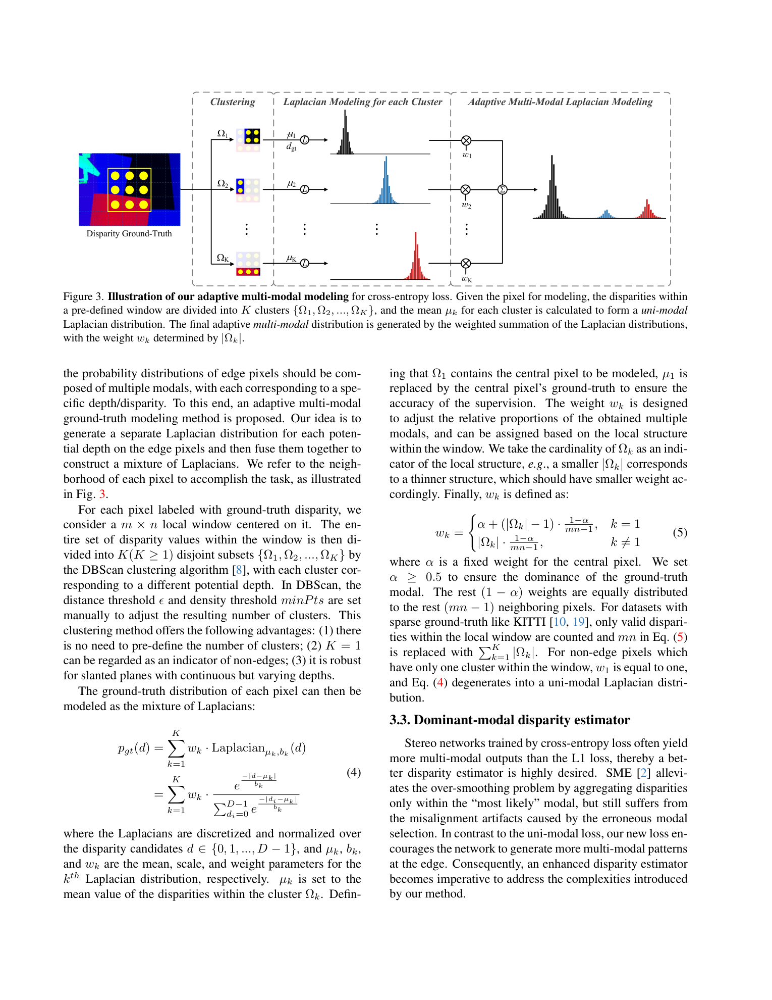
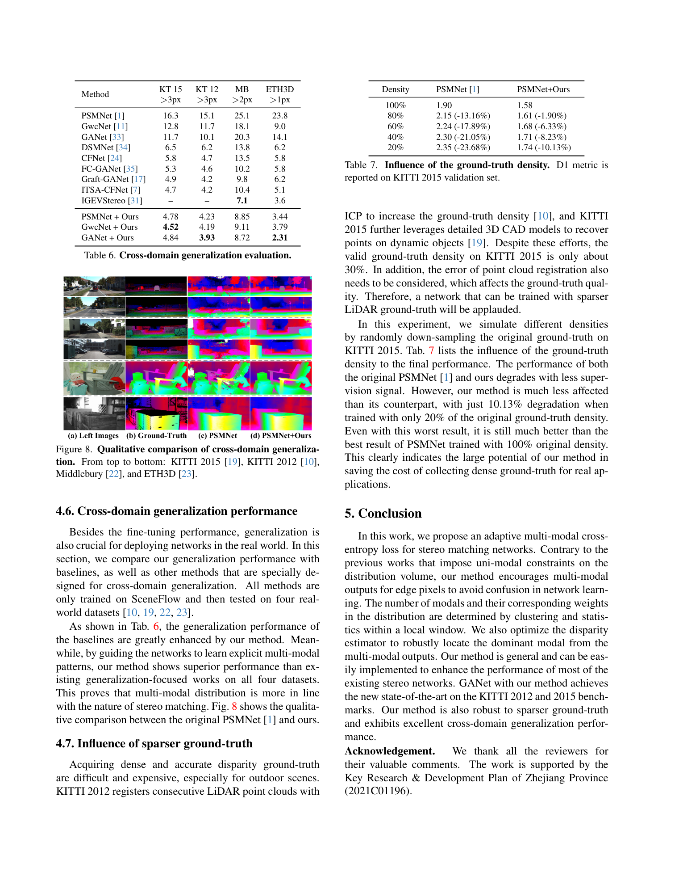

# Adaptive Multi-Modal Cross-Entropy Loss for Stereo Matching (ADL)

**Authors:** Peng Xu, Zhiyu Xiang, Chengyu Qiao, Jingyun Fu, Tianyu Pu (Zhejiang University)
**Venue:** CVPR 2024
**Tier:** 3 (loss-level multi-modal supervision)

---

## Core Idea
Instead of forcing the network's cost volume into a **uni-modal** distribution (as prior cross-entropy stereo losses do), ADL constructs a **per-pixel adaptive mixture of Laplacians** from the local ground-truth window and uses it as the cross-entropy target. Edge pixels naturally get 2–3 modes (foreground + background), while smooth regions get 1 — letting the network represent true depth ambiguity at boundaries.

## Architecture

- **Adaptive multi-modal GT construction:** within a **1 × 9 local window** around each pixel, cluster disparities → fit a **Laplacian per cluster** with weights from local structural context → combine into a Gaussian-mixture-style target distribution
- **Cross-entropy loss** over the full cost volume against the adaptive GT distribution (replaces standard L1 or uni-modal CE)
- **Dominant-Modal Estimator (DME):** at inference, instead of soft-argmax (which averages across modes and blurs edges) or simple argmax (which is noisy), DME selects the **dominant mode** per pixel from the predicted distribution volume
- **No architectural change** — drops into PSMNet, GwcNet, GANet unchanged; only loss + disparity regression head are modified
- **KITTI fine-tuning** uses a 3 × 9 window (sparse GT needs more context)

## Main Innovation
Unifies two previously separate ideas — **probabilistic stereo output** (AcfNet, CDN) and **multi-modal edge-aware estimation** (SMD-Nets) — into a single pure loss-function recipe that requires **no extra parameters**. Turns the "regression vs. classification" stereo debate into a soft probability-modeling problem that matches the physical reality of edge pixels.

## Key Benchmark Numbers

**SceneFlow EPE (px) / >3px (%):**
- PSMNet 0.97 / 4.03 → **+ADL 0.64 / 2.19** (EPE −34%)
- GANet 0.78 / – → **+ADL 0.50 / 1.81**

**KITTI 2015 benchmark (D1-all):** GANet 1.81% → **GANet+ADL 1.55% (1st among published methods at submission)**.
KITTI 2012 Out-Noc: GANet 1.19 → **GANet+ADL 0.98**.

**Cross-domain (trained on SceneFlow, >3/2/1 px):**

| Method | KT-15 | KT-12 | MB | ETH3D |
|---|---|---|---|---|
| PSMNet | 16.3 | 15.1 | 25.1 | 23.8 |
| **PSMNet+ADL** | 4.78 | 4.23 | 8.85 | 3.44 |
| **GANet+ADL** | 4.84 | 3.93 | **8.72** | **2.31** |

ADL also matches the performance of 100%-density training using only 20% of the original KITTI GT (D1 degrades only 10%).

## Role in the Ecosystem
ADL is the **culmination** of the probabilistic-stereo line started by AcfNet (uni-modal CE) and SMD-Nets (bimodal regression output). Its zero-parameter, zero-inference-overhead form makes it a default loss for any cost-volume-based stereo network trained from 2024 onward. Anticipated by, and complementary to, **StereoRisk** (ICML 2024), which takes continuous risk minimization over similar distributions.

## Relevance to Our Edge Model
Extremely relevant — ADL is **training-only**, adding **zero parameters and zero FLOPs** at inference. For an edge stereo model:
- We can train with ADL and deploy the same backbone unchanged on Jetson Orin Nano
- The DME inference head is a simple mode-picking operation (cheap) that replaces soft-argmax
- ADL's robustness to sparse GT (Tab. 7) is a huge practical win — we can train with low-cost synthetic or LiDAR GT without dense-supervision pipelines
- It composes with any backbone we pick (MobileNetV4, EfficientViT) and with any cost-volume method

## One Non-Obvious Insight
Forcing uni-modal supervision actually **hurts non-edge pixels** too, not just edges. The paper shows that when PSMNet+UM+SME is applied, non-edge outlier rate is 2.20%, but ADL reduces it to **2.07%** — even though ADL only changes the edge-pixel supervision. The reason: uni-modal constraint at edges bleeds into neighboring smooth regions via the 3D aggregation module, so **relaxing constraints at edges improves smooth-region predictions too**. Better modeling of the ambiguous pixels cleans up the confident ones.
