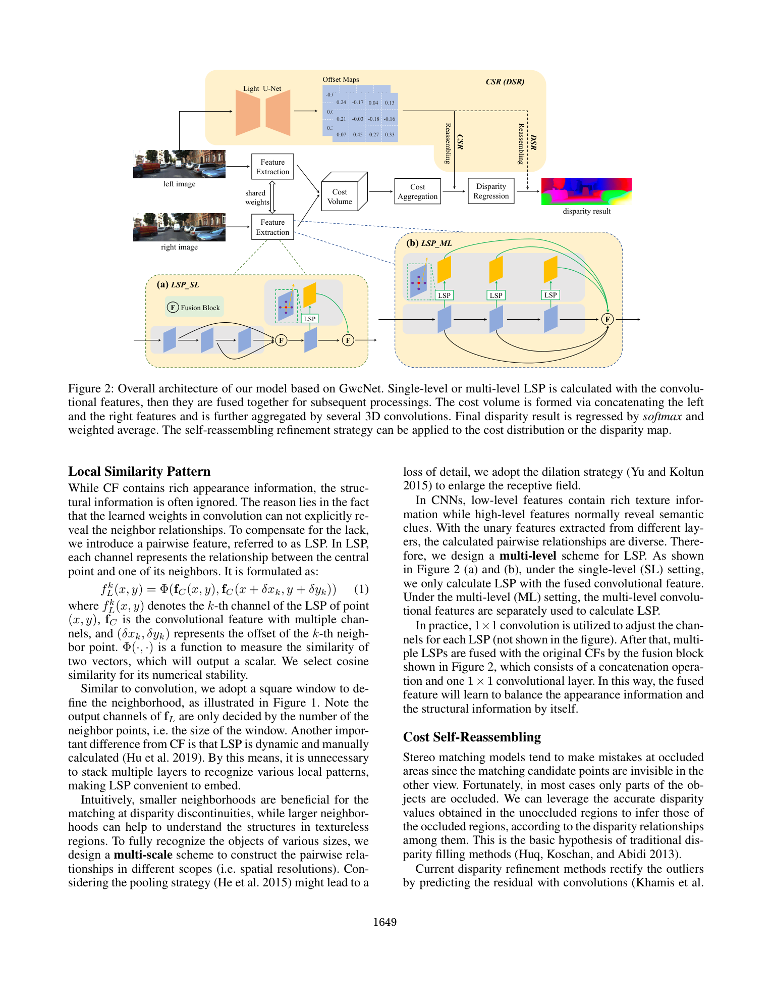
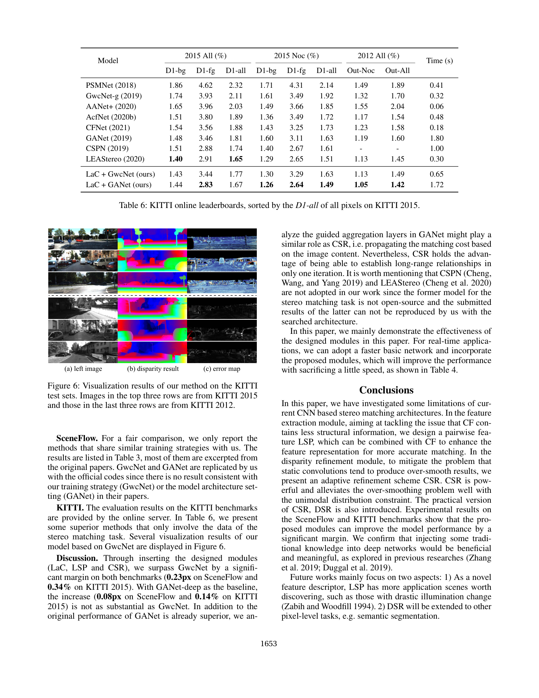

# Local Similarity Pattern and Cost Self-Reassembling for Deep Stereo Matching Networks (LaC)

**Authors:** Biyang Liu, Huimin Yu, Yangqi Long (Zhejiang University / ZJU-League R&D Center)
**Venue:** AAAI 2022
**Tier:** 3 (structural feature + adaptive refinement)

---

## Core Idea
Convolutional features (CF) are biased toward **appearance** and miss explicit neighbor relationships, while static-kernel refinement modules tend to over-smooth. LaC fixes both: (a) **LSP (Local Similarity Pattern)** — a pairwise feature that encodes each pixel's relationship to its neighbors — augments CF; (b) **CSR (Cost Self-Reassembling)** — a dynamic refinement that predicts neighbor **offsets** and re-aggregates the cost distribution from learned locations, replacing over-smoothing static convolutions.

## Architecture

- **Feature extraction (shared):** standard CNN (GwcNet or GANet backbone) produces the convolutional feature CF
- **Local Similarity Pattern (LSP):** each channel k of LSP encodes `Φ(f_C(x,y), f_C(x+δxk, y+δyk))` for neighbors in a 3×3 window — directly exposing pairwise similarity
- **Multi-scale / multi-level LSP:** dilation rates {1, 2, 4, 8} handle multi-scale objects; LSP is computed at several conv-layers and fused, all sharing a bottom-up one-shot computation (no iteration)
- **Fusion block:** LSP + CF → concatenated unary feature for cost volume
- **Cost volume:** feature concatenation, then 3D conv aggregation (as in GwcNet)
- **CSR refinement:** a light U-Net predicts per-pixel **offset maps** (coordinates of N reliable neighbors); the pixel's cost distribution is replaced by a weighted average of predicted neighbor distributions — a **unimodal distribution constraint** forces sharp peaks
- **DSR (Disparity Self-Reassembling):** variant operating on final disparity instead of cost volume — lower memory footprint

## Main Innovation
Replaces static refinement convolutions with **learned, content-aware neighbor selection** that propagates reliable values from adaptively-chosen neighbors — finally addressing the chronic "over-smooth details" problem of prior residual-refinement networks. LSP revives classical pairwise features (census / similarity patterns) inside deep models in a multi-scale, differentiable form.

## Key Benchmark Numbers

**SceneFlow test EPE (px):** GwcNet 0.98 → **LaC+GwcNet 0.75**; GANet 0.80 → **LaC+GANet 0.72**.

**KITTI 2015 benchmark (D1-all):**

| Method | D1-all | D1-fg | Runtime (s) |
|---|---|---|---|
| PSMNet | 2.32 | 4.62 | 0.41 |
| GwcNet-g | 2.11 | 3.93 | 0.32 |
| AcfNet | 1.89 | 3.80 | 0.48 |
| LEAStereo | 1.65 | 2.91 | 0.30 |
| **LaC+GwcNet** | 1.77 | 3.44 | 0.65 |
| **LaC+GANet** | **1.67** | **2.83** | 1.72 |

**KITTI 2012 Out-Noc:** LaC+GANet = **1.05** (top-tier).
**Generalization (SceneFlow→MB Bad2.0-noc):** baseline 22.2 → LaC 18.7.
**Complexity:** adding LSP is ~0.26 M params / 17 G FLOPs; CSR adds memory but minor FLOPs.

## Role in the Ecosystem
LaC popularized **pairwise-feature + adaptive-refinement** hybrids. Its LSP module was a direct precursor to attention-based stereo feature modules; CSR influenced the design of RAFT-Stereo's motion encoder (which also predicts per-pixel lookup offsets). Note: LaC is the same Zhejiang group that produced GraftNet — they share the obsession with **explicit matching structure**. ADL (CVPR 2024) directly builds on LaC's unimodal distribution regularization idea.

## Relevance to Our Edge Model
- **LSP is cheap** (~3% param overhead) and can be inserted between any CNN encoder and the cost volume in an edge model — a free structural bias
- **DSR** (the low-memory variant of CSR) is particularly interesting: propagates disparity rather than cost-volume slices, so it doesn't multiply memory by the disparity dimension. On Jetson Orin Nano where memory is the binding constraint, DSR-style refinement is ideal
- **Unimodal regularization** from LaC pairs with ADL-style multi-modal CE for a principled distribution-shaping loss
- The idea of a **tiny offset-prediction module** for adaptive aggregation maps directly onto our edge "lightweight cost volume" goal

## One Non-Obvious Insight
The LaC authors explicitly argue that GANet's **guided aggregation layers already play a role similar to CSR** — which is why LaC yields a smaller boost on GANet than on GwcNet (0.14% vs. 0.34% on KITTI D1). But CSR has the **"one-iteration long-range" advantage**: guided aggregation propagates locally through many layers, while CSR's learned offsets can jump across the whole image in one go. This distinction matters for edge devices: CSR's one-shot long-range propagation avoids deep 3D-conv stacks, making it **latency-friendly** even though its memory cost is high. DSR keeps the benefit without the memory hit.
