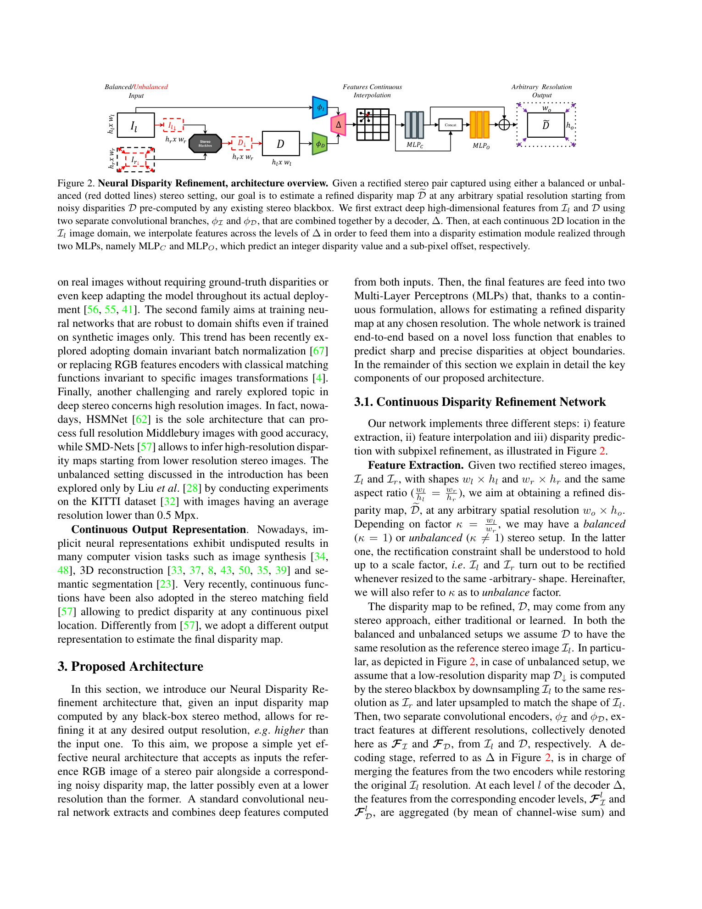
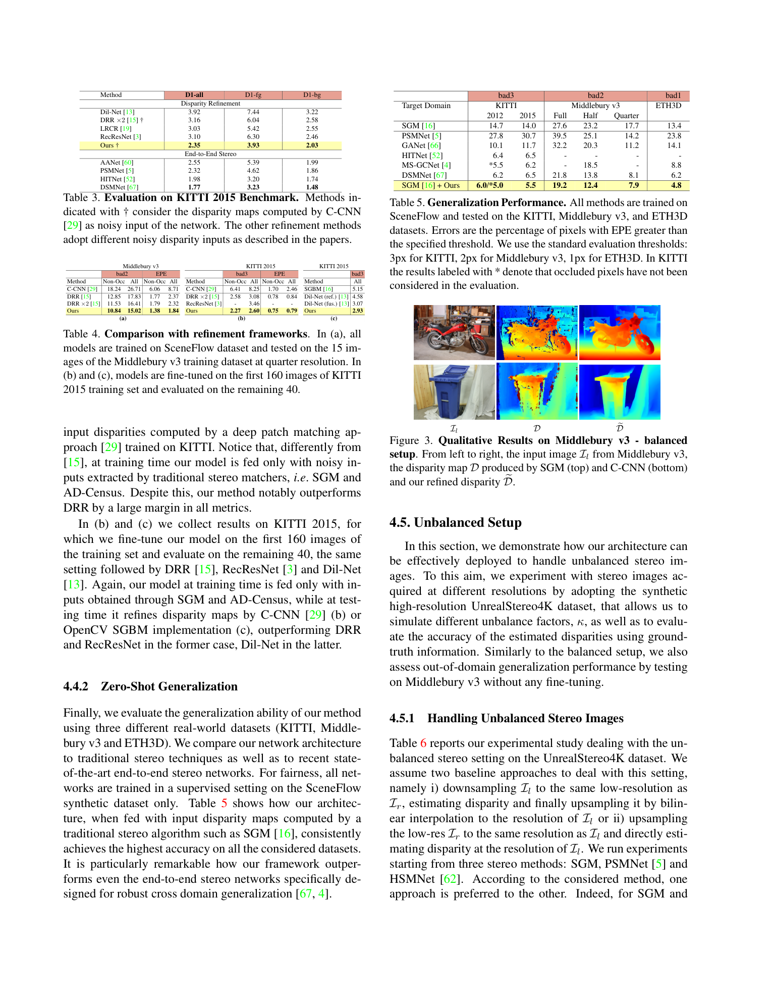

# NDR: Neural Disparity Refinement for Arbitrary Resolution Stereo

**Authors:** Filippo Aleotti*, Fabio Tosi*, Pierluigi Zama Ramirez*, Matteo Poggi, Samuele Salti, Stefano Mattoccia, Luigi Di Stefano (University of Bologna)
**Venue:** 3DV 2021 (extended in TPAMI 2024)
**Tier:** 3 (continuous-resolution refinement)

> **Note:** A 2024 TPAMI extension of this paper exists but is not currently available in our repo (the original arXiv 2412.02626 turned out to be an unrelated LLM paper). This summary covers the 3DV 2021 original, which establishes all the core ideas.

---

## Core Idea
Take a low-resolution disparity map from **any source** (classical SGM, deep stereo network, structured light) and refine it to **arbitrary higher resolution** guided by high-resolution image features, using a **continuous implicit neural function**. The system handles the **asymmetric stereo scenario** — left and right cameras with different resolutions — by downsampling the HR image to match the LR one, running stereo matching at LR, and then using the HR feature network to upscale and refine.

## Architecture

- **Stereo black-box** outputs a noisy disparity D at low resolution
- **Two feature encoders**: φᵢ extracts deep features from the left RGB Iₗ; φd extracts features from the noisy disparity D
- **Continuous interpolation:** features are bilinearly interpolated at any continuous query location
- **Two MLPs:**
  - MLP_C predicts a confidence/correction signal
  - MLP_O predicts the refined disparity offset
- Final output: refined disparity D̃ at **any arbitrary spatial resolution** (super-resolution comes free)
- **Trained only on synthetic data (SceneFlow)** for zero-shot generalization

## Main Innovation
**Decoupling "disparity estimation" from "disparity resolution"** and solving the latter as a **learned continuous upsampling guided by image structure**. The zero-shot cross-domain design (trained synthetic, deployed on any real stereo) makes it a **universal post-processing stage** for any stereo backend.

## Key Benchmark Numbers

- **SceneFlow test (Table 1):** improves over baseline losses across all metrics
- **KITTI 2015 benchmark (Table 3):** competitive with end-to-end deep stereo while operating as a refinement on top of any source
- **Refinement framework comparison (Table 4):** outperforms existing refinement networks on shared backbones
- **Asymmetric stereo (Tables 6, 7):** unique capability — handles unbalanced HR/LR stereo pairs no other method supports
- **Generalization to Middlebury v3** (zero-shot, trained on SceneFlow): produces sharp boundaries competitive with supervised methods

## Role in the Ecosystem
NDR established **refinement as a separate, generalizable module** — earlier methods baked refinement into the stereo backbone. This separation lets you:
- **Pair any cheap stereo matcher with any premium refinement** independently
- **Update refinement separately** without retraining the matcher
- **Run the matcher at low res for speed** and the refinement at full res for quality

The **continuous-coordinate MLP head** pattern from NDR (and SMD-Nets) is now standard in implicit-output stereo methods. The TPAMI 2024 extension (NDR v2) further generalizes this to handle a wider range of stereo input sources and resolutions.

## Relevance to Our Edge Model
**Highly relevant decomposition.** A natural edge architecture inspired by NDR:
1. **Lightweight matcher at LR** (e.g., 320×640) — runs in <20ms on Jetson Orin
2. **NDR-style continuous refinement head** that upscales to full resolution using HR image features
3. Total cost: matcher cost + small MLP — much cheaper than running the full pipeline at HR

The **synthetic-to-real zero-shot property** also supports the generalization goals of our edge model — refinement trained on Scene Flow generalizes to KITTI, Middlebury, ETH3D without fine-tuning.

## One Non-Obvious Insight
By separating "match at LR" from "refine to HR," NDR effectively performs **stereo super-resolution with no additional labeled HR stereo data** — the refinement network learns to **hallucinate boundary sharpness from HR image texture**, which acts as a free geometric prior. This is conceptually similar to **guided depth upsampling in RGB-D sensors** but trained end-to-end on synthetic data and transferred zero-shot to real sensors. For an edge stereo system constrained to low-resolution matching, this is the **only way to recover sharp boundaries without paying the full HR matching cost**.
