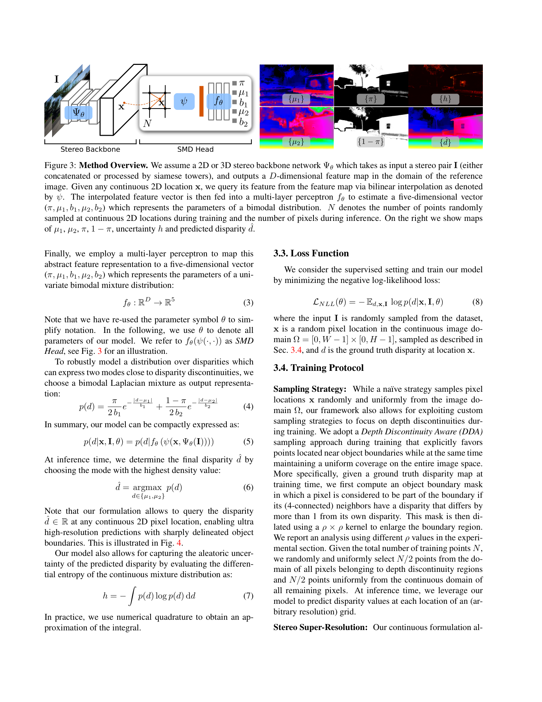
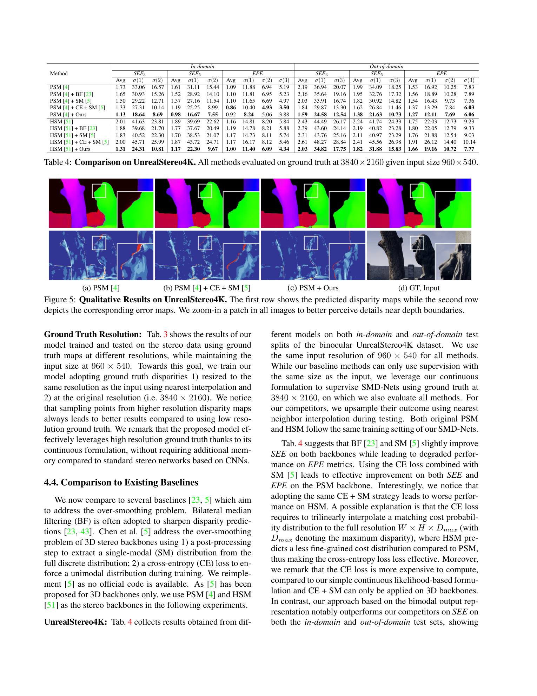

# SMD-Nets: Stereo Mixture Density Networks

**Authors:** Fabio Tosi, Yiyi Liao, Carolin Schmitt, Andreas Geiger (University of Bologna, MPI Tübingen)
**Venue:** CVPR 2021
**Tier:** 3 (bimodal output for sharp edges)

---

## Core Idea
Instead of regressing a **single scalar** disparity per pixel, SMD-Nets predicts a **bimodal Laplacian mixture distribution** (5 parameters: weight π, two means μ₁/μ₂, two scales b₁/b₂) — enabling the network to **straddle foreground and background simultaneously** at depth discontinuities. A companion **continuous formulation** lets the model query disparity at any sub-pixel or super-resolution location by bilinearly interpolating backbone feature maps and passing them through a small MLP head.

## Architecture

- **Any existing stereo backbone** acts as a feature extractor (tested with PSMNet 3D, HSMNet 3D, U-Net 2D)
- **SMD Head:** small MLP (D → 1024 → 512 → 256 → 128 → 5 neurons, **sine activations**) that outputs bimodal Laplacian parameters at any continuous 2D query location
- **Bilinear interpolation** of feature map at the continuous pixel coordinate feeds the MLP
- **Depth Discontinuity Aware (DDA) sampling** during training: half the query points come from a dilated band around depth boundaries (kernel ρ=10), half uniformly
- **Loss:** negative log-likelihood of the bimodal Laplacian mixture
- **Inference:** select the mode (μ₁ or μ₂) with the highest probability density

## Main Innovation
Replacing the scalar (or unimodal) output representation with a **bimodal mixture** lets a smooth neural network represent **sharp disparity discontinuities** without architectural changes. The continuous spatial query formulation additionally enables **stereo super-resolution** with zero extra memory: training on 8 Mpx ground truth while feeding 0.5 Mpx input.

## Key Benchmark Numbers

**UnrealStereo4K (their own 8 Mpx synthetic dataset):**
- PSM baseline SEE3 = 1.73 → **PSM+SMD-Nets = 1.13** (~35% improvement in boundary softness error)
- σ-1% boundary error: **18.64**

**KITTI 2015 validation (boundary SEE3):**
- PSM baseline 1.10 → **PSM+SMD-Nets 0.90** (18% improvement)
- vs. PSM+CE+SM competitor: 1.02

**KITTI 2015 test (D1-all):**
- **PSM+SMD-Nets = 2.08%** vs. base PSM 2.31%, competitive with GWCNet-g (2.11%)

**Middlebury v3 (zero-shot generalization, trained on UnrealStereo4K):**
- PSM SEE3 Avg = 3.35 → **PSM+SMD = 2.61**

## Role in the Ecosystem
SMD-Nets introduced **distributional output for stereo** — a paradigm later extended by:
- **NDR (Neural Disparity Refinement)** — uses a similar continuous query formulation for refinement
- **StereoRisk (ICML 2024)** — explicit risk minimization over disparity distributions
- **Modern foundation-stereo methods** that output uncertainty alongside disparity

## Relevance to Our Edge Model
**The bimodal output head is a near-zero-cost add-on** (~190 extra parameters) that eliminates **boundary bleeding** without changing backbone inference. This is directly applicable as a **post-processing head** on our edge stereo model to restore sharp depth edges at negligible compute cost.

The continuous spatial query idea also means **the same backbone can serve multiple output resolutions**, useful for multi-scale edge deployment (e.g., 320×640 for fast inference, 640×1280 for high-quality mode using the same model).

## One Non-Obvious Insight
The bimodal mixture does **NOT** need explicit supervision on which mode is foreground vs. background — the model learns mode assignments **purely from the NLL loss** on ground-truth scalar disparities. The network self-organizes the two modes to represent the two locally dominant depth layers at every pixel, which is why it works for unimodal regions too: **both modes converge to the same value in flat regions, naturally collapsing to unimodal**. No mode-collapse losses, no auxiliary classification — the geometry of the loss does the work.
