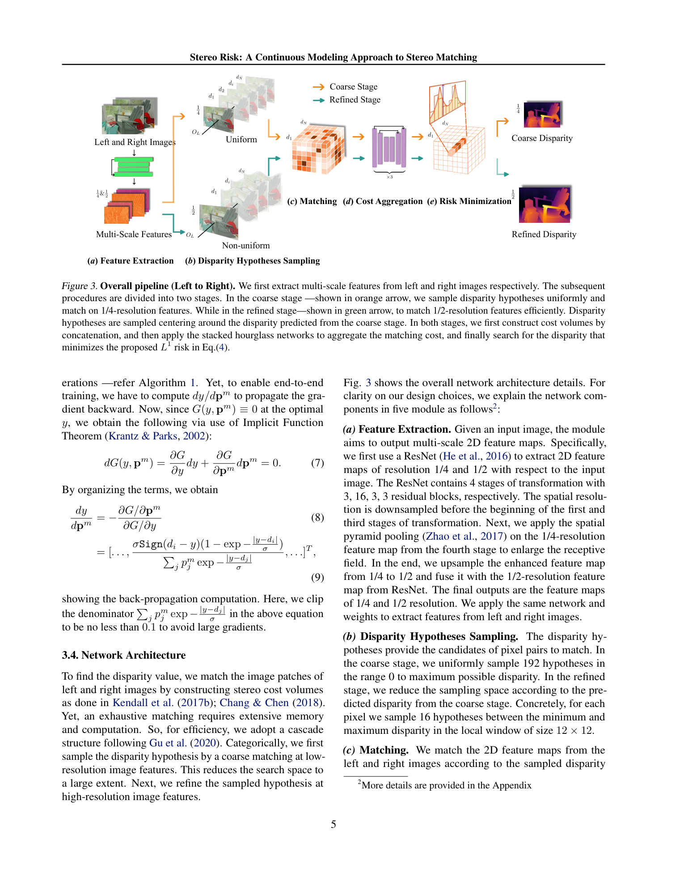
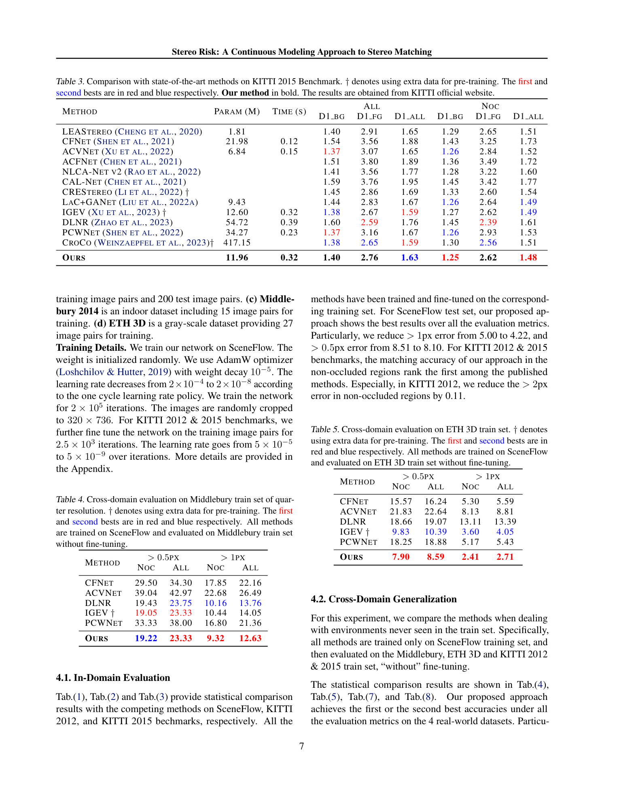

# Stereo Risk: A Continuous Modeling Approach to Stereo Matching

**Authors:** Ce Liu, Suryansh Kumar, Shuhang Gu, Radu Timofte, Yao Yao, Luc Van Gool (ETH Zurich, TAMU, UESTC, University of Würzburg, Nanjing University)
**Venue:** ICML 2024
**Tier:** 3 (continuous risk minimization over disparity distributions)

---

## Core Idea
Rather than regressing disparity as the **expectation** (soft-argmax) of a discrete probability volume — which averages across modes and produces blurred boundaries — Stereo Risk formulates disparity as the **minimizer of a continuous L1 risk function** over the interpolated probability density of disparity hypotheses. The non-differentiable arg-min is made differentiable via the **implicit function theorem**, enabling end-to-end training.

## Architecture

- **Multi-scale feature extraction** (shared weights) from left and right images at 1/2 and 1/4 resolutions
- **Coarse stage:** 1/4-resolution cost volume via feature concatenation, stacked-hourglass 3D aggregation → discrete disparity distribution
- **Refined stage:** 1/2-resolution cost volume for high-frequency details, same hourglass structure
- **Risk Minimization module (the key piece):** given the discrete distribution, interpolate to a continuous density, then solve `x* = argmin_x E[ ||x - d|| ]` under L1 risk — the continuous analog of a **weighted median** rather than a mean
- **Differentiable solver:** implicit function theorem gives `∂x*/∂θ` through the risk minimum, plugged into standard back-prop
- **Loss:** smooth L1 between predicted disparity and GT, applied at both coarse (weight 0.1) and refined (weight 1.0) outputs
- **Backbone:** similar to PSMNet/GwcNet — the contribution is the output head, not the encoder

## Main Innovation
First to cleanly apply **statistical risk minimization** to stereo, showing that the expectation (soft-argmax) is suboptimal when the true distribution is multi-modal — and that the L1-risk minimum (continuous weighted median) is robust to outlier modes. The implicit-gradient trick makes the continuous, non-differentiable arg-min trainable end-to-end without approximations.

## Key Benchmark Numbers

**SceneFlow test (EPE / >1px / >2px):**

| Method | Params | EPE | >1px | >2px |
|---|---|---|---|---|
| ACVNet | 6.84 M | 0.47 | 5.00 | 2.74 |
| IGEV | 12.60 M | 0.47 | 5.21 | 3.26 |
| **StereoRisk** | 11.96 M | **0.43** | **4.22** | **2.34** |

**KITTI 2012 (>2px Noc / All, >3px Noc / All):** StereoRisk = **1.58 / 2.20 / 1.00 / 1.44** (1st in non-occluded among published methods at submission).
**KITTI 2015 (D1 bg/fg/all, Noc):** StereoRisk Noc D1-all = **1.48** (1st place).

**Cross-domain (SceneFlow → targets, trained without any fine-tuning):**
- Middlebury quarter: **>1px Noc 9.32 / All 12.63** (best)
- ETH3D: competitive with IGEV, better than CFNet/ACVNet/PCWNet

Runs at **0.35 s** at SceneFlow resolution — comparable to IGEV despite the risk-minimization step.

## Role in the Ecosystem
StereoRisk closes the **probabilistic-output** line that started with AcfNet, ran through SMD-Nets (bimodal regression) and CDN (offset regression), and peaked in ADL (adaptive multi-modal CE). It provides the theoretically cleanest answer to "how do we read off a disparity from a distribution": as a **risk minimum**, not a mean. Likely to influence future foundation-stereo heads where multi-modal output is increasingly common.

## Relevance to Our Edge Model
- **Risk-minimization head is cheap** — it's iterative but operates on a 1-D density per pixel, so it adds only small compute overhead. Could replace soft-argmax in an edge model with negligible cost
- **Implicit-function-theorem gradient** is training-only; at inference only the forward arg-min is needed (fast)
- **Multi-modal robustness at edges** directly translates to cleaner depth boundaries — critical for downstream edge applications (object detection, AR) that consume depth maps
- Fewer parameters (11.96 M) than many 2024 methods and runs at competitive latency — fits the efficient-architecture envelope
- Straightforward to combine with ADL's multi-modal CE loss as training supervision and StereoRisk's head as inference regressor

## One Non-Obvious Insight
For multi-modal distributions, the **expectation is worse than any of the modes** — it falls in the valley between them, producing a disparity value that corresponds to **no physical surface** (a "ghost" depth between foreground and background). The L1 risk minimum, by contrast, is always near one of the modes. This is why soft-argmax creates the characteristic "fattened edges" in point clouds from stereo: it's not noise, it's a systematic bias. Switching to risk minimization is therefore a **geometric correction**, not merely a numerical improvement — it changes the class of outputs the model can produce.
