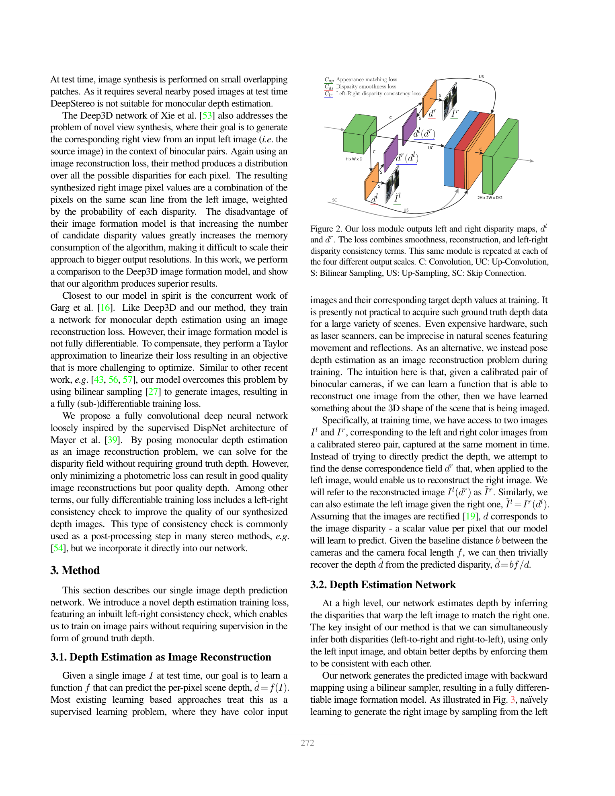
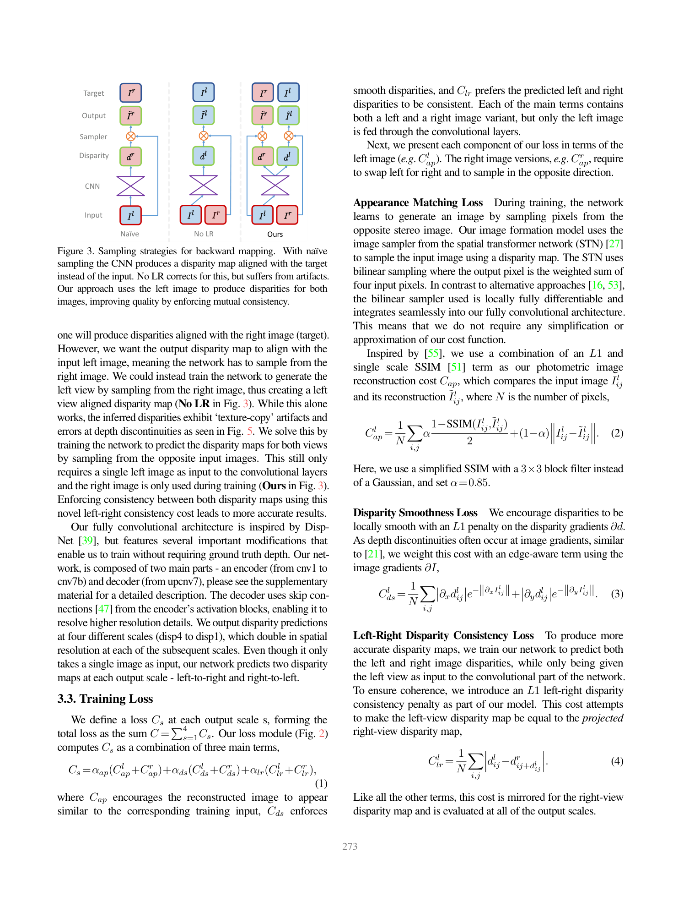
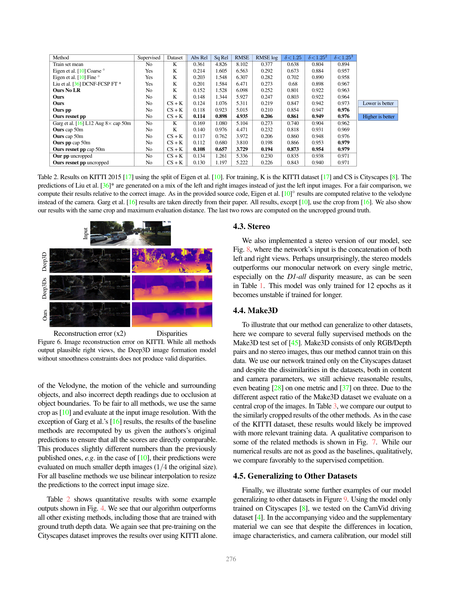

# MonoDepth: Unsupervised Monocular Depth Estimation with Left-Right Consistency

**Authors:** Clément Godard, Oisin Mac Aodha, Gabriel J. Brostow (UCL)
**Venue:** CVPR 2017
**Tier:** 3 (foundational self-supervised paradigm)

---

## Core Idea
Train a CNN for single-image depth estimation using **only stereo image pairs** (no LiDAR / GT depth) by replacing label loss with a photometric image-reconstruction loss, and crucially enforcing a **left-right disparity consistency** constraint as part of training.

## Architecture & Method

- Encoder-decoder CNN (DispNet-inspired, 31M params) takes the **left image only** at inference
- During training the network outputs **two** disparity maps (left-to-right and right-to-left)
- Loss = appearance matching (SSIM + L1) + disparity smoothness + **left-right consistency**
- Bilinear sampler enables fully differentiable image reconstruction
- Multi-scale supervision (4 output scales)

## Main Innovation
**Embedding the left-right consistency constraint as a training loss** rather than as post-processing — the network learns geometrically coherent disparities purely from photometric supervision.

## Key Benchmark Numbers

- **KITTI Eigen split (cap 80m):** Abs Rel = 0.114 (ResNet + Cityscapes pretraining + post-processing) — surpasses supervised Eigen et al. (0.203) at the time
- **KITTI 2015 D1-all** (their training split): 30.27% — **Deep3D variant was 59.64%**
- **Make3D:** Abs Rel 0.443 (cross-dataset generalization)
- **Inference:** ~35ms for 512×256 on a single GPU

## Role in the Ecosystem
The **foundational self-supervised stereo paper.** Established that:
1. Photometric reconstruction loss is a viable training signal without GT depth
2. Left-right consistency is essential to prevent network from cheating on appearance
3. You can use stereo pairs at training time and deploy a monocular model at test time

This pattern was extended by **Reversing-Stereo (Aleotti et al., ECCV 2020)** which inverted the relationship — using monocular depth to *generate* stereo training data — and later by **NeRF-Supervised Stereo** which replaced stereo cameras entirely with NeRF-rendered triplets.

## Relevance to Our Edge Model
**Indirect but conceptually important.** MonoDepth's recipe is the bedrock of every modern self-supervised stereo training pipeline:
- The **photometric reconstruction loss** is directly usable for unsupervised fine-tuning of an edge stereo model on a deployed scene
- The **left-right consistency loss** is a free regularizer at training time, zero inference cost
- For ADAS deployment where labeled stereo data is scarce, this enables cheap target-domain adaptation

## One Non-Obvious Insight
The network only sees the **left image** at inference time but predicts both left and right disparity maps during training. The right image is purely a reconstruction target — never enters the convolution stack. This means:
- The right-disparity head can be **dropped at deployment** for free
- Consistency enforcement happens at zero additional inference cost
- The same architecture trick generalizes to any stereo backbone

This asymmetry is exactly the principle our edge model could borrow: **train with rich supervision, deploy with minimal compute.**
