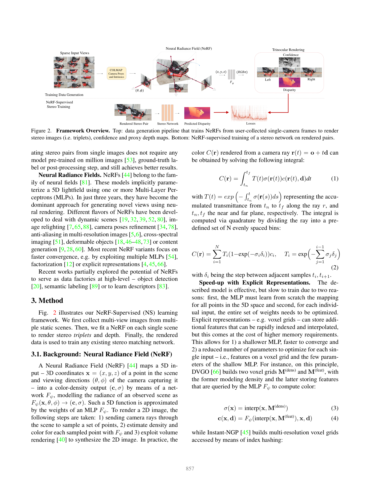
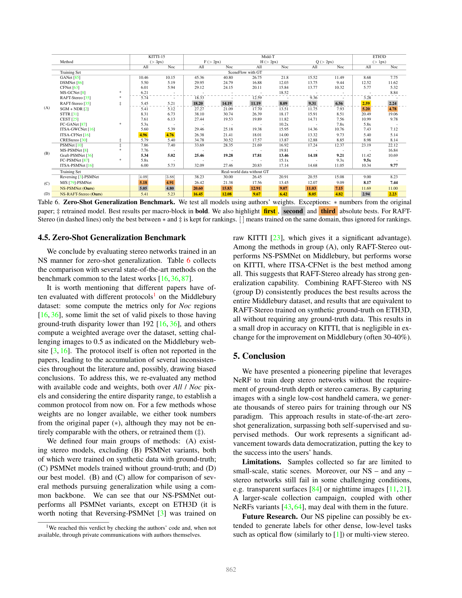

# NeRF-Supervised Deep Stereo

**Authors:** Fabio Tosi, Alessio Tonioni, Daniele De Gregorio, Matteo Poggi (University of Bologna, Google, Eyecan.ai)
**Venue:** CVPR 2023
**Tier:** 3 (training data revolution via NeRF)

---

## Core Idea
Use **Neural Radiance Fields fitted to casually-collected single-camera image sequences** as a "data factory" to render unlimited, perfectly-rectified synthetic stereo training pairs — eliminating the need for ground-truth depth, physical stereo cameras, or expensive synthetic 3D assets.

## Architecture & Method

**Data generation pipeline:**
1. **COLMAP** estimates camera poses from a casually-captured image sequence
2. **Instant-NGP** fits a NeRF per scene (~25 min/scene)
3. **Render rectified stereo triplets** at virtual baselines b ∈ {0.5, 0.3, 0.1}
4. The NeRF also provides **depth pseudo-labels** + **ambient occlusion (AO) masks** for confidence

**Trinocular training loss:**
- Photometric loss between the **center** view and **left** view, and between **center** and **right** view
- Per-pixel **minimum** of the two losses → naturally suppresses occlusion artifacts (every occluded pixel is visible in at least one of the two opposite views)
- **AO-gated NeRF disparity supervision** as a proxy label loss
- Backbone: **RAFT-Stereo** (also tested with PSMNet, CFNet)

**Dataset:** 270 scenes captured by 4 authors using smartphones; **65,148 rendered triplets**.

## Main Innovation
Replacing the entire synthetic 3D asset pipeline (Blender, Unreal) **AND** the requirement for a physical stereo rig with: a phone + COLMAP + Instant-NGP. The **trinocular rendering trick** elegantly resolves the occlusion blind-spot of standard self-supervised photometric losses.

## Key Benchmark Numbers (zero-shot, NO GT used in training)

- **Middlebury-A (H, >2px):** NS-RAFT-Stereo = **9.67%** vs. MfS-RAFT-Stereo = 12.67%
- **Middlebury-21 (>2px):** NS-RAFT-Stereo = **12.87%** vs. MfS-RAFT-Stereo = 22.26%
- **KITTI-12 (>3px):** NS-RAFT-Stereo = **4.02%** — competitive with **supervised** SceneFlow-trained models
- **ETH3D (>1px):** NS-RAFT-Stereo = **2.94%** — matches supervised RAFT-Stereo (2.59%)

**Outperforms all supervised baselines on Middlebury-A** with only 65K rendered pairs vs. 535K+ supervised images.

## Role in the Ecosystem
This paper opened the door to **on-demand, domain-specific stereo training data without specialized hardware.** It's the spiritual ancestor of approaches that use foundation models (DepthAnythingV2 + inpainting) to generate **53M+ pseudo-stereo pairs** from monocular images — the data strategy underlying StereoAnything and Pip-Stereo's MPT.

## Relevance to Our Edge Model
**Highly practical for deployment:** Adapting an edge stereo model to a new environment (warehouse, robot platform, factory floor) becomes a 1-day procedure:
1. Walk through the space with a smartphone (~100 images per scene)
2. Run Instant-NGP to fit a NeRF
3. Render thousands of stereo pairs at chosen baseline
4. Fine-tune the edge model using NS loss

**Zero labeled data, zero stereo rig, zero domain expertise required.**

## One Non-Obvious Insight
Using **three** rendered views instead of two fundamentally changes supervision quality. The per-pixel minimum of two photometric losses (center-left and center-right) creates a **natural occlusion mask at zero label cost** — every pixel that's occluded in one view is visible in the opposite view. This is conceptually cleaner than explicit occlusion modeling, requires no learned confidence, and falls out automatically from the geometry of NeRF rendering.
