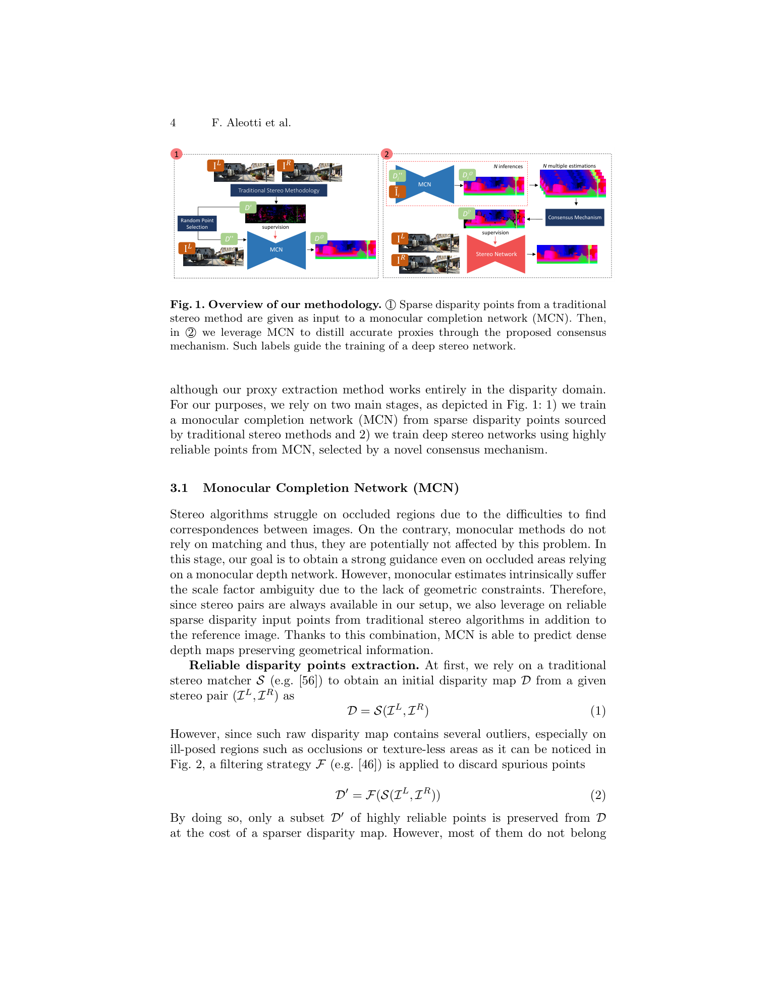
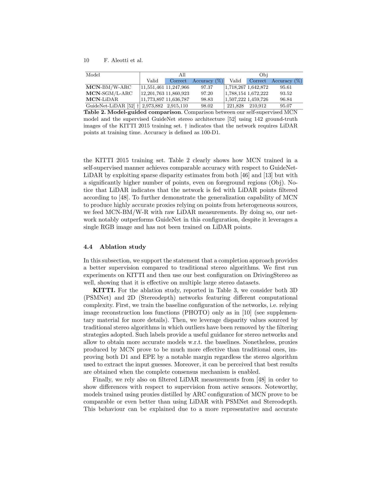

# Reversing the Cycle: Self-Supervised Deep Stereo through Enhanced Monocular Distillation

**Authors:** Filippo Aleotti, Fabio Tosi, Li Zhang, Matteo Poggi, Stefano Mattoccia (University of Bologna, China Agricultural University)
**Venue:** ECCV 2020
**Tier:** 3 (proxy-label generation via monocular completion; still-relevant precursor to DEFOM-style mono priors)

---

## Core Idea
"Reverse" the conventional pipeline (stereo supervises monocular) by letting a **monocular completion network (MCN)** — fed with sparse disparity seeds from a traditional stereo algorithm — produce **dense proxy labels** that then train a deep stereo network. This fixes two complementary weaknesses simultaneously: monocular methods suffer scale ambiguity (resolved by injecting a few metric-accurate stereo anchors), and stereo methods fail in occlusions (resolved by the monocular prior).

## Architecture

- **Stage 1 - MCN training.** Start from a traditional stereo method (SGM with left-right check, SGM/L; or Block-Matching filtered with the WILD strategy, BM/W) to produce a **sparse but highly reliable** disparity map D'. The MCN (based on monoResMatch) takes (RGB image, sparse D' as extra channel) and is trained **self-supervised** by photometric reprojection loss between stereo pairs, with horizontal-flip augmentation to handle occlusions
- **Stage 2 - Consensus distillation.** For each image, run MCN **N times** with (a) different random subsamples of D' and (b) different photometric augmentations of the RGB input. Compute the **per-pixel mean mu** across the N outputs; keep the pixel only if the **variance sigma^2 < gamma** (agreement among perturbations). The resulting filtered, dense, scale-accurate map D_P supervises any deep stereo network (Stereodepth, PSMNet) via L1 regression
- **Key formula:** D_P(p) ← mu({D_i^O(p)}_{i=1..N}) if sigma^2({D_i^O(p)}_{i=1..N}) < gamma  \quad \text{(consensus gate)}

## Main Innovation
Traditional proxy labels (raw SGM, filtered SGM, LiDAR) are **sparse, biased against occlusions, and scale-inconsistent**. MCN + consensus gating turns them into **dense, occlusion-complete, variance-filtered** supervision — beating even LiDAR-supervised baselines on KITTI 2015 despite using **no active sensor**. The consensus mechanism is a model-free way to estimate epistemic uncertainty without ensembles or dropout.

## Key Benchmark Numbers

**Proxy quality on KITTI 2015 training (Table 1):**
- Raw SGM: D1 all = 8.12, EPE 2.16
- SGM/L (after LRC filter, 86% density): D1 = 4.01, EPE 1.00
- **MCN-SGM/L-ARC (100% density): D1 = 2.92, EPE 0.86** (3x better D1 than raw SGM at full density)
- **MCN-BM/W-RC: D1 = 4.03, EPE 1.00** — from a weak BM seed!

**Proxy accuracy vs LiDAR (Table 2):** MCN-SGM/L-ARC produces **12.2M valid pixels at 97.20% accuracy**, vs GuideNet-LiDAR at **3.0M pixels / 98.02% accuracy**. MCN delivers **4x more labels** at nearly the same correctness, without any LiDAR.

**Final stereo nets trained on MCN proxies (Table 3, KITTI 2015):**
- PSMNet / SGM-L proxy: D1 = 5.61
- PSMNet / LiDAR-SGM proxy: D1 = 4.07
- **PSMNet / MCN-BM/W-ARC proxy: D1 = 3.85** — beats the LiDAR-supervised baseline

## Role in the Ecosystem
This work is a cornerstone in the "**monocular priors help stereo**" narrative that now dominates the field:
- Direct intellectual ancestor of **DEFOM-Stereo (CVPR 2025)** and **FoundationStereo**, which replace MCN with a frozen Depth Anything V2 ViT and move the fusion from proxy-label distillation into the forward pass
- **Stereo Anywhere** and **MonSter** likewise combine monocular foundation depth with stereo matching
- The consensus gating idea reappears in uncertainty-aware pseudo-labelling for domain adaptation and continual learning
- Spiritual cousin to **NS-RAFT** and self-supervised RAFT-stereo variants

## Relevance to Our Edge Model
Three concrete takeaways:
1. **Data-side distillation.** Train the edge model offline from MCN-style dense proxies generated by a large teacher (Depth Anything V2 or DEFOM-Stereo itself). The student never needs the heavy mono backbone at inference — all the prior knowledge is baked into the weights
2. **Consensus gating for self-training on-device.** If the edge model is self-supervised on deployment footage, a cheap N-run perturbation ensemble can filter unreliable pixels without expensive uncertainty heads
3. **Sparse LiDAR fusion for "free"** — the MCN formulation shows that as few as 12% density of reliable anchors (BM/W) is enough to anchor a monocular prior. An edge system with sparse depth (rolling-shutter structured light, ultrasonic, or downsampled ToF) can use the same principle to densify cheaply

## One Non-Obvious Insight
The paper shows that MCN trained from **weak** BM/W seeds (only ~12% density, D1 = 1.35) actually produces **final stereo networks nearly as good** as when trained from strong SGM/L seeds (86% density, D1 = 4.01). What matters is not the density of the input seeds but **their precision**: a small number of near-perfect anchors is sufficient to resolve monocular scale ambiguity, and the MCN fills the rest. This is the same asymmetry exploited by modern "foundation depth + stereo correction" pipelines — you don't need many stereo measurements, just **scale-accurate ones**.
