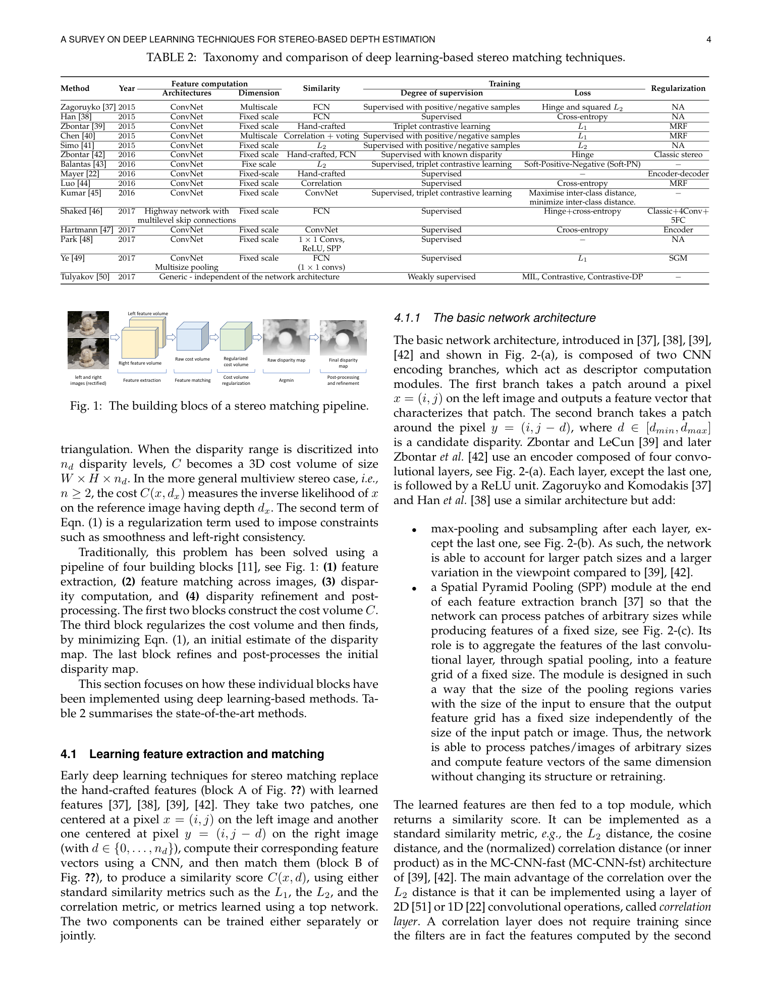
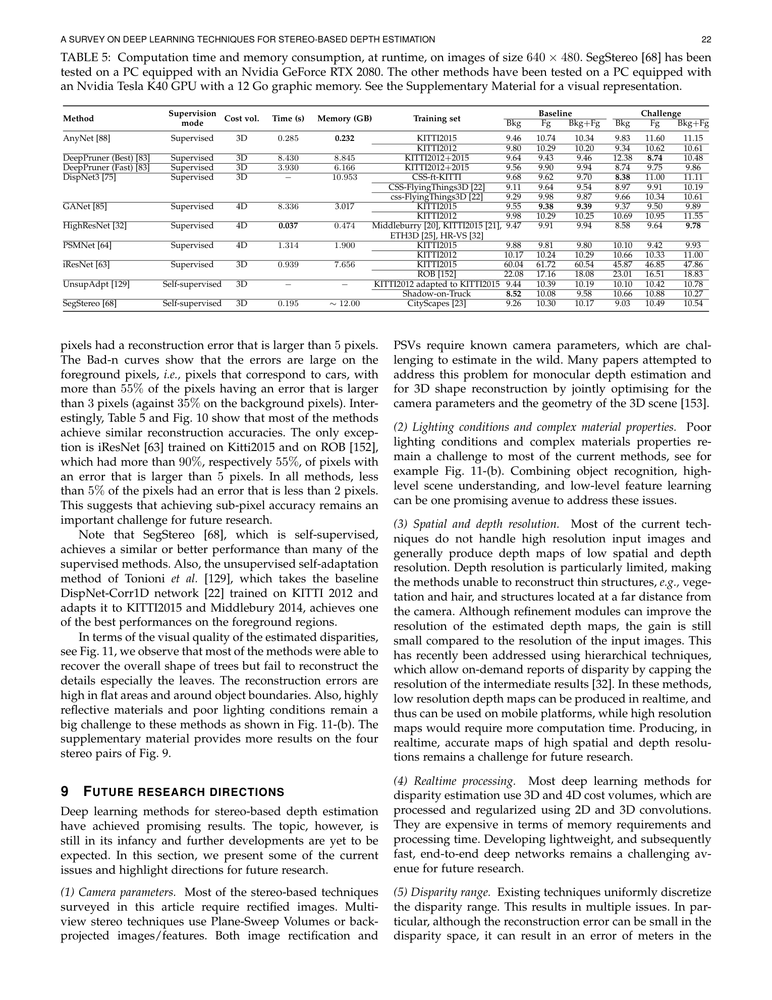

# Laga et al. — A Survey on Deep Learning Techniques for Stereo-Based Depth Estimation

**Authors:** Hamid Laga, Laurent Valentin Jospin, Farid Boussaid, Mohammed Bennamoun
**Venue:** IEEE TPAMI 2020 (arXiv 2006.02535, 28 pages)
**Tier:** 3 (comprehensive deep-stereo survey, pre-iterative-era)

---

## Core Idea
A 28-page systematic review of deep learning techniques for stereo-based depth estimation, organized around the classical Scharstein-Szeliski four-stage pipeline (matching cost, cost aggregation, disparity computation, refinement) and how each stage has been replaced or augmented by neural modules. The paper covers both **stereo matching** and **multi-view stereo (MVS)** as a unified depth-from-multi-image survey.

## Scope / Coverage

The survey organizes ~60+ stereo methods into a structured taxonomy:

- **Datasets** (Table 1): KITTI 2012/2015, Middlebury v3, ETH3D, Scene Flow (FlyingThings3D + Monkaa + Driving), DrivingStereo, synthetic vs. real GT
- **Matching-cost networks**: MC-CNN (fast and accurate variants), Content-CNN, SDC descriptors, Siamese / Pseudo-Siamese designs
- **End-to-end 2D architectures**: DispNet, DispNetC, CRL (Cascade Residual Learning), iResNet, EdgeStereo
- **End-to-end 3D cost-volume architectures**: GC-Net, PSMNet, GA-Net, GWCNet, StereoNet, DeepPruner, HSM-Net, AANet
- **Refinement networks**: hierarchical and residual refinement stages
- **Loss functions**: smooth-L1, cross-entropy on disparity distributions, soft-argmin regression, multi-scale supervision
- **Multi-view stereo (MVS)** (Table 4, p17): 13 deep MVS techniques covered separately
- **Unsupervised / self-supervised stereo**: photometric reprojection losses, left-right consistency (MonoDepth-style)

## Main Innovation (Survey Contribution)
The Laga survey is the **canonical deep-stereo taxonomy reference** for the pre-RAFT-Stereo era. Its key contribution is showing that **every deep stereo network can still be decomposed into the four classical Scharstein-Szeliski stages** even when trained end-to-end — letting practitioners reason about each stage's design choice independently.

## Key Findings

- End-to-end deep networks (2016–2019 cohort) surpass classical SGM and MC-CNN on KITTI, but **generalisation across domains remains weak**
- **3D cost-volume regularisation** with 3D convolutions (PSMNet, GA-Net) dominated accuracy at the cost of memory/compute
- **2D correlation-based architectures** (DispNet-C family) remain competitive for speed-sensitive applications
- The **matching-cost stage is the most "learnable"** — biggest deep-learning wins came from learned matching costs, not learned regularisation
- **Speed-accuracy frontier:** StereoNet (~60ms, ~5% D1) vs PSMNet (~400ms, ~2.3% D1) — efficiency was recognized but treated as orthogonal to accuracy SOTA
- **Open problems** identified: data augmentation, domain randomization, synthetic-to-real transfer (the survey predates RAFT-Stereo and the foundation-model era)

## Role in the Ecosystem
The most widely cited deep-stereo survey of the **pre-iterative era**. It anchors the "classical + matching-cost CNN + 3D cost volume" narrative that nearly every 2021–2023 stereo paper uses as background in its introduction. For our review paper, it's *the* reference to cite for **taxonomy** before jumping into RAFT-Stereo / CREStereo / IGEV / foundation-model work.

**Successor surveys** that updated the picture:
- **Poggi & Mattoccia (TPAMI 2021)** — synergies between ML and stereo (already in Tier 1)
- **Tosi et al. (IJCV 2025)** — modern survey covering iterative + foundation era (already in Tier 1)

## Relevance to Our Edge Model
- Provides the **canonical taxonomy** we'll use to explain our architectural choices in the review paper
- Its efficiency/accuracy frontier section is **outdated** (no RAFT, no MobileStereoNet, no BGNet, no foundation models) — this is precisely where our edge contribution lands
- Documents the **matching-cost-first design philosophy** that still underpins edge-friendly approaches (group-wise correlation, concat cost, bilateral grid cost)
- Table 5's runtime comparison (640×480 reference image size) is the methodology template we should adopt for **honest edge-latency reporting**

## One Non-Obvious Insight
The survey's structural choice — organizing deep stereo along the **Scharstein-Szeliski four-stage pipeline** rather than by architecture class — is itself a **modeling argument**: every deep stereo network can be decomposed into classical stages even when trained end-to-end, and an edge model designer can therefore pick **one lightweight component per stage** rather than inheriting an entire heavy architecture. This **per-stage replaceability** is exactly the design philosophy we want for our edge variant of DEFOM-Stereo: lightweight encoder + cheap cost volume + few-iteration GRU + lightweight refinement, each chosen independently to fit the latency budget.
