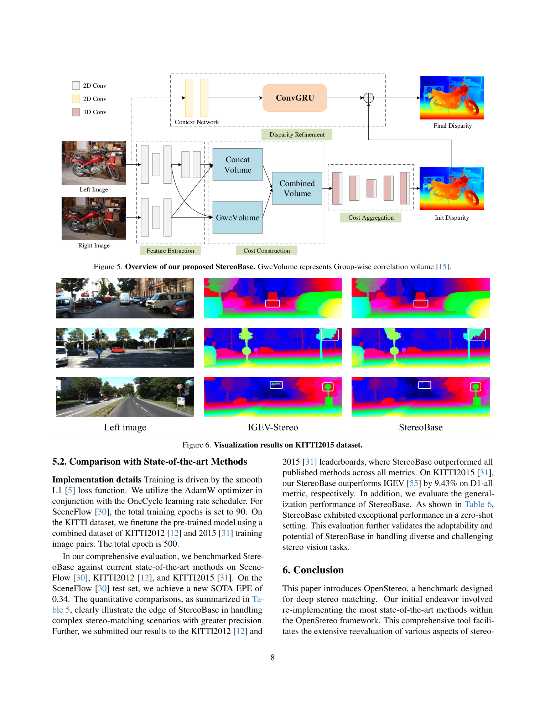
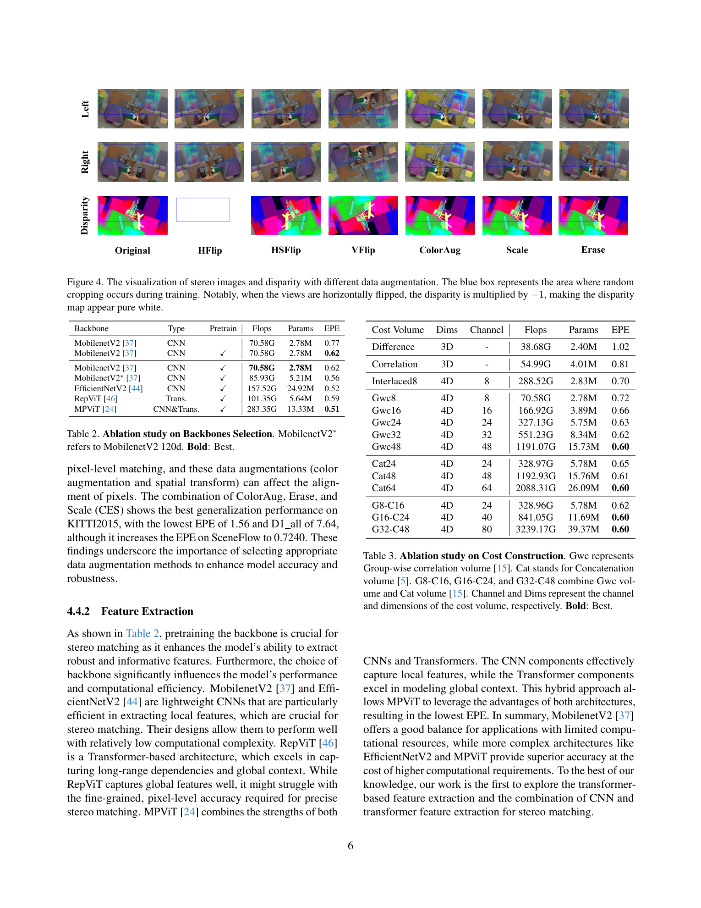

# OpenStereo: A Comprehensive Benchmark for Stereo Matching and Strong Baseline

**Authors:** Xianda Guo, Chenming Zhang, Juntao Lu, Yiqun Duan, Yiqi Wang, Tian Yang, Zheng Zhu, Long Chen (WHU, Waytous, GigaAI, CASIA)
**Venue:** arXiv 2023
**Tier:** 3 (unified stereo benchmark codebase + StereoBase baseline)

---

## Core Idea
Build a unified PyTorch toolbox that re-implements 10+ stereo matching networks under one training/evaluation pipeline so that comparisons between methods are actually apples-to-apples. The paper argues that the stereo literature has become unreproducible: different papers use different augmentations, data splits, and evaluation resolutions, so reported numbers are not comparable. OpenStereo fixes that, runs exhaustive ablations over each pipeline component (backbone, cost volume, aggregation, regression, refinement), and distils the findings into a single strong model called **StereoBase** that ranks #1 on KITTI 2012 (reflective) and KITTI 2015 among published methods at submission time.

## Scope/Coverage

- **Codebase** — YAML-config-driven, modular: backbone / cost construction / aggregation / regression / refinement are swappable.
- **Methods re-implemented** — PSMNet, GwcNet, CFNet, STTR, AANet, COEX, FADNet++, MobileStereoNet 2D/3D, CascadeStereo, IGEV-Stereo, CStereo (≥10 models) with verified reproduction of original numbers (and in several cases slight improvements via standardised training).
- **Ablation dimensions** covered in the paper:
  - **Data augmentation** — Color, HFlip/HSFlip/VFlip, Scale, Erase, crop; CES combo (Color+Erase+Scale) is best on KITTI.
  - **Backbones** — MobileNetV2, EfficientNetV2, RepViT, MPViT, with/without pretraining.
  - **Cost construction** — Difference, Correlation, Gwc (group-wise correlation) at varying group counts, Concat, Interlaced (MobileStereoNet).
  - **Aggregation** — 2D hourglass, 3D hourglass, group-wise 3D.
  - **Disparity regression** — differentiable argmin vs. ConvGRU (RAFT-style recurrent).
  - **Refinement** — RGBRefine, Context upsampling, DRNetRefine, Context+ConvGRU.

## Key Findings
- **Pretrained backbones are essential**: MobileNetV2 EPE drops from 0.77 to 0.62 on SceneFlow just by pretraining.
- **Transformer/hybrid backbones help** but only modestly — MPViT achieves 0.51 EPE vs. MobileNetV2's 0.62, at 4x the FLOPs.
- **Cost volume depth matters**: group-wise correlation with more channels monotonically improves accuracy. Interlaced cost (MobileStereoNet) wins on mobile networks but is expensive.
- **ConvGRU recurrent refinement dominates everything**: drops EPE from 0.71 (argmin+Context) to 0.46, at a 20x FLOPs premium (3024G vs. 130G). This is the single biggest architectural lever.
- **Data augmentation significantly changes cross-domain rankings** — same model trained with different augmentations crosses ranks on KITTI vs. SceneFlow.

## Notable Results

- **Reproduction:** OpenStereo reproductions are within 0.05 EPE of every original paper on SceneFlow; in several cases (PSMNet 0.87 -> 0.80, CFNet 1.04 -> 0.96) OpenStereo *beats* the original due to better training hygiene.
- **StereoBase** (composed of MobileNetV2-pretrained + Gwc+Concat combined cost + 3D hourglass aggregation + ConvGRU refinement):
  - SceneFlow EPE = **0.34** (new SOTA at submission).
  - KITTI 2015 3-px error = **1.59** — matches IGEV-Stereo reproductively (1.59) and better than paper-reported IGEV (2.26).
  - KITTI 2012 ranks #1 on reflective regions among published methods.
  - Cross-domain (SceneFlow-trained, tested on K12/K15/Midd/ETH3D): 4.85 / 5.35 / 9.76 / 3.12 — beats IGEV (4.88 / 5.16 / 8.47 / 3.53) on 3 of 4 benchmarks.

## Role in the Ecosystem
OpenStereo plays the same role for stereo matching that MMDetection did for detection: it ends the "my trained model beats your reported numbers" era. Its existence changes how future papers must argue — reviewers now expect OpenStereo-reproduction numbers. The StereoBase model itself is less influential than the codebase because newer methods (IGEV++, Selective-Stereo, FoundationStereo) have moved past it; but as a **reference baseline for ablations**, OpenStereo is now standard.

## Relevance to Our Edge Model
Very high direct relevance:
- Our edge model should be released *as an OpenStereo config* so that comparisons against StereoBase, IGEV, and MobileStereoNet are instant and fair.
- The ablation already tells us where to invest edge compute: **ConvGRU recurrent refinement** is the highest-leverage component (0.71 -> 0.46 EPE), even though it is expensive — if we can find an edge-cheap variant (few iterations, distilled from a larger teacher) we capture most of the accuracy gap.
- The backbone ablation gives us a shortlist: MobileNetV2-120d (0.56 EPE @ 86G FLOPs) and RepViT (0.59 EPE @ 101G FLOPs) are the sweet spot. Larger hybrids (MPViT 283G) are off-limits for Jetson Orin.
- Shows that group-wise correlation with few channels matches concatenation at a fraction of the memory — an obvious edge-model choice for cost volume construction.

## One Non-Obvious Insight
The reproduction effort revealed a systematic pattern: networks that rely heavily on data augmentation (PSMNet, CFNet) had the largest reported-vs-reproduced gaps, while networks with simpler training recipes (IGEV) reproduced cleanly. **This suggests that published SOTA numbers in pre-2023 stereo are partially an augmentation artefact**, and that a well-tuned simpler architecture under OpenStereo's standard training can catch or exceed them. For an edge model, this is reassuring: a lightweight architecture trained under OpenStereo's recipes will be competitive with published heavy-architecture numbers that used bespoke augmentation. It also underscores that StereoBase's win is less about novel architecture and more about **composing the right components under disciplined training**.
