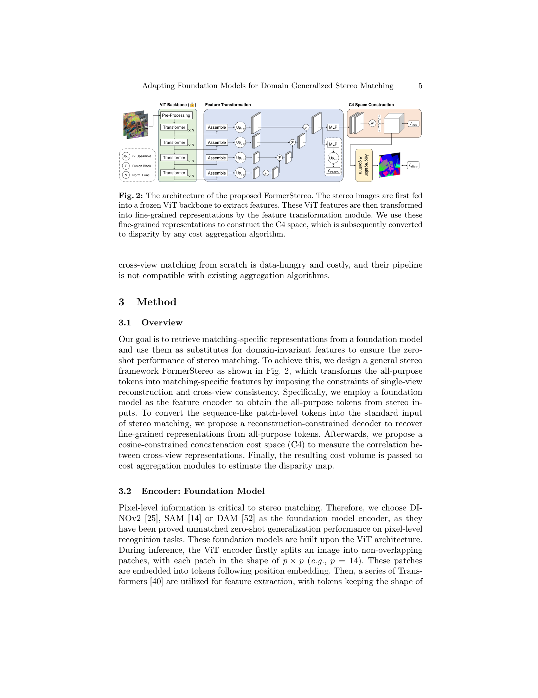
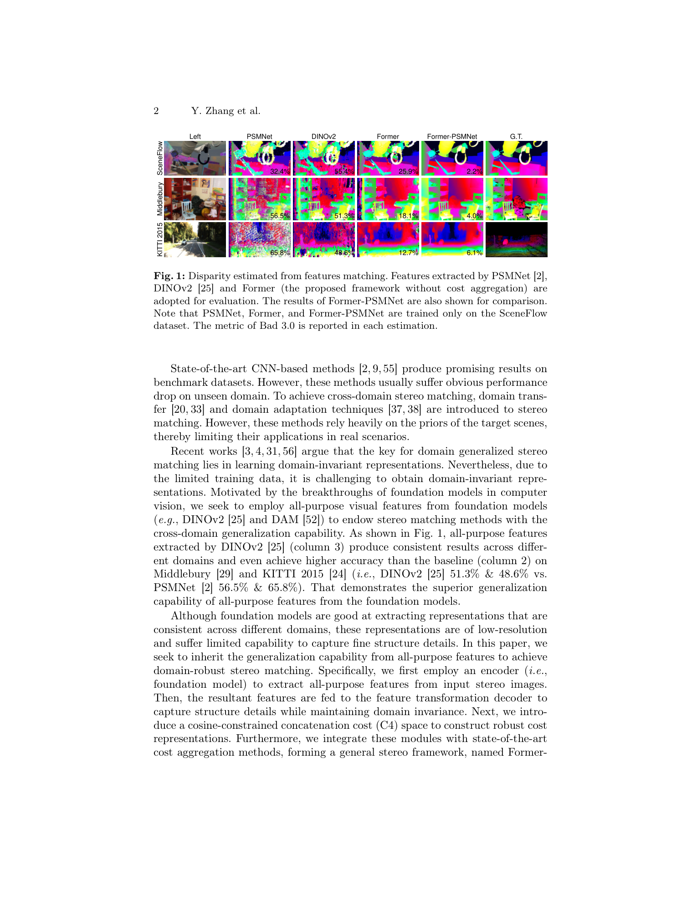

# FormerStereo: Learning Representations from Foundation Models for Domain Generalized Stereo Matching

**Authors:** Yongjian Zhang, Longguang Wang, Kunhong Li, Yun Wang, Yulan Guo (Sun Yat-Sen, AUAF, CityU HK)
**Venue:** ECCV 2024
**Tier:** 3 (ViT foundation-model adapter for zero-shot generalization)

---

## Core Idea
Adapt frozen vision-transformer foundation models (DINOv2, SAM, Depth Anything) into existing stereo pipelines (PSMNet, GwcNet, CFNet, RAFT-Stereo) to unlock strong zero-shot cross-domain generalization, without replacing the stereo backbone. The key bridge is a reconstruction-constrained decoder that converts coarse ViT tokens into fine-grained matching features, plus a new cost-volume space that keeps semantics and cross-view consistency together.

## Architecture

- **Frozen ViT encoder** (DINOv2 / SAM / DAM ViT-Large) extracts coarse patch tokens from both left and right images
- **Feature Convex Upsample (FCU) block** — learnable convex-combination upsampling that retrieves fine-grained pixelwise features from 14x-downsampled tokens (beats bilinear/deconv/pixel-shuffle)
- **Reconstruction-constrained decoder** — auxiliary image-reconstruction head forces the decoded features to preserve low-level structure that ViT tokens lose during patchification
- **C4 cost space** — Cosine-Constrained Concatenation Cost: concatenation-style cost volume regularised by a cosine-similarity contrastive loss, giving both semantic richness (concat) and cross-view consistency (cosine)
- **Plug into any aggregation network** — PSMNet 3D hourglass, GwcNet group correlation, CFNet cascade, or RAFT-Stereo recurrent GRU — unchanged

## Main Innovation
Previous attempts to drop ViT features into stereo failed because patch tokens are geometrically too coarse for pixel-accurate matching and ViT features are view-invariant in a way that destroys correspondence cues. FormerStereo's answer has three pieces: (1) FCU upsampling that is structural and learnable, (2) a reconstruction auxiliary that preserves pixel-level information, and (3) a cost space that explicitly balances semantic priors against cross-view matching. The design is deliberately backbone-agnostic — the same adapter improves four different stereo backbones.

## Key Benchmark Numbers

Zero-shot after training only on SceneFlow (lower is better):
- **Former-PSMNet (DAM):** ETH3D Bad 1.0 = 6.9, Middlebury(H) Bad 2.0 = 6.8, KITTI-15 Bad 3.0 = 5.0 — vs. PSMNet baseline 10.2 / 15.8 / 6.3
- **Former-GwcNet (DAM):** ETH3D 4.0, Middlebury 6.6, KITTI 5.1 — vs. GwcNet 30.1 / 34.2 / 22.7
- **Former-RAFT (DAM):** ETH3D 3.3, Middlebury 8.1, KITTI 5.1 — beats prior HVT-RAFT
- **DrivingStereo weather:** Former-CFNet trained on SceneFlow matches CFNet_RVC that was fine-tuned on multiple real datasets
- **Volatility:** std across last-10 epochs is 0.13 on KITTI15 vs. 1.03 for PSMNet — the foundation prior stabilises training

## Role in the Ecosystem
FormerStereo sits at the inflection point between stereo-matching-as-standalone and the foundation-model era exemplified by DEFOM-Stereo, FoundationStereo, and Stereo Anywhere (all 2024-2025). Where DEFOM-Stereo fuses monocular depth priors into RAFT-style iteration, FormerStereo shows that even a generic self-supervised ViT (DINOv2) without depth pretraining delivers most of the generalization gain, provided the adapter is right.

## Relevance to Our Edge Model
Directly against us on parameters — ViT-Large is ~300M parameters, far too heavy for Jetson Orin Nano. However, three ideas transfer:
- **FCU upsampling** is cheap (a few convs predicting convex weights) and could replace bilinear upsampling in our lightweight backbone.
- **Reconstruction-constrained training** is a training-time trick — zero inference cost — and could boost cross-domain generalization of our edge model without touching deployment latency.
- **C4 cost space** (concat + cosine-contrastive regularizer) is a training-time regularisation; at inference it is just a standard concat cost volume, so it is a "free" quality-bumping addition.

## One Non-Obvious Insight
The ablation (Table 2, ID=3) shows that pure cosine cost space (Graft-Net style) collapses on KITTI and Middlebury because it strips semantic cues, while pure concatenation fails on the strict ETH3D Bad-1.0 metric because non-corresponding semantic features confuse pixel-level matching. Neither extreme works — **the contrastive cosine loss must be applied to a concatenation volume, not substitute for it.** In other words, semantics and geometric correspondence are not interchangeable signals even when both come from ViT tokens; a good cost space needs them simultaneously.
