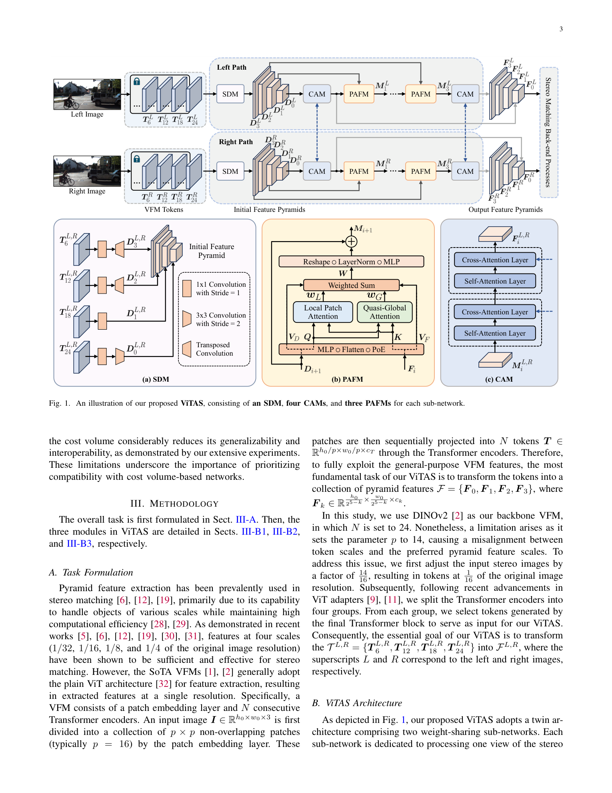
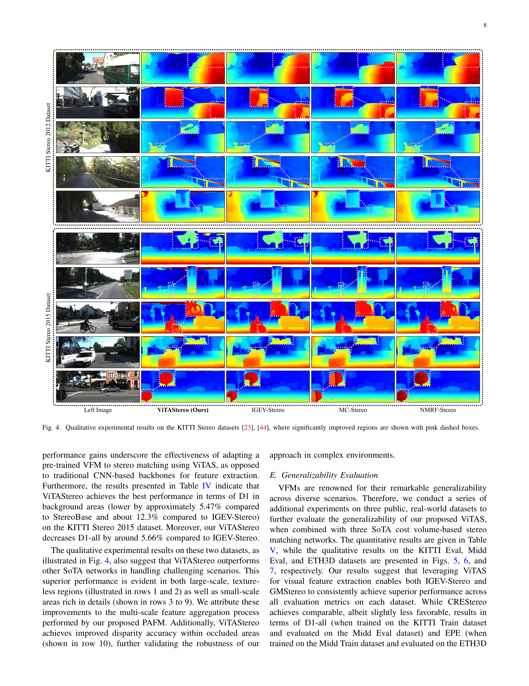

# ViTAStereo: Playing to Vision Foundation Model's Strengths in Stereo Matching

**Authors:** Chuang-Wei Liu, Qijun Chen, Rui Fan (Tongji University) — paper attributed in task list to "Zhang et al."; actual authors above
**Venue:** IEEE Transactions on Intelligent Vehicles (TIV) 2024
**Tier:** 3 (ViT adapter for cost-volume stereo, ranked #1 on KITTI 2012)

---

## Core Idea
Adapt a frozen self-supervised Vision Foundation Model (ViT, e.g. DINOv2) to stereo matching via a three-module adapter called **ViTAS**, and pair it with a conventional cost-volume back-end. The central claim: CNN feature extractors (the de facto backbone in IGEV/GMStereo/CREStereo) are the accuracy bottleneck; swap them for adapted ViT features and the rest of the pipeline wins for free. The paper also argues — against the emerging "just use attention" consensus — that cost volumes are still essential for generalisable stereo.

## Architecture

- **Backbone:** frozen self-supervised ViT (ViT-B, DINOv2 weights), stack of transformer blocks producing multi-scale tokens
- **Spatial Differentiation Module (SDM):** initialises a feature pyramid by differentiating adjacent ViT layer outputs to recover edge/structure detail lost by patchification
- **Patch Attention Fusion Module (PAFM):** aggregates multi-scale context into fine-grained features; identified in ablations as the most influential of the three modules
- **Cross-Attention Module (CAM):** aggregates stereo context across left and right views (four CAMs per sub-network) using cross-attention; the authors note CAM is the remaining compute bottleneck
- **Back-end:** standard cost-volume stereo network (cost construction, 3D aggregation, soft-argmin disparity regression) — intentionally unchanged to isolate the feature-extractor contribution

## Main Innovation
ViTAS is a surgical adapter: three modules that sit between a frozen ViT and any existing cost-volume back-end. Unlike FormerStereo (ECCV 2024) which uses a reconstruction-constrained decoder and a specialised cost space, ViTAS emphasises *initialising a multi-scale pyramid from ViT* (SDM) and *stereo-aware context fusion via cross-attention* (CAM). Critically, the paper benchmarks ViTAS on top of IGEV, GMStereo, and CREStereo — showing it is architecture-agnostic — and attacks CroCo-Stereo's cost-volume-free design by showing it has severe scale ambiguity on ETH3D.

## Key Benchmark Numbers

**KITTI Stereo 2012 leaderboard (top rank at submission):**
- ViTAStereo: 2-noc = 1.46%, 2-all = 1.80%, 3-noc = 0.93%, 3-all = 1.16% — beating StereoBase (1.54 / 1.95 / 1.00 / 1.26) and IGEV-Stereo (1.71 / 2.17 / 1.12 / 1.44).
- KITTI Stereo 2015: D1-bg reduced ~5.47% vs. StereoBase, ~12.3% vs. IGEV; D1-all reduced ~5.66% vs. IGEV.

**Cross-architecture boost (Table V):**
- IGEV-Stereo + ViTAS (KITTI train, Midd eval): EPE 5.27 -> 3.05, D1-all 16.8 -> 10.9
- GMStereo + ViTAS (Midd train, ETH3D eval): EPE 1.72 -> 0.67, D1-all 10.1 -> 4.34
- CREStereo + ViTAS (KITTI train, ETH3D eval): EPE 3.45 -> 1.75

**Module ablation (EPE reduction):** SDM alone -1.8%, PAFM alone -11.9%, CAM alone -4.1% — PAFM dominates.

## Role in the Ecosystem
ViTAStereo is an early-2024 complement to FormerStereo: both argue that VFM features beat CNN features for stereo when properly adapted. It is positioned on the KITTI leaderboard side (accuracy-at-any-cost), whereas FormerStereo is positioned on the zero-shot / cross-domain side. Together they mark the moment when transformer features stopped being a bolted-on research curiosity (STTR, GMStereo) and became the default in top KITTI entries.

## Relevance to Our Edge Model
Net-negative on deployability — ViT-B + four CAMs + multi-scale PAFM is heavier than our Jetson budget. But useful signals:
- **PAFM dominating the ablation** tells us that *multi-scale patch-attention fusion* is doing the real work; an efficient approximation (e.g. depthwise multi-scale context aggregation, FastViT-style) may recover most of the gain.
- The **conclusion reaffirms cost volumes** — a warning against edge designs that skip cost volumes for pure attention. Our iterative edge model should retain an explicit (but lightweight) cost volume.
- The authors themselves flag CAM as the compute bottleneck and list "more efficient stereo context aggregation" as future work — exactly the gap an edge model can fill.

## One Non-Obvious Insight
The CroCo-Stereo experiment (Fig. 8, Table VI) is the quiet bombshell: removing the cost volume and relying on cross-attention alone produces visually plausible but **scale-ambiguous** disparity — KITTI-trained CroCo predicts small disparities on Middlebury and large ones on ETH3D. The failure mode is not blur or noise; the architecture is learning *relative* depth structure and losing the geometric anchor that a correlation/concatenation volume provides. **For edge stereo, this means a cost volume is not just a useful feature — it is what prevents scale drift across domains**, and dropping it for attention-only designs trades generalizability for parameter count in the wrong direction.
